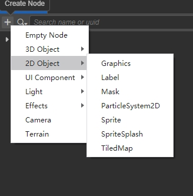
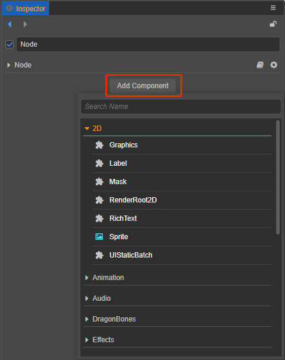

# 2D Render Description

All rendering objects in the engine that do not own a model are 2D rendering objects. Unlike 3D objects, 2D objects do not have model information, and their vertex information is held by the Rect information of the UITransform component and created by the engine, and they have no thickness themselves. Due to the design requirements of the engine, the 2D render object needs to be a child of the RenderRoot node (the node with the RenderRoot2D component) in order to complete the data collection operation.

The rendering requirements for the 2D render object are twofold:
1. It needs to have a UITransform component
2. It needs to be a child of a RenderRoot node

## 2D Rendering Object Visibility Description

Since there is no difference between 2D rendering objects and 3D rendering nodes in terms of camera visibility, users need to control the layer property of the node and set the Visibility of the camera to match the group rendering. If there are multiple cameras in the scene, wrong layer settings may cause the node to be rendered repeatedly or not at all.

## 2D Rendering Components

Components that have rendering capabilities in their own right are called 2D rendering components, including:

- [Sprite Component Reference](../../ui-system/components/editor/sprite.md)
- [Label Component Reference](../../ui-system/components/editor/label.md)
- [Mask Component Reference](../../ui-system/components/editor/mask.md)
- [Graphics Component Reference](../../ui-system/components/editor/graphics.md)
- [RichText Component Reference](../../ui-system/components/editor/richtext.md)
- [UIStaticBatch Component Reference](../../ui-system/components/editor/ui-static.md)
- [TiledMap Component Reference](../../editor/components/tiledmap.md)
- [TiledTile Component Reference](../../editor/components/tiledtile.md)
- [Spine (Skeletal Animation) Skeleton Component Reference](../../editor/components/spine.md)
- [DragonBones ArmatureDisplay Component Reference](../../editor/components/dragonbones.md)
- [MotionStreak Component Reference](../../editor/components/motion-streak.md)

## How to add 2D Rendering Components

Some 2D rendering components are built into the editor. After creating a RenderRoot node, create a node with 2D rendering components under this node:

2D rendering components can also be added by adding components to the node, the nodes under the 2D menu in the components menu are all 2D rendering components:

> **Note**: only one rendering component can be added to each node, and repeated additions will result in error reporting.

## 2D rendering component rules introduction

- [Rendering Order Rules](../../ui-system/components/engine/priority.md)
- [UI Batching Rule Description](../../ui-system/components/engine/ui-batch.md)
- [UI Material Description](../../ui-system/components/engine/ui-material.md)
