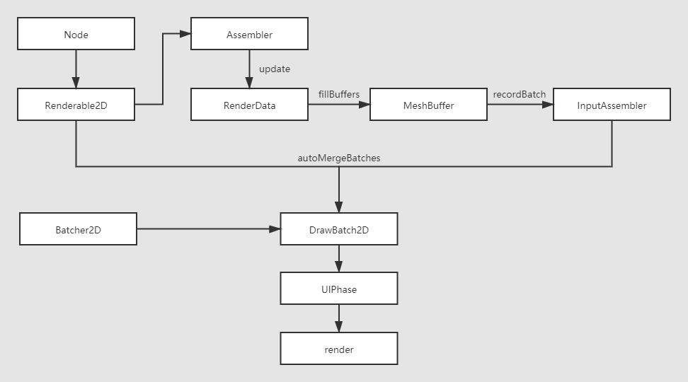

# 2D Objects Overview

Unlike 3D model objects, 2D rendering objects are referred to as the rendering of images that do not involve models. 2D rendering objects are handled differently from 3D models in terms of the underlying data submission, and follow their own rules with some specific adjustments for better efficiency and experience.

## 2D Object Rendering Structure Description

The RenderRoot node (the node with the RenderRoot2D component) is the entry point for 2D object data collection, and all 2D rendering objects must be rendered under the RenderRoot node. Since the Canvas component inherits from the RenderRoot2D component, the Canvas component can also be the entry point for data collection. 2D rendering nodes must have a UITransform component as a requirement for rendering vertex data, click or alignment policies, etc.

2D rendering can also support rendering of models, the only condition is that nodes with model components (e.g. `MeshRenderer`/`SkinnedMeshRenderer`) must have **UI/UIMeshRenderer** components added to them in order to render on the same pipeline as the UI.

The 2D rendering flow is as follows:

## 2D object classification

2D objects can be broadly classified into two categories, **2D rendering objects** and **User-interface (UI)**. The difference is that 2D rendering objects are generally only responsible for rendering 2D objects, while UI is more about user interaction. For more details on the differences, users can refer to the specific descriptions:

- [2D Rendering Component Description](2d-render/index.md)
- [UI System](ui-system/index.md)
