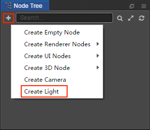
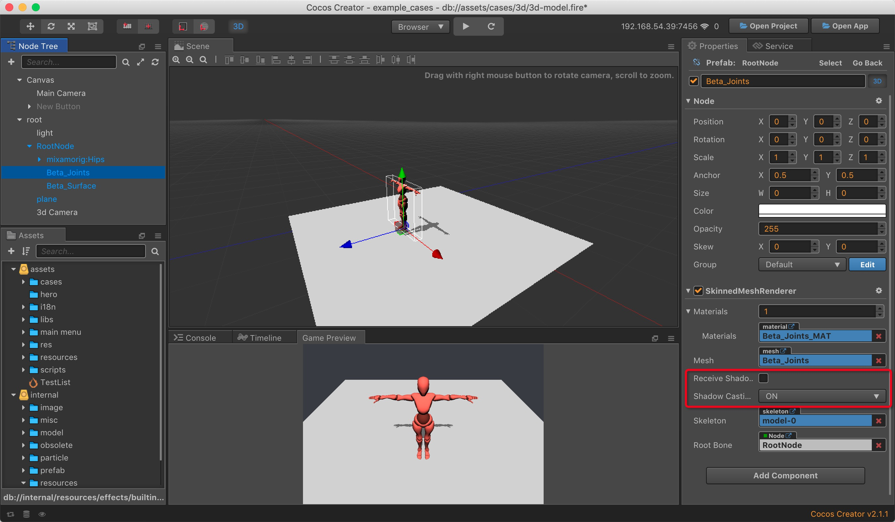
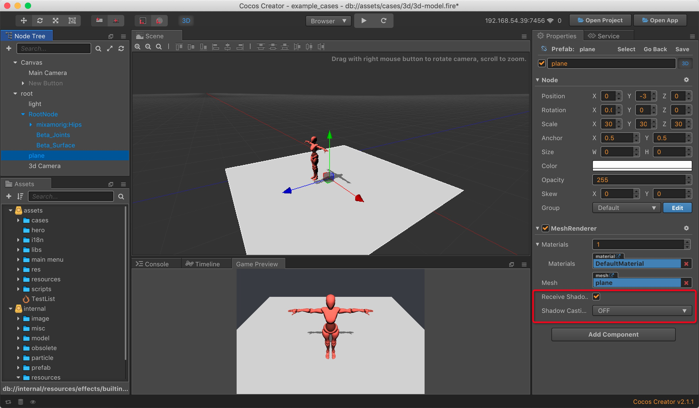

# Lighting

Adding light in the scene can make the **Scene** produce the corresponding shadow and lighting effect. And obtain better visual effects through the strength and range of the light, make the scene rendering more realistic. It is recommended to switch the scene editor to 3D scene mode by clicking the **3D** button at the top left of the editor for better editing of the light, etc.

## Add Lights

There are two ways to add lights:

- Click on the **+** button in the upper left corner of the **Node Tree** and select **Create Light** to create a node containing the **Light component** to your scene.

- Add a Light component to the node by selecting the node in the **Node Tree** where you want to add the lights, then clicking the **Add Component** button below the **Properties** and selecting **Light** from the **Renderer Component**.

## Types of light

### Directional lights

Directional lights are the most common type of lights, and it is very useful for creating effects such as sunlight in your scenes. Behaving in many ways like the sun, unaffected by Position and Scale (In the figure below, you can see that the brightness of the directional lights produced on the plane is the same). However, the rotation will affect the direction of directional lights illumination, and the direction of the illumination affects the range to which the model receives illumination and where the model produces shadows.

The user can adjust the color of the light by modifying the Color property of the Light component in the **Properties**. And adjust the light intensity by modifying the **Indensity** property.

### Point lights

A point light is located at a point in space and sends light out in all directions equally. And is sililar to the light produced by the candle. The intensity diminishes with distance from the light, reaching zero at a specified range. The position of the point light and its illumination range can be seen in the editor as shown below.

The user can adjust the illumination range of the point light by modifying the Range property of the Light component in the **Properties**.

### Spot lights

Like a point light, a spot light has a specified location and range over which the light falls off. However, the spot light is constrained to an angle, resulting in a cone-shaped region of illumination, close to the light produced by the flashlight.

The spot light has one more **Spot Angle** property than other types of lights, which allows you to adjust the illumination range of the spot light.

## Shadows

If you want to make object shadows, there are a few steps:

1. Change the **Shadow Type** option on the Light component. **NONE** means that the lights will not generate shadows, and **HARD** means that the lights will generate hard shadows.
2. Select the **MeshRenderer component** that you want to generate the shadow and change the **Shadow Casting Mode** parameter. **OFF** means no shadow will be generated, **ON** means shadow will be generated.
3. Select the **MeshRenderer component** that wants to accept the shadow, change the **Receive Shadows** parameter. **True** means will accept the shadow, and **False** means will not accept the shadow.

Suppose we want to display the projection of a model on a plane, then the parameter settings of each node can refer to the following figure:

1. Light component

2. The MeshRenderer component of the model

3. The MeshRenderer component of the plane

