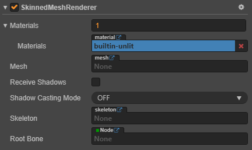

# Skinned Mesh Renderer Component Reference

> Authors: Xunyi, youyou

Skinned Mesh Renderer component inherits from Mesh Renderer, so Skinned Mesh Renderer component can also specify `Mesh` and `Materials` properties.

Cocos Creator uses Skinned Mesh Renderer component to render skeletal animation, skeletal animation. Skeletal animation will associate vertices in the mesh with the skeleton (a set of nodes), then the skeletal animation will drive the skeletal in a pre-edited animation, to deform the mesh to achieve animation effects

When importing a model, if there is a skeletal animation in the model, the editor automatically adds the Skinned Mesh Renderer component to the generated Prefab.

## Properties

| Property | Description |
| :-- | :------ |
| Materials       | Mesh resource allow for the use of multiple material resources, and all material resources are stored in the materials array. If there are multiple sub-meshes in the mesh resource, the Mesh Renderer will obtain the corresponding material from the materials array to render the sub-mesh. |
| Mesh            | Specify the mesh resource used for rendering. |
| Receive Shadows | Specifies whether the current model will receive and display shadow effects generated by other objects.  |
| Shadows Casting Mode | Specifies whether the current model will cast shadows.  |
| Skeleton | Specify the skeleton animation asset for rendering. |
| Root Bone    | The skeletal root node. |
