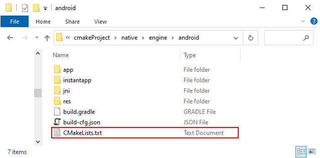
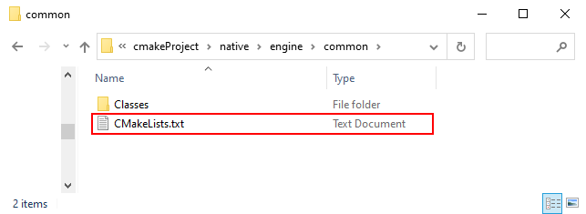
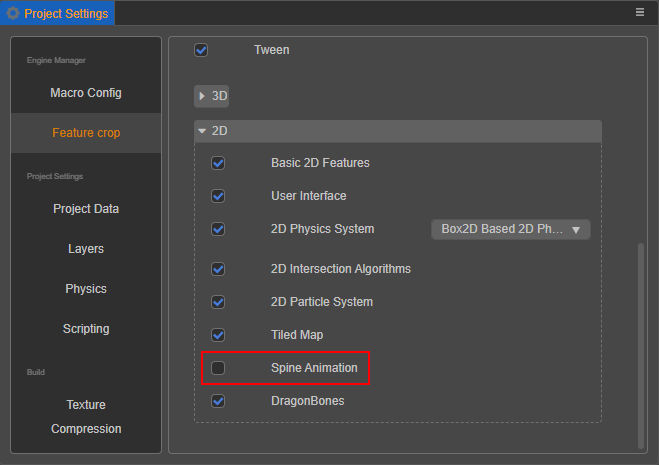
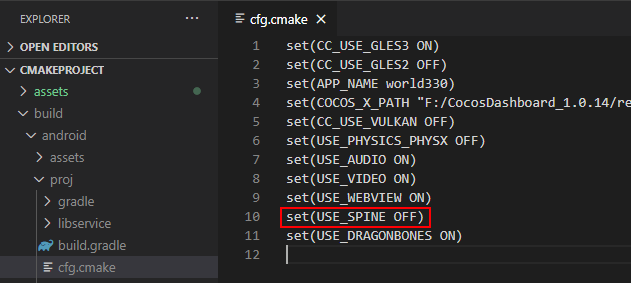
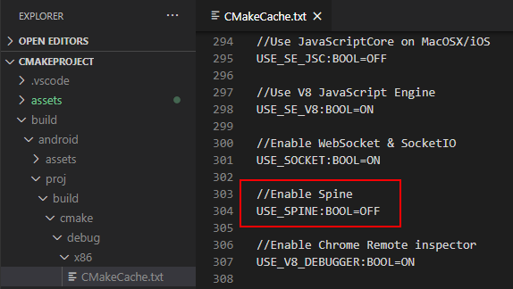

# CMake Usage Introduction


CMake is a very powerful build tool that can greatly simplify the software compilation process and improve development efficiency. Cocos Creator uses CMake on various native platforms. Here are some quick advantages of CMake:

- CMake uses the CMakeLists.txt file to describe the entire project's build process, rather than using script files like other build tools.
- CMake is cross-platform and can run on operating systems such as Windows, Linux, and macOS.
- CMake can automatically generate Makefiles, Visual Studio, and other IDE project files, simplifying the software compilation process.
- CMake can easily manage dependency libraries, organize code into modules, etc.
- CMake supports multiple programming languages, including C, C++, Fortran, Java, Python, etc.

Although CMake is a very powerful build tool, it also has some drawbacks, such as its complex syntax and the need for a certain learning cost.

Developers can learn the syntax of CMake and add their own modules to perform specific tasks during the build process. For example, they can define their own preprocessor macros or compiler options to execute custom operations during the build. In addition, they can write scripts to modify project files for different configurations on different platforms, review [Secondary Development](../editor/publish/native-options.md#secondary-development).

If you want to learn CMake in depth, you can read other chapters of this tutorial to learn how to install CMake, create CMakeLists.txt files, specify compilers, add source files, add dependency libraries, and build projects, etc. Due to length limitations, this article cannot provide detailed information on how to use FindPackage, set build types, install and test, etc. To master it better, developers need to consult other documents and engage in more practice.

## Installing CMake

For the convenience of developers, Cocos Creator integrates the CMake program internally, which will be used in the build process. Therefore, in general, developers do not need to manually install CMake.

If developers want to use the CMake on their device, they can edit the relevant configuration to do so.

If developers want to use CMake in the command line, they can go to [the official website](https://cmake.org/download/) to download it. On the Mac platform, they can also use Homebrew to install it by executing the following command:

```bash
brew install cmake

```

## **Getting Started with CMake**

The `CMakeLists.txt` file is the core file of CMake, which describes the entire project's build process. Using this file, you can easily manage the project's building and compilation processes. It contains a series of commands and variables used to specify project names, version numbers, source files, dependency libraries, compiler specifications, compilation options, and other parameters.

Here is a simple example of a CMake helloworld project:

First, create a file named `CMakeLists.txt`. In this file, add the following content:

```
# CMake Version
cmake_minimum_required(VERSION 3.10)

# Set project name and main language
project(helloworld CXX)

add_executable(helloworld main.cpp)

```

Then, create a file named `main.cpp` in the root directory of the project and add the following content:：

```
#include <iostream>

int main() {
    std::cout << "Hello, world!" << std::endl;
    return 0;
}

```

Finally, create a directory named `build` in the root directory of the project and execute the following command inside it:

```bash
# Generate the default project files in the build directory. If Visual Studio is installed, it defaults to a Visual Studio project; on Mac, it defaults to a Makefile project. The project file type can be set by specifying -G, for example, -GXcode.
cmake -B build -S . 
# Generate executable target
cmake --build build
```

After executing these commands, an executable file named `helloworld` will be generated in the `build` directory. Running the file will output "Hello, world!".

Two commands used here are `project` and `add_executable`.

`project` is a command in CMake used to specify project name, version number, programming language, and other information. Its syntax is as follows:

```
project(project_name [version] [LANGUAGES languages...])

```

Here, `project_name` specifies the project name, `version` specifies the version number of the project, and `languages` specifies the programming languages used in the project. If `version` or `languages` are not specified, they can be omitted. For example:

```
project(MyProject)

```

This command sets the project name as `MyProject`, without specifying the version number and programming language.

`add_executable` is used to add build rules for executable files, and its syntax is as follows:

```
add_executable(executable_name [source1] [source2] ...)

```

Where `executable_name` is used to specify the name of the executable file, and `source1`, `source2`, and other parameters are used to specify the names of source files. For example:

```
add_executable(MyProject main.cpp)

```

This command will set the executable file name to `MyProject` and add the `main.cpp` file as a source file to the project.

### Other commonly used CMake commands

### **`message`**

The `message()` command is used to display messages in the CMake console during the build process. It can be used for debugging, testing, and other purposes. Its syntax is as follows:

```
message([<mode>] "message text" ...)

```

The `mode` parameter specifies the message type, which can be `STATUS`, `WARNING`, `AUTHOR_WARNING`, `SEND_ERROR`, `FATAL_ERROR`, or `DEPRECATION`. The `message text` parameter specifies the message to be displayed. For example:

```
message(STATUS "This is a status message.")
message(WARNING "This is a warning message.")
message(AUTHOR_WARNING "This is an author warning message.")
message(SEND_ERROR "This is a send error message.")
message(FATAL_ERROR "This is a fatal error message.")
message(DEPRECATION "This is a deprecation message.")

```

The message type determines the text color and icon displayed in the CMake console. For example, `STATUS` messages are displayed in green, while `WARNING` messages are displayed in yellow with a warning icon. The `FATAL_ERROR` message will stop the build process and display an error message in the console.

### `set`

The `set()` command is mainly used to create or modify variables. The command accepts at least two arguments: the variable name and its value. For example, you can use `set(SRC_FILES main.cpp)` to set the value of the variable `SRC_FILES` to `main.cpp`. If you want to set multiple values (such as a list) for a variable, you can add more arguments to the command, like `set(SRC_FILES main.cpp util.cpp)`. To read the value of a variable, you can use the `${}` syntax, like `message(${SRC_FILES})`.

You can use the `set` command to add elements to a list variable. Specifically, you can use the command `set(SRC_FILES ${SRC_FILES} util.cpp)` to add `util.cpp` to the end of the `SRC_FILES` list. `${SRC_FILES}` represents the current value of the `SRC_FILES` variable. This command can also use other `set` command options, such as `CACHE` and `APPEND`.

### `list`

The `list()` command is used for handling list-type variables. It can accept multiple subcommands, such as `APPEND` (adds an element to the end of the list), `INSERT` (inserts an element at a specified position), `REMOVE_ITEM` (removes a specified element), and so on. For example, the `list(APPEND SRC_FILES util.cpp)` command adds `util.cpp` to the end of the `SRC_FILES` list.

### `add_library`

The `add_library` command is used to define a library target. It requires at least two arguments: the name of the library and the source file. If you provide only one source file, CMake will create a library built from that file. For example, `add_library(MyLib main.cpp)`. If you have multiple source files, you can put them all in the `add_library()` command, like `add_library(MyLib main.cpp util.cpp)`.

CMake supports creating static libraries and dynamic libraries. By default, the `add_library()` command creates a static library. If you want to create a dynamic library, you need to add the `SHARED` parameter to the command, like `add_library(MyLib SHARED main.cpp)`.

If you want to create both static and dynamic libraries, you can list them both, like `add_library(MyLibStatic STATIC main.cpp)` and `add_library(MyLibShared SHARED main.cpp)`.

A static library is a library linked to the executable file at compile time, while a dynamic library is a library loaded at runtime. Static libraries usually only contain the code needed by the executable file, so they are smaller. Dynamic libraries usually contain more code and data, as they need to be executed at runtime. The advantage of dynamic libraries is that they can be updated without recompiling the executable file. They can also be shared among multiple executable files, saving disk space.

When using the `add_library()` command, you can specify the name and type (static or dynamic) of the library, as well as the source files and header files to include. For example, the `add_library(MyLib STATIC main.cpp)` command adds the `main.cpp` source file to the static library named `MyLib`.

### `find_library`

The command is used to locate library files on the system. You need to provide a variable name (to store the path of the found library) and the name of the library. For example, `find_library(MY_LIB NAMES MyLib)`. In this example, CMake will search for the library named `MyLib` in the system's library paths. If found, the value of the `MY_LIB` variable will be set to the full path of the library.

You can use the `find_library` command to locate library files on the system. You need to provide a variable name (to store the path of the found library) and the name of the library.

For example, suppose you want to locate a library named `libexample` that is in the `/usr/local/lib` directory. The absolute path can be converted to a relative path using variables such as `${CMAKE_CURRENT_LIST_DIR}`. You can add the following command to your `CMakeLists.txt` file:

```
find_library(EXAMPLE_LIB libexample /usr/local/lib)

```

This command will store the path of the `libexample` library in the `EXAMPLE_LIB` variable. If the library cannot be found, the value of the `EXAMPLE_LIB` variable will be empty.

When using the `find_library` command, you can specify the name, path, version, and language of the library. For example, the command `find_library(EXAMPLE_LIB NAMES example PATHS /usr/local/lib VERSION 1.0 LANGUAGES CXX)` will locate a library named `example` with version `1.0` and written in the `C++` language, and store its path in the `EXAMPLE_LIB` variable.

If you want to locate multiple libraries, you can add multiple library names to the command. For example, the command `find_library(LIB1 NAMES lib1 lib1.a PATHS /usr/local/lib)` will locate a library named `lib1` or `lib1.a`, and store its path in the `LIB1` variable.

Note that when using the `find_library` command, you need to ensure that the name, path, version, and language of the library match your project. Otherwise, your project may not link to the library file correctly.

### `target_link_libraries`

The `target_link_libraries()` command is used to link specified libraries to a target. This command requires at least two arguments: the target name and the library name. For example, `target_link_libraries(MyApp MyLib)` will link the `MyLib` library to the `MyApp` target. This means that `MyApp` will use `MyLib` during the build process.

### `target_include_directories`

The `target_include_directories()` command is used to add include directories to a specified target. This command requires at least two arguments: the target name and the directory to be added. For example, `target_include_directories(MyApp PRIVATE include/)` will add the `include/` directory to the include directories of the `MyApp` target. This means that during compilation of `MyApp`, the compiler will search for header files in the `include/` directory.

### `target_compile_options`

The `target_compile_options()` command is used to set compilation options for a specified target. This command requires at least two arguments: the target name and the compilation option. For example, `target_compile_options(MyApp PRIVATE -Wall)` will add the `-Wall` option to the compilation options of `MyApp`. This means that `MyApp` will enable all warnings during compilation (which is the effect of the `-Wall` option).

## Common Tasks

### Adding Source Files

You can use the following command to add source files:

```
add_executable(MyProject main.cpp math/vec3.cpp math/vec4.cpp)

```

In this example, the source files for `MyProject` include **`main.cpp`**, `math/vec3.cpp`, and `math/vec4.cpp`. If there are more source files, simply add them to this list.

### Adding Dependency Libraries

You can use the following command to add dependency libraries:

```
target_link_libraries(MyProject MyLibrary)

```

In the example below, the `find_library()` command searches for a static library named `libexample` in the `libs` directory and saves its path to the `LIBS` variable. The `target_link_libraries()` command links this library to the `MyProject` target.

```
find_library(LIBS libexample libs PATHS ${CMAKE_CURRENT_LIST_DIR}/libs/android/${ANDROID_ABI})

add_executable(MyProject main.cpp)
target_link_libraries(MyProject ${LIBS})

# add include search path
target_include_directories(MyProject  PUBLIC ${CMAKE_CURRENT_LIST_DIR}/libs/include)
```

### CMake Variables

CMake has some built-in variables starting with `CMAKE_` that are useful for interacting with the environment. Using these variables can make your CMakeLists.txt file more concise and easier to maintain. For example, the `CMAKE_CURRENT_LIST_DIR` variable is used to store the path of the directory where the currently processed CMakeLists.txt file is located. An example of using this variable in a CMakeLists.txt file is as follows:

```
add_library(MyLibrary STATIC ${CMAKE_CURRENT_LIST_DIR}/src/my_library.cpp)

```

In the above example, we use the `CMAKE_CURRENT_LIST_DIR` variable to specify the path of the source file. Similarly, the `CMAKE_BINARY_DIR` variable is used to store the path of the root directory of the binary files. An example of using this variable in a CMakeLists.txt file is as follows:

```
set(EXECUTABLE_OUTPUT_PATH ${CMAKE_BINARY_DIR}/bin)

```

Here, the CMAKE_BINARY_DIR variable is used to specify the root directory for executable file output. When compiling the project, the executable file will be output to the ${CMAKE_BINARY_DIR}/bin directory.

Note the difference between the `${CMAKE_BINARY_DIR}` and `${CMAKE_CURRENT_BINARY_DIR}` variables. `${CMAKE_BINARY_DIR}` refers to the root directory of the binary files, while `${CMAKE_CURRENT_BINARY_DIR}` refers to the binary directory of the currently processed CMakeLists.txt file.

Additionally, other commonly used variables include but are not limited to:

- CMAKE_SOURCE_DIR: The directory where the CMakeLists.txt file is located
- CMAKE_CURRENT_SOURCE_DIR: The directory where the currently processed CMakeLists.txt file is located
- CMAKE_BINARY_DIR: The root directory of the binary files
- CMAKE_CURRENT_BINARY_DIR: The binary directory of the currently processed CMakeLists.txt file
- CMAKE_INSTALL_PREFIX: The root directory of the installation path
- CMAKE_MODULE_PATH: The root directory of the CMake modules
- CMAKE_BUILD_TYPE: The build type
- CMAKE_CXX_FLAGS: C++ compiler options

## Using CMake in Cocos

CMake is natively supported in Android for compiling C++ code. We use Gradle to configure parameters and call CMake commands to generate, compile, and package C++ code. For other native platforms, we use build plugins to call the corresponding CMake commands to generate project files, such as Visual Studio projects on Windows and Xcode projects on Mac. Subsequent development can be completed through the IDE.

Due to the nature of CMake, there may be differences due to different development environments and configurations, so it is not recommended to share generated project files. In addition, modifications to the generated project can be easily overwritten by subsequent generated projects. Instead, the CMakeLists.txt file should be included in the project, and CMake should be used in each development environment to generate the corresponding project files. All modifications to the project should be written in CMake instructions in CMakeLists.txt.

When using CMake and Xcode cocoapods, some issues may arise. The main issue is that the Xcode project files generated by CMake are incompatible with cocoapods integration. This is because cocoapods uses its own way of managing Xcode project files, and the generated project files by CMake do not consider this. This can cause problems such as compilation errors, link errors, and overwritten modifications.

To solve this problem, we can select the "Skip Xcode Project Update" option when building for Mac/iOS platforms. This means that subsequent CMake configuration updates for the engine or project will not be synchronized to the Xcode project. After selecting this option, we can collaborate with CocoaPods and build in a regular Xcode project format.

### Share Generated Xcode Project Files

The Xcode project generated by CMake records dependency paths from the following sources:

- The installation path of Xcode
- The version and installation path of Cocos Creator
- The version and installation path of the project
- The path where the project file is located

By using the same directory structure on different devices, Xcode can achieve sharing between different devices.

Another approach is to modify the paths referenced internally in the Xcode project file, which is a more hacky method and will not be discussed in detail here.

In contrast to Xcode, Android Studio compiles CMakeLists.txt directly as the configuration file instead of generating project files. Therefore, the native library generated by CMake for the Android platform should behave consistently on different devices. In addition, the Gradle plugin of Android Studio automatically handles dependency relationships, so there is no need to manually manage dependency directories like in Xcode.


### Directory structure

When selecting a native platform to build on, the `native\engine` directory will generate a `current build platform name` folder (e.g.: `android`) and a `common` folder, and CMake will generate `CMakeLists.txt` files in each of these two directories when it is first run, with which serve different purposes:

- In the `current build platform name` folder: `CMakeLists.txt` is mainly used to configure the corresponding build platform. For the Android platform, for example:

    

- In the `common` folder: `CMakeLists.txt` is mainly used to configure the whole project.

    

The syntax of `CMakeLists.txt` is relatively simple, consisting of **commands**, **comments** and **spaces**. The commands are case-insensitive, but the parameters and variables in the commands are case sensitive.

### CMakeLists.txt comments

How to use CMake to compile a project into a dynamic library for other projects? Simply put, enter the compilation information first, and then the CMake command generates the Makefile file needed for compilation according to the configuration in `CMakeLists.txt`.

Taking the Android platform as an example and see how to configure `CMakeLists.txt` in the project directory `native/engine/android`.

```CMake
# Require CMake version 3.8 or higher 
cmake_minimum_required(VERSION 3.8)  

# Set project name option
option(APP_NAME "Project name" "NewProject")

# Set project name and enable C++
project(${APP_NAME} CXX)  

# Set library name  
set(CC_LIB_NAME cocos)

# Set project directory
set(CC_PROJECT_DIR ${CMAKE_CURRENT_LIST_DIR})  

# Set project source files 
set(CC_PROJ_SOURCES)  

# Set common source files
set(CC_COMMON_SOURCES)

# Set all source files 
set(CC_ALL_SOURCES)  

# Include common CMake functions
include(${CC_PROJECT_DIR}/../common/CMakeLists.txt) 

# If you need to add source code, you can modify CC_PROJ_SOURCES here 

# Call Android pre-build steps
cc_android_before_target(${CC_LIB_NAME})  

# Add library 
add_library(${CC_LIB_NAME} SHARED ${CC_ALL_SOURCES})  

# Call Android post-build steps
cc_android_after_target(${CC_LIB_NAME})
```

The `CMakeLists.txt` file in the project directory `native/engine/common` is configured in the same way, but with some more basic configuration. For example:

```CMake
option(USE_SPINE                "Enable Spine"                      ON)
```

The release package directory generated after the build (e.g.: `build/android`) has a `proj/cfg.cmake` file to store some configuration for the current project. Since `CMakeLists.txt` introduces the `cfg.cmake` file, when the configuration in the `cfg.cmake` file is modified, it will be synchronized to `CMakeLists.txt`; if the configuration is the same, it will be overwritten directly, and the one in the `cfg.cmake` file will prevail.

Starting from 3.6.2, developers can override the options written in `cfg.cmake` through `native/engine/common/localCfg.cmake`, and the file `localCfg.cmake` will be ignored from the GIT.

```CMake
CMakeLists.txt

# Introduce cfg.cmake
include(${RES_DIR}/proj/cfg.CMake)
```

For example, uncheck **Spine Animation** in the editor's main menu **Project -> Project Settings -> Feature Cropping**.



Then `USE_SPINE` will be set to `OFF` in the re-generated `cfg.make` when building again:



Then at compile time, CMake generates a **CMakeCache.txt** file based on the configuration (e.g.: `CMakeLists.txt` and the `cfg.make` configuration file introduced in `CMakeLists.txt`), which contains the **various input parameters that the project needs to rely on** when building.




### **Further Learning**

You can refer to the following resources for further learning: [CMake Official Documentation](https://cmake.org/documentation/)