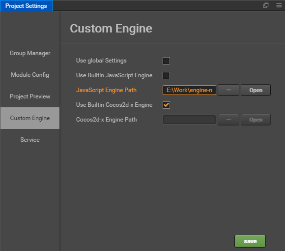
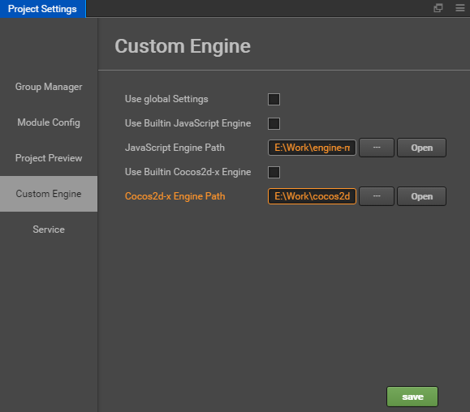

# Engine Customization Workflow

The game engine in Cocos Creator has three parts: JavaScript engine with ECS (entity-component system), Cocos2d-x (custom version of Cocos2d-x) and adapters. They are all open sourced on GitHub:

- [Creator-JS engine](https://github.com/cocos/cocos-engine)
- [Cocos2d-x engine](https://github.com/cocos/engine-native)

There are two adapters:

- `jsb-adapter`: <https://github.com/cocos-creator-packages/jsb-adapter>
- `mini-game-adapters`: <https://github.com/cocos-creator-packages/adapters/>

If you want to customize engine, we recommend that you follow the __fork workflow__ thru GitHub. Please read [GitHub help: Fork A Repo](https://help.github.com/articles/fork-a-repo) to learn the details.

In addition, depending on the different version of Creator, you have to make sure the engine repo is at the corresponding branch. For example:

- **master/develop** branch: Branch used for current latest version
- **vX.Y-release** branch: The branch that corresponds to the x.y version
- **vX.Y** branch: Same as the vX.Y-release branch, mainly used for development before the engine release
- **next** branch: Branch for large refactoring

It is generally recommended to use the same version of the vX.Y-release branch as the Creator used, and if it is not found, use the master branch.

## 1 Customize JavaScript Engine

If your concern is only Web based games, or what you want to change in the engine is not native API, related (for example UI and animation components), you just need to follow the workflow here:

### 1.1 Get JavaScript Engine Repository

If you only need to make some adjustments based on the current version, Then you can modify it based on the builtin engine of Cocos Creator. Click **Open App** in the upper right corner of the Creator Editor, and then copy the builtin **engine** directory to another local paths.


If you want to get the latest version that is currently under development, you need to first fork or clone the original version of the JavaScript engine from GitHub. You have to make sure the repo is at the corresponding branch. In this tutorial, we clone the engine repo to the path `E:/engine`.


### 1.2 Setup JS engine path

Use the **Custom Engine** tab of the **Project -> Project Settings** panel to set the path for the JavaScript engine you want to customize.



### 1.3 Install NPM Dependencies

__npm__ and __gulp__ are core components for engine building. These need to be installed. Example:

```bash
# Enter the engine path in the command line
cd E:/engine
# Install the gulp build tool
npm install -g gulp
# Install dependent modules
npm install
```

### 1.4 Change and Build

Now you can do whatever you want to do with the engine, once you finished:

```bash
# build engine
gulp build-dev
```

This command will generate a `bin` folder in the engine directory and compile the engine source into the `bin` directory.


> **Note**: if a `JavaScript heap out of memory` error occurs during compilation, you can use the following command to solve it:

```js
gulp build-dev --max-old-space-size=8192
```

## 2 Customize Cocos2d-x Engine

If you need to customize the engine functionality associated with the native platform. Besides updating JavaScript engine (so that your change can work with component system) you may also need to synchronize your change to the customized Cocos2d-x engine of Cocos Creator.

### 2.1 Get the Cocos2d-x Engine

If you only need to make some adjustments based on the current version, Then you can modify it based on the builtin Cocos2d-x engine of Cocos Creator. Same as get JavaScript engine: click **Open App** in the upper right corner of the Creator Editor, and then copy the builtin **cocos2d-x** directory to another local paths.

If you want to get the latest version that is currently under development, you need to download or clone it from the GitHub repo specified above. please make sure you get the cocos2d-x engine repo from the link on top of this article. Same as JavaScript engine, you need to make sure Cocos2d-x repo is on correct branch.

### 2.2 Initialize

Once cloned or downloaded, enter the Cocos2d-x engine path at the command line and run the following command.

> **Note**: if you copied the builtin **cocos2d-x** directory from the Creator editor, you can skip this step.

```bash
# Enter the Cocos2d-x engine path from the command line
cd E:/cocos2d-x
# Install NPM dependencies
npm install
# Initialize repo
gulp init
```

- If you get an error like the one below, please download the zip file manually. The reason for the error is that the version of a library that your python ships with is too low, but it is not very easy to upgrade. The simpler method is to download the zip file and manually put it under the Cocos2d-x engine repo and rename it to `v3-deps-54.zip` (you do not need to unzip the zip file.) and rerun `gulp init` again.

    ```bash
    > ==> Ready to download 'v3-deps-54.zip' from
    > 'https://github.com/cocos/cocos-engine-external/archive/v3-deps-54.zip'
    > Traceback (most recent call last):
    > ...
    > URLError: <urlopen error [SSL: TLSV1_ALERT_PROTOCOL_VERSION] tlsv1 alert protocol version (_ssl.c:590)>
    ```

- If you get an error like the one below, please manually download the zip file. Manually put it in the Cocos2d-x engine repository under the `tools/cocos2d-console` directory and rename it to `creator-console-2.zip` (without unzipping the zip file), and rerun `gulp init` again.

    ```bash
    > ==> Ready to download 'creator-console-2.zip' from
    > 'https://github.com/cocos2d/console-binary/archive/creator-console-2.zip'
    > Traceback (most recent call last):
    > ...
    > URLError: <urlopen error [SSL: TLSV1_ALERT_PROTOCOL_VERSION] tlsv1 alert protocol version (_ssl.c:590)>
    ```

- If you get an error like the one below, it's usually because the Cocos2d-x engine folder was downloaded, not cloned from GitHub. You can execute `git init` and then rerun `gulp init` again.

    ```bash
    fatal: not a git repository (or any of the parent directories): .git
    ```

### 2.3 Configure Custom Engine in Cocos Creator

Use the **Custom Engine** tab of the **Project -> Project Settings** panel to set the path to your customized cocos2d-x engine.



### 2.4 Build from Source

Next, you can start working on updating code for Cocos2d-x. If you want to use source code in your built project you can just choose `default` or `link` template in **Build** panel and compile from the source, no extra command line work needed.

### 2.5 Build simulator

To generate simulator to preview your changes:

```bash
# use cocos console to generate simulator
gulp gen-simulator
gulp update-simulator-config
```

**Attention**: If you need to debug your customized simulator on macOS, you must sign the Xcode project first. See [Build simulator](https://github.com/cocos/engine-native/blob/develop/README.md#git-user-attention) for details.


## 3 Customize adapter

Cocos Creator in order to achieve cross-platform, in the JavaScript layer needs to do a number of different platform adaptation work. These efforts include:

- Suitable for different platforms with BOM and DOM running environment
- Some engine-level adaptation  

The current adaptation layer consists of two parts:

- `jsb-adapter`: Suitable for native platforms
- `mini-game-adapters`: Suitable for Mini Games

### 3.1 Get adapter

If you only need to make some adjustments based on the current version, Then you can modify it based on the builtin adapter engine of Cocos Creator. Same as get JavaScript engine: click **Open App** in the upper right corner of the Creator Editor, and the `jsb-adapter` and `adapters` directories can be found within the `resources/builtin` directory.

If you want to get the latest version of the official developing, you need to download it from the GitHub repo specified above, Then replace it with the `resources/builtin` directory of the program installation path. Same as JavaScript engine, you need to make sure adapter repo is on correct branch.

### 3.2 Customize jsb-adapter

In the `jsb-adapter` directory, the following two directory structures are included:

- `builtin`: Adapt the runtime of the native platform
- `engine`: Adapt some APIs of the engine level

The `builtin` section also includes a number of related JSB interfaces, such as openGL, audioEngine, in addition to adapting the BOM and DOM runtime environment.

We made some adjustments and optimizations in different versions of Creator. Please reference to the different guide below according to the current Creator version you are using.

#### 3.2.1 Customization before Creator v2.0.5

Customization of the `engine` section only requires modification of the code.<br>
Customization of the `builtin` section requires installing the dependencies first, please execute them on the command line:

```bash
# Enter the jsb-adapter/builtin engine path from the command line
cd jsb-adapter/builtin
# Install the gulp build tool
npm install -g gulp
# Install dependent modules
npm install
```

Next, you can customize the code in the `builtin` section. After the modification is complete, continue to execute it on the command line:

```bash
# in jsb-adapter/builtin folder
gulp
```

When the command completes, a new `jsb-builtin.js` file is generated in the `jsb-adapter/builtin/dist` directory.

After customizing the `jsb-adapter`, the editor will copy the `jsb-builtin.js` file and the `engine` directory together to the `jsb-adapter` folder in the project when you **build** the native platform in the **Build** panel.

#### 3.2.2 Customization on Creator v2.0.5 and v2.0.6

First of all, you should install the dependencies. Please execute them on the command line:

```bash
# Enter the jsb-adapter engine path from the command line
cd jsb-adapter/
# Install the gulp build tool
npm install -g gulp
# Install dependent modules
npm install
```

Next, you can customize the code in **jsb-adapter**. After the modification is complete, continue to execute it on the command line:

```bash
# in jsb-adapter folder
gulp
```

The `gulp` command will pack all the code in **builtin** into file `jsb-builtin.js`, and translate code in engine from ES6 to ES5. All the target files are put into the **dist** folder.

After customizing the `jsb-adapter`, the editor will copy files in **dist** folder to the **jsb-adapter** folder in the project when you **build** the native platform in the **Build** panel.

#### 3.2.3 Customization after Creator v2.0.7 (v2.0.7 included)

After Creator v2.0.7, Jsb-adapter abandoned the cumbersome manual compilation operation. You can directly modify the source code in directories **builtin** and **engine**. When the modification is complete, open the editor and the editor will automatically compile this part of the source code at startup.

### 3.3 Customize Mini Games adapter

The adaptation layer code for the Mini Games is located in the `adapters` in the `resources/builtin` directory.

- The customization of this part of the code does not require any compilation operations.  
- Engine-level adaptation work, please complete in the appropriate engine directory.

If you want to learn more about mini game adapter, please refer to [Mini Game Documentation](https://developers.weixin.qq.com/minigame/en/dev/guide/best-practice/adapter.html) for details.

## 4 JSB Workflow (JavaScript Binding)

If you need to modify the JavaScript interface provided by the Cocos2d-x engine, you should complete the JSB binding.

Creator >= 1.7, please refer to:

- [JSB 2.0 Binding Tutorial](JSB2.0-learning.md).

Creator <= 1.6, please refer to:

- [Script binding in Cocos [cn]](https://zhuanlan.zhihu.com/p/20525026)
- [Automatic binding in Cocos [cn]](https://zhuanlan.zhihu.com/p/20525109)
