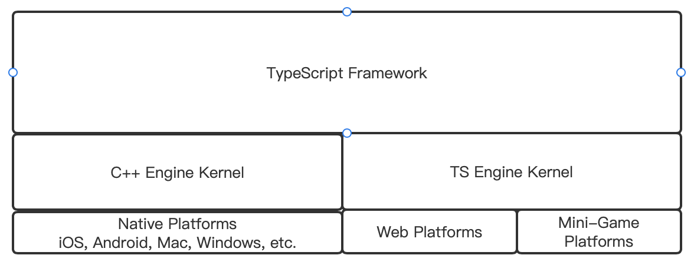
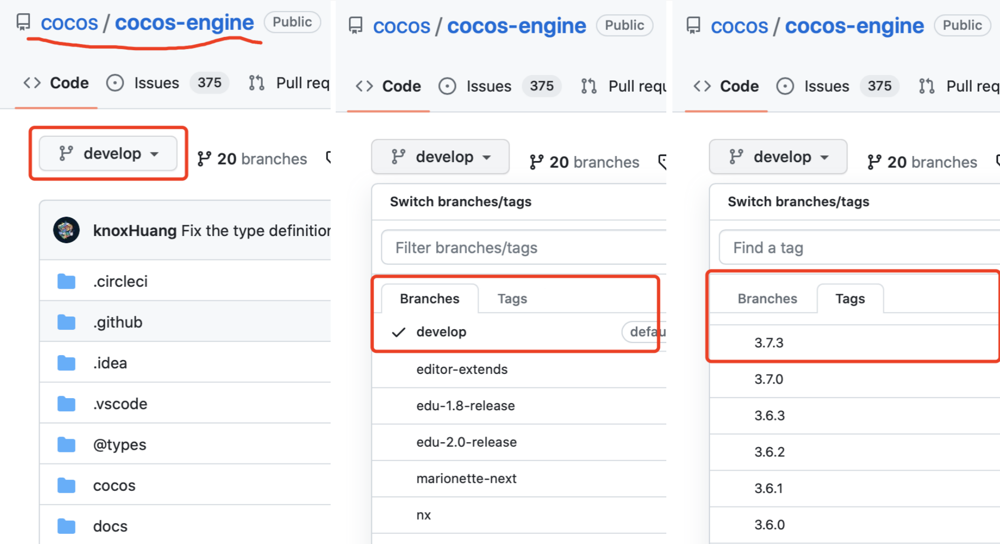
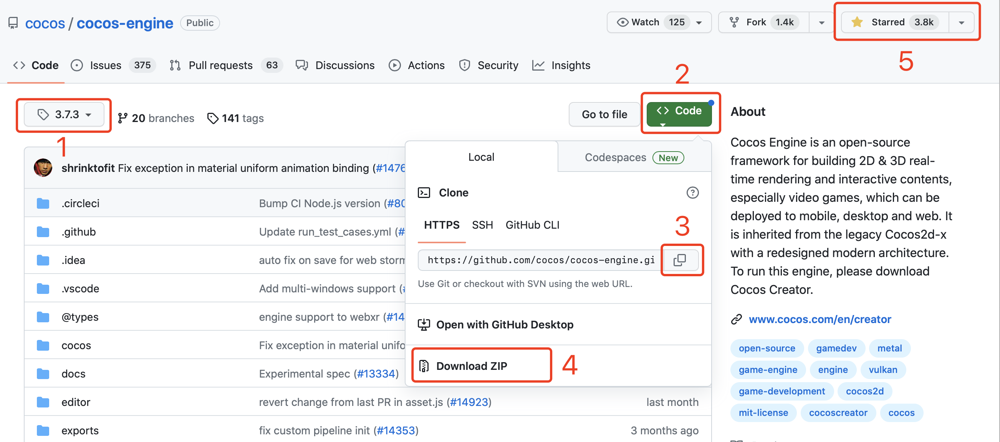
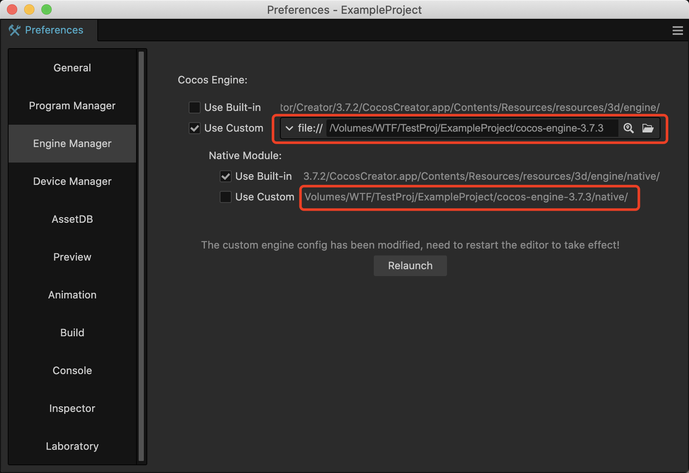
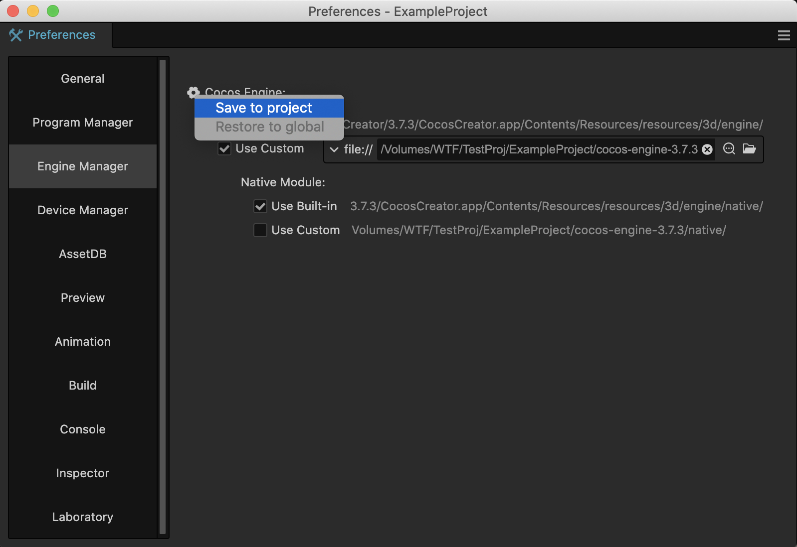
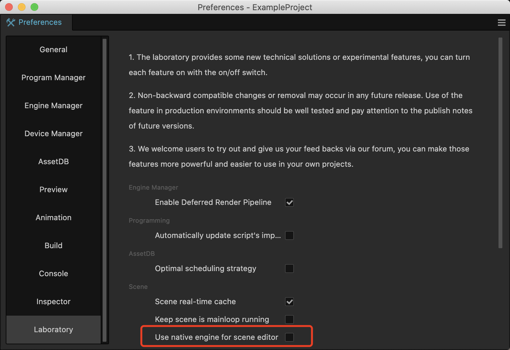
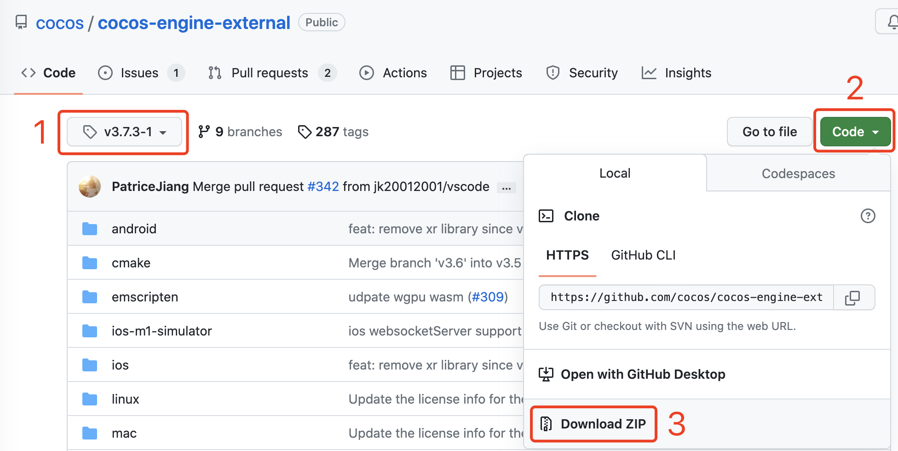
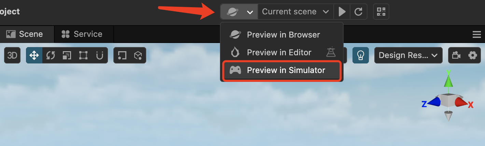

# Engine Customization Workflow

Cocos Creator has two engine kernels: C++ kernel and TypeScript kernel. The C++ kernel is used for native platforms, while the TypeScript kernel is used for web and mini-game platforms. On top of the engine kernels is the engine framework layer written in TypeScript, which aims to unify the differences between the two kernels and make development more convenient.



## Getting the Engine Source Code



### 1. Accessing the Cocos Engine Repository

Cocos is an open-source engine, and you can obtain different versions of the engine source code from the official Cocos Engine repository. The repository links are as follows:

- cocos/cocos-engine：[GitHub](https://github.com/cocos/cocos-engine/)

Open the repository homepage, and you will see the content shown in the left sub-figure of the above image. You can decide which version to use based on your requirements.

### 2. Selecting a Branch

If you want to use the latest branch, select the "develop" branch as shown in the middle sub-figure of the image.

>**Note:** This branch is the latest in-developing branch and may not guarantee stability.

### Selecting a Tag

If you want to use a tag (a stable branch) corresponding to a specific version of Cocos Creator, follow the steps shown in the right sub-figure of the image. Switch to the "Tags" tab and select the desired version. For example, if you are using Cocos Creator 3.7.3, select version 3.7.3.

>**Note:** Different versions of Cocos Creator require corresponding engine branches or tags. Make sure the versions match.

### 3. Clone/Download



As shown in the image above, after selecting the appropriate branch or tag, you will be in the corresponding repository (1).

Click on the "Code" button on the right (2) to open the code-getting panel.

You can either copy the repository link (3) and clone it to local using Git, or choose **Download ZIP**(4) to download the source code as a ZIP file and extract it in your disk.

>Don't forget to give a star to the Cocos Engine repository in the top right corner (5). Thank you!

## Configuring Development Environment

### 1. Placing the Engine Source Code in a Specified Directory

Obtain the specific version of cocos-engine source code from the Cocos Engine repository according to your project's needs and place it in a suitable directory.

- If the custom engine is only used for a specific project, it is recommended to put it in the project directory.
- If multiple projects will share the same custom engine, place it in a suitable shared directory based on your project management approach.

### 2. Installing Compilation Dependencies

The compilation dependencies require `NodeJS`. Make sure you have installed `NodeJS v12.0` or above on your computer. If not, please download and install it from [https://nodejs.org/](https://nodejs.org/).

After installation, navigate to the root directory of the custom engine and execute the following commands:

```bash
# Install gulp
npm install -g gulp
# Install the required modules
npm install
# Compile some data, including debug, infos and .d.ts
gulp build
```

### 3. Modifying the Engine Path

Use the **Cocos Creator -> Preferences -> Engine Manager** tab to set the path to the engine source code. Note that **you need to restart the editor after modifying the engine path**.



#### Specifying the TypeScript Engine

By default, the `Use Built-in` option is selected, indicating that the built-in engine of Cocos Creator is being used. To use the custom engine, switch to the `Use Custom` tab and specify the path to the engine source code root directory.

#### Specifying the Native（C++）Engine

If you need to customize the engine functionality related to native platforms, you also need to check the `Use Custom` option under `Native Module`. It will automatically recognize the `native` folder under the custom engine's root directory as the path, which cannot be changed.

#### Modifying the Storage Location



By default, modifications to the engine path are saved as global configurations, which will affect all projects using the current version of Cocos Creator.

Hover your mouse over the "Cocos Engine" text, and a settings button will appear in front of the text. Click on the button to select a storage location.

#### Relaunching Cocos Creator

After modifying the engine path, you need to restart Cocos Creator editor for the changes to take effect. You can either close Cocos Creator and open it again or click on the Relaunch button on the panel.

**Note:** Once the custom engine is in working, the scene editor in Cocos Creator will also use the custom engine for rendering. By default, it uses the TypeScript kernel. If you want the editor to use the native engine for rendering as well, you need to enable the `Use native engine for scene editor` option in the **Preferences -> Laboratory** panel.



## Modifying the TypeScript Engine

If you only need to customize the engine functionality for web and mini-game platforms or modify the TypeScript modules of the engine (such as the UI system, animation system, etc.), you only need to compile the engine by clicking **Developer -> Compile the Engine** on the menu bar of Cocos Creator.


This command will generate a bin folder under the engine directory and compile the engine source code there.

## Modifying the Native (C++) Engine

If you need to customize the engine functionality related to native platforms, in addition to modifying the TypeScript code, you may also need to modify the C++ code.

To ensure that the native code can be compiled properly, make sure that the `Use Custom` option in the `Native Module` is selected.

### Downloading external

The compilation of the Cocos native engine depends on the libraries in `cocos-engine/native/external/`. These libraries are several hundred megabytes in size and are not included by default in the source code package. You can obtain them in the following three ways:

**The First Way:** Use git command-line

```ts
  cd cocos-engine/native
  git clone https://github.com/cocos/cocos-engine-external external
  cd external
  git checkout -b branch_name tag 
```

- branch_name：The new branch name
- tag：The tag name corresponding to the third-party library. You can get it from the `checkout` field in `cocos-engine/native/external-config.json` file.

> Example: If we want to use version 3.7.1-1, it can be written as `git checkout -b 3.7.3-1 3.7.3-1`

**The Second Way:** Use gulp

The following shell will only download the third-party libraries corresponding to the specific tag.

```ts
  cd cocos-engine/native
  npm install
  gulp init
```

> Whenever the used tag changes, you need to download it again. It requires downloading several hundred megabytes of content each time.

**The Third Way:** Download the ZIP package

If, for some reason, you cannot download the `external` source code package using `NodeJS` and `git commands`, you can directly download it from the [cocos-engine-external repository](https://github.com/cocos/cocos-engine-external) by following these steps.



1. Select the corresponding tag. You can check which one to use from the `checkout` field of `cocos-engine/native/external-config.json`.
2. Click the **Code** button on the right to open the code-getting panel.
3. Click the **Download ZIP** button to download the source code as a ZIP package.
4. Exact the package, rename it to `external`, and place it in the  `cocos-engine/native` folder.

> **Note:** The version of `external` and `cocos-engine` must match, otherwise, it may result in compilation errors.

### Compiling in Cocos Creator

After modifying the engine, open the **Build** panel, click **Build**, and after the build is complete, click **Make** to Compile.

### Compiling in an IDE

After configuring the custom engine path for the first time, you need to click the `Build` button in the **Build** panel to synchronize the relevant configuration to your IDE (such as Xcode, Android Studio, Visual Studio, etc.).

The engine code used by the IDE project will then reference to the custom engine.

From now on, each time when you modify the native engine code, you can compile it using IDE directly.

## Rebuild the Native Engine Simulator

Cocos Creator provides a feature to preview in a simulator based on the native engine.



### Modified TypeScript Engine

If you are using custom TypeScript engine, the native simulator will attempt to load the TS engine modules under `custom-engine-path/native/simulator/`.

The first time you launch the simulator in this situation, you need to click **Developer-> Rebuild Native Simulator Engine** in the top menu bar, otherwise, the TS engine modules will not be loaded successfully.

### Modified Native(C++) Engine

If you have selected to use a custom native engine, Cocos Creator will launch the simulator located at `custom-engine-path/native/simulator/` when previewing in simulator.

To avoid a large installation package, Cocos Creator excludes the native simulator project before publishing. Therefore, you need to follow these steps to configure the environment and rebuild it,otherwise, the simulator won't start.

### Installing and Configuring CMake

>Cocos Creator comes with its own CMake and has configured the paths, so you don't need to do additional configuration when building, compiling, and publishing your project.

The compilation of the native simulator is not part of the build process, so you need to configure the CMake environment yourself.

Since there are so many differences among different system, platforms, and versions, please refer to the [CMake official website](https://cmake.org/install/) for installing CMake and configuring the system environment variables.

### Compilation

After configuring `CMake`, navigate to the `custom-engine-path/native/` folder and execute the following commands.

```bash
# Install the required modules
npm install
# compile and generate native simulator
gulp gen-simulator
```

After the compilation is complete, a simulator project and an executable application will be generated under the `custom-engine-path/native/simulator/` directory. You can then run the **Preview in Simulator**.

Once the native simulator is successfully compiled and generated, if you only make changes to the TypeScript part, you only need to click **Developer->Rebuild the Native Simulator Engine** to make it in effect.
