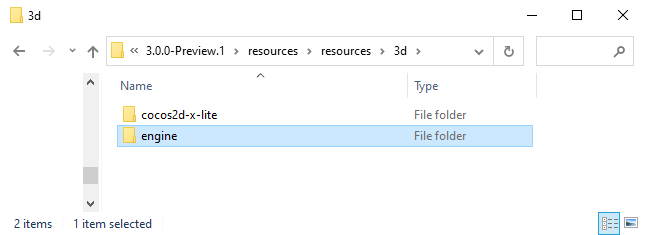
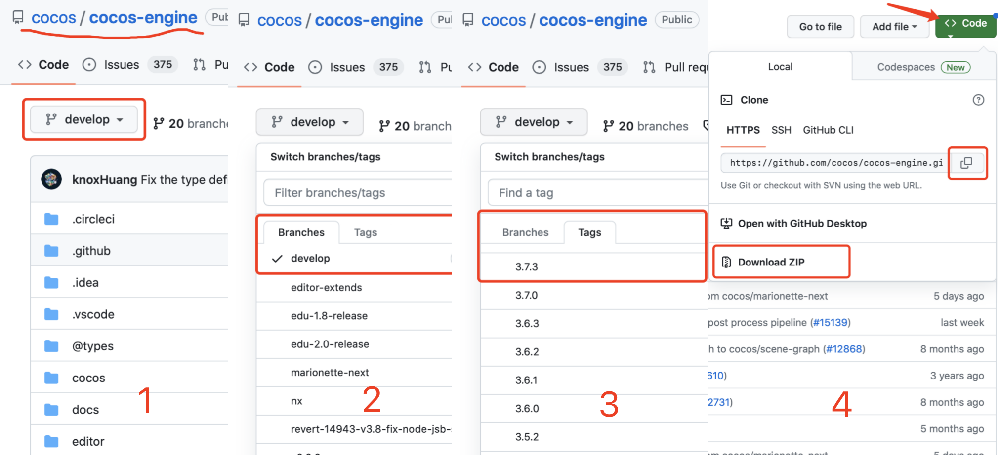
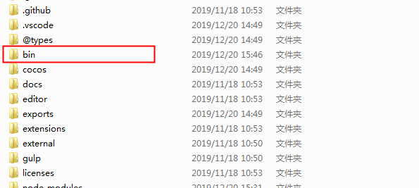
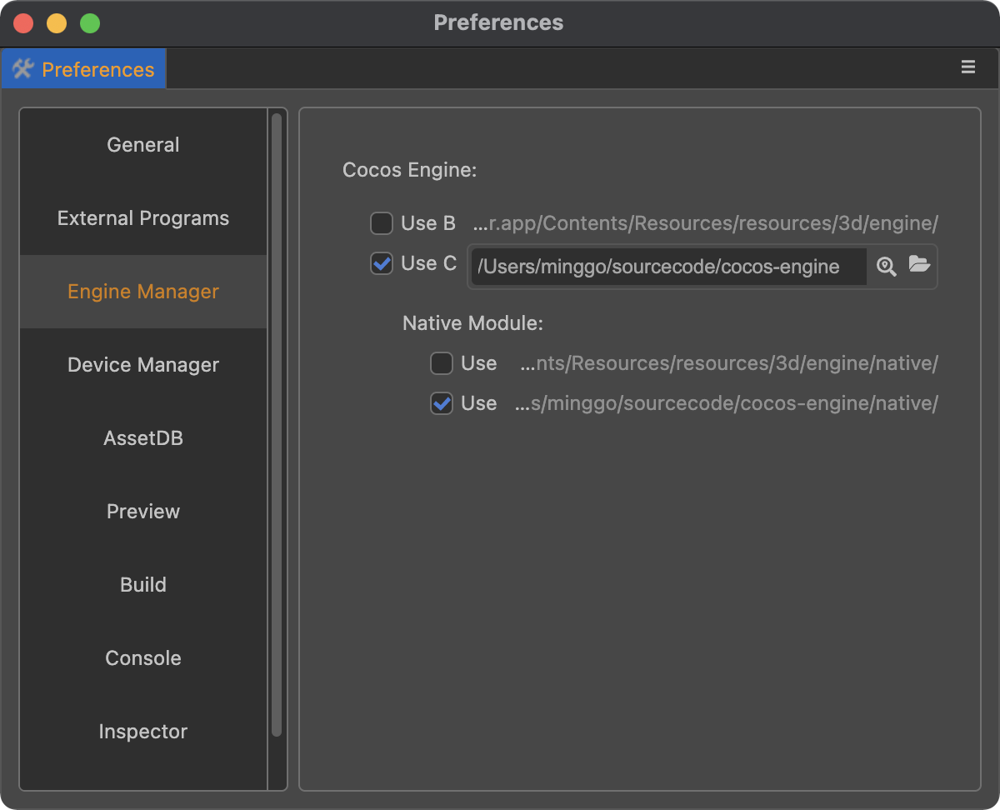

# Engine Customization Workflow

The engine part of Cocos Creator 3.x includes **TypeScript** and **engine-native**. The engine is all open-source on GitHub. They are in the same Github repo. The address is:

- [cocos engine](https://github.com/cocos/cocos-engine/)

It is recommended to maintain custom code using the GitHub's Fork workflow. This workflow allows developers to easily update custom engine parts when the engine is upgraded in the future. This workflow is described in the [Fork a repo](https://help.github.com/articles/fork-a-repo) documentation. For more GitHub-related workflows, please refer to the [GitHub Help](https://help.github.com).

Also, depending on the version of Creator, developers may need to switch to a different engine branch, it is recommended to use the same branch that corresponds to the version of Creator being used.

## 1 Customize the TypeScript engine

If you only need to customize the engine functionality of the web version of the game, or if you only need to modify the pure TypeScript layer logic (e.g.: UI system, animation system), simply modify the TypeScript engine by following the procedure below:

### 1.1 Get the TypeScript engine

It is possible to modify the engine based on the one built in Cocos Creator 3.x to make some adjustments based on the current version. Click the **App** button at the top right of the editor, and then copy the built-in `engine` directory to another local path.



To get the latest official version in development, fork or clone the original version of the TypeScript engine from GitHub (see above), and switch the corresponding branch of the TypeScript engine according to the version of Creator before using it. Once downloaded, store it to any local path.



### 1.2 Modify the TypeScript Engine Path

Set the path of the TypeScript engine to be customized via the **Engine Manager** tab of **Cocos Creator -> Preferences**.


> **Note**: it is necessary to restart Creator after modifying the engine path.

### 1.3 Install Compilation Dependencies

```bash
### Go to the engine path in the command line
cd E:/engine
# Install the gulp build tool
npm install -g gulp
# Install dependent modules
npm install
# Compile some data, including 'debug infos' and '.d.ts'
gulp build
```

> **Note**: the gulp build tool is required to generate debug infos.

### 1.4 Make changes and compile

Next, customize the engine modifications and then click **Developer -> Compile the engine** in the Cocos Creator editor menu bar to compile.


This command will generate a `bin` folder under the engine directory and compile the engine source code under the `bin` directory.



## 2 Customize the engine-native Engine

Since v3.5.0, engine-native engine is merged into and TypeScript engine. But you can custom them separately.

### 2.1 Get the engine-native Engine

The engine-native engine and TypeScript engine are merged. After cloning TypeScript engine, engine-native engine is in `cocos-engine/native`.

As 3rd libraries is hold in another github repo. So should download the 3rd libraries separately. There are two ways to download it:
- Clone the 3rd libraries github repo, use this way can sync it easily in future. We suggest using this way:
    ```bash
    cd cocos-engine/native
    git clone https://github.com/cocos/cocos-engine-external external
    git checkout -b branch_name tag
    ```
    `tag` is the value of `checkout` which is defined in `cocos-engine/native/external-config.json`.
- Use script provided by engine to download the zip file of the 3rd libraries with the specific `tag`. If `tag` value is changed, then should download it again. The size of the zip file is hundreds of mega bytes.
    ```bash
    cd cocos-engine/native
    npm install
    gulp init
    ```

### 2.2 Initialization

Since engine-native is merged into engine. So it is the same as TypeScript engine initialization.

### 2.3 Configure a custom engine-native in Cocos Creator 3.x

Set the path to the **engine-native** engine to be customized via the **Engine Manager** tab of **Cocos Creator -> Preferences**.



### 2.4 Modify the Engine

It is possible to customize the **engine-native** engine. Since the code is only compiled during the **build release** process, directly open the **Build** panel after modifying the engine and select the **link** template to build and compile.

### 2.5 Customizing the native engine simulator

To prevent the package from becoming too large, Creator excludes the native engine simulator related projects at release time, if it is necessary to use a custom native simulator, recompile it by following the steps below:

1. Refer to the [CMake Official Documentation](https://cmake.org/install/) to install CMake and configure system environment variables.

2. Compile the native simulator engine, which can be divided into TypeScript and C++:

    - If the developer is customizing the **TypeScript** part, click **Developer -> Rebuild Native Engine** in the top menu bar of Creator after the customization is finished.

    - If the developer is customizing the **C++** part, after the customization is completed, execute the following commands in the `cocos-engine/native` directory in order.

        ```bash
        # Install the dependent modules
        npm install
        # Generate native simulator-related files
        gulp gen-simulator
        ```

        Once executed, a simulator project and simulator executable will be generated under the `cocos-engine/native/simulator` path, and the native simulator will be ready to run.
