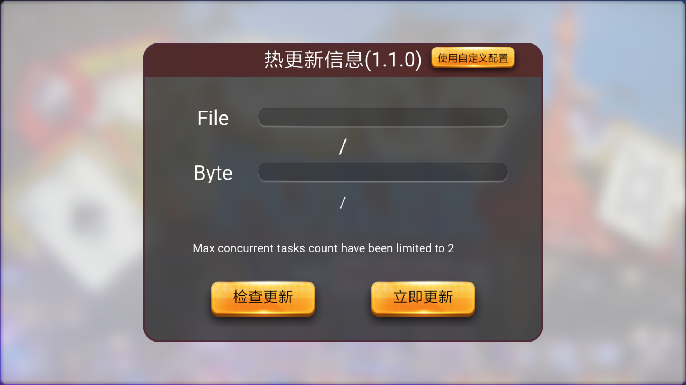
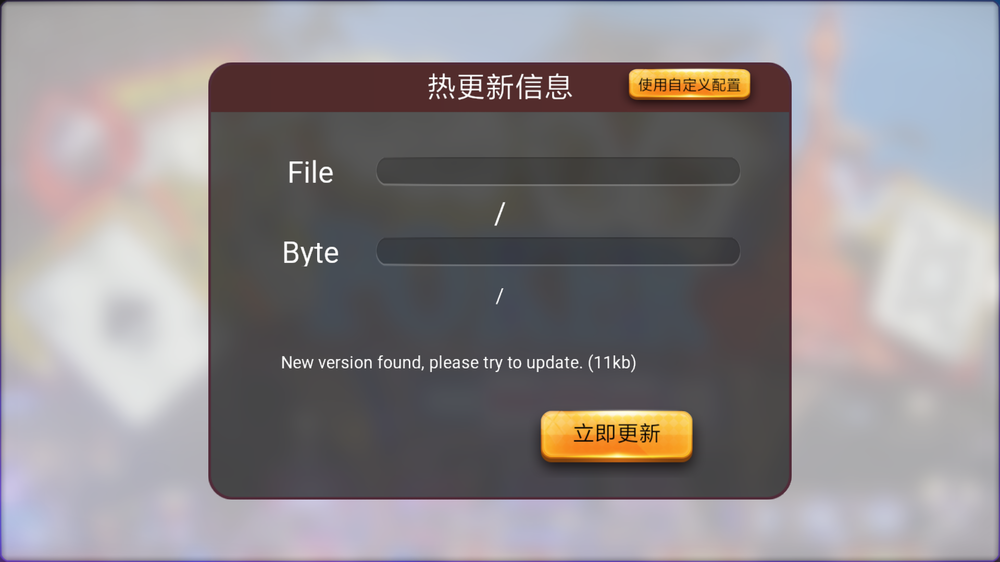

# Assets Hot Update Tutorial

## Preface

In current Cocos Creator version, assets hot update workflow has not been fully integrated into the editor. But the engine itself has complete support for hot update system, so with some of the external script and tool the workflow is complete.

The sample project for this document is available from [Github Repo](https://github.com/cocos-creator/tutorial-hot-update/tree/master).


## Usage scenarios and design ideas

Game developers are very familiar with the pattern that the game has been released in app market but each time user launch the game it will automatically look for updates from the server, to keep the client always updated. Of course, there are some other usage scenarios for hot update, but are not related to what we discuss here. We will mainly discuss how to implement hot update system in Cocos Creator.

Hot update in Cocos Creator comes mainly from the `AssetsManager` module in the Cocos engine. It has a very important feature:

**Server and client both keep a full list of the game asset (manifest)**, during hot update process, by comparing server and client asset manifest, the client should know what to download to get the latest content. This can naturally support cross-version updates, such as when client version is A, remote version is C, then we can directly update the assets from A to C. We do not need to generate A to B and B to C update package. Therefore, when we push new asset version to server, we can save new version files discreately on server, and during update the client will download each file needed seprately.

Please be aware that **hot update system is for native games only**, since Web game would always request assets from web server. So `AssetsManager` class exists only in the jsb namespace, please check runtime environment before implement these API.

## Manifest file

For different versions of file-level differences, AssetsManager uses a manifest file for version control. The client and server manifest files each contains an asset file list and version for each file. This allows comparing the version of each file to determine whether a file should be downloaded.

The manifest file contains the following important information:

1. The root path of remote assets
2. Remote manifest file url
3. Remote version file url (optionally)
4. Major version number
5. File list: index of file pathes, including file version information. We recommend using the file md5 as the version number
6. List of search path.

The version file can be part of the contents of the manifest file and do not contain a list of files. But the manifest file may be large, each time client need to download the whole file for checking version update. So developer can provide a very small version file for version check only. `AssetsManager` will first check the version number provided by the version file to determine if it is necessary to continue downloading the manifest file and update it.

## Implement hot update in the Cocos Creator project

In this tutorial, we will provide a hot update workflow for Cocos Creator project. We have also opened `Downloader` JavaScript interface in cocos2d-x engine, so users are free to develop their own hot update solution.

Before starting to explain in detail, developers can take a look at the directory structure of published native version of any game in Cocos Creator. The Creator published directory structure and cocos2d-x JS project directory is exactly the same. For Cocos Creator, engine scripts will be packaged into the `src` directory, and other assets will be exported to the `assets` directory.

Based on this project structure, the hot update process in this tutorial is simple:

1. Generate the local manifest file based on the `assets` and `src` directories in the native published directory.
2. Create a component script to be responsible for the hot update logic.
3. After release of the game, if you need to update the version, you need to generate a set of remote asset versions, including the `assets` directory, `src` directory and manifest file. Then deploy these files to your server.
4. When the hot update script detects that the server manifest version does not match local version, the hot update starts

To show the hot update process, the example project used in the tutorial has a full version with 1.1.0 information saved in the `remote-assets` directory, and the default build of the project generates version 1.0.0. At the beginning of the game it will check whether there is a version of the remote update, if you find a remote version the user is prompted to update. When update is complete, the user re-enter the game and see the version 1.1.0 information.


**Note:** the project contains `remove-assets` is for debug mode, the developer must use the debug mode when building the test project, otherwise the release mode jsc file priority will be higher than `remove-assets` in the assets and cause the script to fail.

### Use the version generator to generate the manifest file

In the example project provided, [version_generator.js](https://github.com/cocos-creator/tutorial-hot-update/blob/master/version_generator.js) is a script file, which is a Nodejs script for generating the manifest file. Use it as follows:

```bash
> node version_generator.js -v 1.0.0 -u http://your-server-address/tutorial-hot-update/remote-assets/ -s native/package/ -d assets/
```

The following is a description of the parameters:

- `-v` Specifies the major version number of the manifest file.
- `-u` Specifies the url of the server remote package, which needs to be the same as the remote package url of the manifest file in the original release version, otherwise the update can not be detected.
- `-s` local native published directory relative to the current path.
- `-d` the path of the output manifest file.

### Hot update component script

In the example project, the implementation of the hot update component is located at [assets/hotupdate/HotUpdate.ts](https://github.com/cocos-creator/tutorial-hot-update/blob/master/assets/hotupdate/HotUpdate.ts), the developer can refer to this implementation, but also free to modify according to their own needs.

In addition, the sample project is also equipped with a `Scene/Canvas/update` node for prompting to update and display the progress of the update.



### Deploy to remote server

In order to allow the game to detect remote versions, it is possible to simulate a remote server on the machine, there are a variety of server solutions (such as [SimpleHTTPServer](https://docs.python.org/2/library/simplehttpserver.html) for Python). We will not discuss detail here, developers can use their own prefered way. Once the remote server is up, modify the following places to allow the game to successfully find the remote package:

1. `assets/project.manifest`: `packageUrl`, `remoteManifestUrl` and `remoteVersionUrl` in the client manifest file of the game
2. `remote-assets/project.manifest`: `packageUrl`, `remoteManifestUrl` and `remoteVersionUrl` in the manifest file of the remote package
3. `remote-assets/version.manifest`: `packageUrl`, `remoteManifestUrl` and `remoteVersionUrl` in the remote package's version file

### Publish the original version

After downloading the sample project, use Cocos Creator to open the project directly. Open **Build** panel, build for native platform, choose Windows / Mac as the target to test.

**Note:**
- 1. Do not check MD5 Cache when building, otherwise it will cause the hot update to be invalid.
- 2. Make sure to import editor plugin hot-update into the extensions folder (the demo project has imported the plugin)

The editor plugin automatically adds the search path logic and fix code to `main.js` everytime we build a successful native version:

```js
// Add the following code at the beginning of main.js
(function () {
    if (typeof window.jsb === 'object') {
        var hotUpdateSearchPaths = localStorage.getItem('HotUpdateSearchPaths');
        if (hotUpdateSearchPaths) {
            var paths = JSON.parse(hotUpdateSearchPaths);
            jsb.fileUtils.setSearchPaths(paths);

            var fileList = [];
            var storagePath = paths[0] || '';
            var tempPath = storagePath + '_temp/';
            var baseOffset = tempPath.length;

            if (jsb.fileUtils.isDirectoryExist(tempPath) && !jsb.fileUtils.isFileExist(tempPath + 'project.manifest.temp')) {
                jsb.fileUtils.listFilesRecursively(tempPath, fileList);
                fileList.forEach(srcPath => {
                    var relativePath = srcPath.substr(baseOffset);
                    var dstPath = storagePath + relativePath;

                    if (srcPath[srcPath.length] == '/') {
                        cc.fileUtils.createDirectory(dstPath)
                    }
                    else {
                        if (cc.fileUtils.isFileExist(dstPath)) {
                            cc.fileUtils.removeFile(dstPath)
                        }
                        cc.fileUtils.renameFile(srcPath, dstPath);
                    }
                })
                cc.fileUtils.removeDirectory(tempPath);
            }
        }
    }
})();
```

This step must be done because the essence of the hot update is to replace the files in the original game package with a remotely downloaded file. Cocos2d-x search path just meet this demand, it can be used to specify the remote package download url as the default search path, so the game will run the process of downloading a good remote version. In addition, the search path is used in the last update process using `localStorage` (which conforms to the WEB standard [Local Storage API](https://developer.mozilla.org/en/docs/Web/API/Window/localStorage)) to store on the user's machine. The `HotUpdateSearchPaths` key is specified in `HotUpdate.js`, and the name used for the save and read process must match.

In addition, if encountering this warning during the opening of the project, ignore: `loader for [.manifest] not exists!`.

### Run the example project

If everything is alright, run the native version of the sample project. A new version will be detected, suggesting that the update will automatically restart the game after the game, then enter the table scene.



## Conclusion

The above is a hot update solution, Cocos Creator in the future version to provide more mature hot update process, directly integrated into the editor. Of course, the underlying Downloader API will also be provided to allow users to freely implement their own hot update scheme and to build a complete visual workflow in the editor through the plug-in mechanism. This tutorial and sample project is for your reference and we encourage developers to customize their own workflows. If you have questions and communication also welcome feedback to [Forum](https://discuss.cocos2d-x.org/c/creator).

## Next Step

[AssetsManager Document](hot-update-manager.md)
