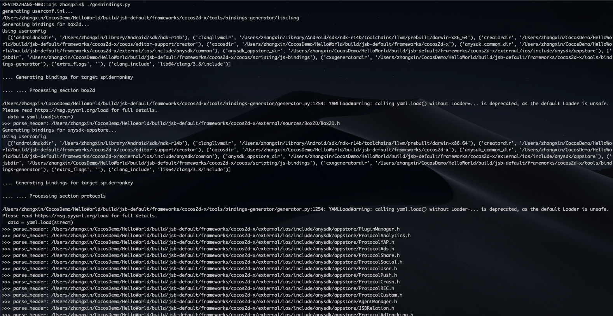
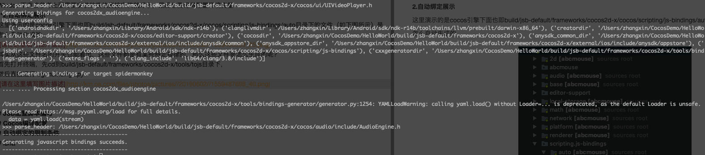
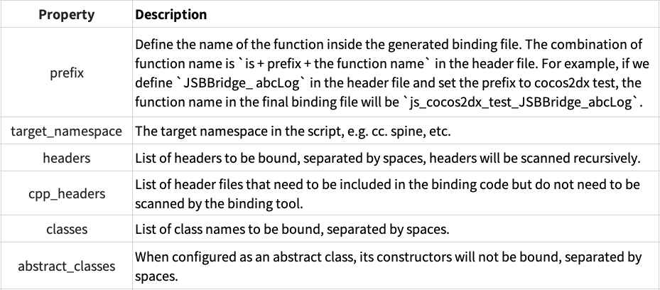

# Using JSB Auto Binding

> This article is republished from [Tencent Online Education Department Technical Blog](https://oedx.github.io/2019/07/03/cocos-creator-js-binding-auto/)<br>
> Author: kevinxzhang

Creator provides `native.reflection.callStaticMethod` method to support the interface of calling Native side (Android/iOS/Mac) directly from TypeScript side, but after much practice, we found that the performance of this interface is very low under a lot of frequent calls, especially on Android side, such as calling the interface implemented on Native side for printing logs. And it is easy to cause some native crashes, such as `local reference table overflow` and other problems. Throughout the implementation of Cocos native code, basically all interface methods are implemented based on the JSB approach, so this article mainly explains the JSB auto-binding logic to help you quickly implement the `callStaticMethod` to JSB transformation process.

## Background

For those who have used Cocos Creator (or CC for convenience), `native.reflection.callStaticMethod` is certainly no stranger to providing the ability to call the Native side from the TypeScript side. For example, if we want to call the Native implementation of the log printing and persistence interface, we can easily do so in JavaScript as follows:

```javascript
import {NATIVE} from 'cc/env';

if (NATIVE && sys.os == sys.OS.IOS) {
    msg = this.buffer_string + '\n[cclog][' + clock + '][' + tag + ']' + msg;
    native.reflection.callStaticMethod("ABCLogService", "log:module:level:", msg, 'cclog', level);
    return;
} else if (NATIVE && sys.os == sys.OS.ANDROID) {
    msg = this.buffer_string + '\n[cclog][' + clock + '][' + tag + ']' + msg;
    native.reflection.callStaticMethod("com/example/test/CommonUtils", "log", "(ILjava/lang/String;Ljava/lang/String;)V", level, 'cclog', msg);
    return;
}
```

It is very simple to use and can be called cross-platform in one line of code, a little look at its implementation shows that the C++ layer is implemented in the Android side by way of jni, and the iOS side is called dynamically by way of runtime. However, in order to take into account the generality and support all methods, the Android side does not have a caching mechanism for jni-related objects, which can lead to serious performance problems when a large number of calls are made in a short period of time. Previously we encountered more cases is printing log in the downloader, some application scenarios trigger a large number of download operations in a short period of time, resulting in `local reference table overflow` crashes, or even interface lag on low-end machines that cannot be loaded out.

Fixing this problem requires a JSB modification for log calls, along with a caching mechanism related to jni to optimize performance. jSB binding is simply the process of converting objects between the C++ and script layers, and forwarding script layer function calls to the C++ layer.

JSB binding is usually done in two ways: **manual binding** and **automatic binding**. The manual binding method can be found in the [Using JSB Manual Binding](jsb-manual-binding.md) documentation.
- The advantage of manual binding is that it is flexible and customizable; the disadvantage is the necessity to write all the code yourself, especially the conversion between C++ type and TypeScript type, which can easily lead to memory leaks and some pointers or objects not being freed.
- Auto-binding will save a lot of trouble, which directly generates the relevant code through a script in one click, and subsequently, if there are new codes or changes, simply re-execute the script once. Auto-binding is perfect for cases where it is not necessary to do strong customization and then need to finish JSB quickly. The following is a step-by-step explanation of how to implement automatic JSB binding.

## Environment Configuration and Auto-Binding Demonstration

### Environment Configuration

Auto-binding, to put it simply, is a matter of executing a python script to automatically generate the corresponding `.cpp` and `.h` files. First,make sure that the computer has a python runtime environment. Example of how to install it on a Mac:

1. To install python 3.0, download the installation package from the python website:

    <https://www.python.org/downloads/release/python-398/>

2. Install some of the python dependencies via pip3:

    ```shell
    sudo pip3 install pyyaml==5.4.1
    sudo pip3 install Cheetah3
    ```

3. Install the NDK, which is definitely essential when it comes to C++. It is recommended to install the [Android NDK r21e](https://github.com/android/ndk/wiki/Unsupported-Downloads#r16b) version, set the `PYTH_profile` in `~/.bash_ profile`, then set `PYTHON_ROOT` and `NDK_ROOT` in `~/.bash_profile`, because these two environment variables will be used directly in the python file that will be executed later.

    ```shell
    export NDK_ROOT=/Users/kevin/android-ndk-r21e
    export PYTHON_BIN=python3
    ```

In Windows, directly install the modules by referring to the above, and remember to configure the environment variables at the end.

### Auto-Binding Demonstration

Here's a demonstration of how the files under the cocos engine, i.e. the **cocos/bindings/auto** directory (shown below) are automatically generate:


In fact, the beginning of these file names that there are some specific rules for naming these files, so how are these files generated? First, open a terminal, `cd` to the **tools/tojs** directory, and then run `./genbindings.py`.



After about a minute or so of running, the following message will appear, indicating that it has been successfully generated:



After the above steps, all the files under **cocos/bindings/auto** will be automatically generated, which is very convenient.

The following is an example of how the TypeScript layer prints logs by calling the Native layer log method through JSB, and how to implement the auto-binding tool to generate the corresponding auto-binding files based on the C++ code written.

## Writing the C++ layer implementation

C++ is the bridge between TypeScript and Native layers. To implement JSB calls, the first step is to prepare the header files and implementation for the C++ layer, here we create a `test` folder in `cocos` directory to store the relevant files:


`ABCJSBBridge.h`, declares an `abcLog` function for the TypeScript layer to call the logging, and because the logging method will certainly be used in many places in the TypeScript layer, a singleton pattern is used here, providing `getInstance()` to get the current instance of the class.

```cpp
#pragma once

#include <string>

namespace abc
{
    class JSBBridge
    {
    public:
        void abcLog(const std::string& msg);
        /**
        * Returns a shared instance of the director.
        * @js _getInstance
        */
        static JSBBridge* getInstance();

        /** @private */
        JSBBridge();
        /** @private */
        ~JSBBridge();
        bool init();
    };
}
```

The following is the corresponding implementation of `ABCJSBBridge.cpp`:

```cpp
#include <cocos/base/Log.h>
#include "ABCJSBBridge.h"

namespace abc
{
    // singleton stuff
    static JSBBridge *s_SharedJSBBridge = nullptr;

    JSBBridge::JSBBridge()
    {
        CC_LOG_ERROR("Construct JSBBridge %p", this);
        init();
    }

    JSBBridge::~JSBBridge()
    {
        CC_LOG_ERROR("Destruct JSBBridge %p", this);
        s_SharedJSBBridge = nullptr;
    }

    JSBBridge* JSBBridge::getInstance()
    {
        if (!s_SharedJSBBridge)
        {
            CC_LOG_ERROR("getInstance JSBBridge ");
            s_SharedJSBBridge = new (std::nothrow) JSBBridge();
            CCASSERT(s_SharedJSBBridge, "FATAL: Not enough memory for create JSBBridge");
        }

        return s_SharedJSBBridge;
    }

    bool JSBBridge::init(void)
    {
        CC_LOG_ERROR("init JSBBridge ");
        return true;
    }

    void JSBBridge::abcLog(const std::string& msg)
    {
        CC_LOG_ERROR("%s", msg.c_str());
    }
}
```

## JSB Configuration Scripting

Find the `genbindings.py` script in the **tools/tojs** directory, copy it and rename it to `genbindings_test.py`, then modify the `genbindings_test.py` module configuration to keep only the cocos2dx_test module.


The next step is to add a custom configuration file `cocos2dx_test.ini` to the **tools/tojs** directory, which is actually similar to the other `.ini` files under **tools/tojs**, mainly to let the auto-binding tool know which APIs to bind and in what way. Refer directly to Cocos' existing `.ini` file to write this, here is the contents of `cocos2dx_test.ini`:

```ini
[cocos2dx_test]
# the prefix to be added to the generated functions. You might or might not use this in your own
# templates
prefix = cocos2dx_test

# create a target namespace (in javascript, this would create some code like the equiv. to `ns = ns || {}`)
# all classes will be embedded in that namespace
target_namespace = abc

macro_judgement  =

android_headers =

android_flags =  -target armv7-none-linux-androideabi -D_LIBCPP_DISABLE_VISIBILITY_ANNOTATIONS -DANDROID -D__ANDROID_API__=14 -gcc-toolchain %(gcc_toolchain_dir)s --sysroot=%(androidndkdir)s/platforms/android-14/arch-arm  -idirafter %(androidndkdir)s/sources/android/support/include -idirafter %(androidndkdir)s/sysroot/usr/include -idirafter %(androidndkdir)s/sysroot/usr/include/arm-linux-androideabi -idirafter %(clangllvmdir)s/lib64/clang/5.0/include -I%(androidndkdir)s/sources/cxx-stl/llvm-libc++/include

clang_headers =
clang_flags = -nostdinc -x c++ -std=c++17 -fsigned-char -mfloat-abi=soft -U__SSE__

cocos_headers = -I%(cocosdir)s/cocos -I%(cocosdir)s/cocos/platform/android -I%(cocosdir)s/external/sources

cocos_flags = -DANDROID -DCC_PLATFORM=3 -DCC_PLATFORM_MAC_IOS=1 -DCC_PLATFORM_MAC_OSX=4 -DCC_PLATFORM_WINDOWS=2 -DCC_PLATFORM_ANDROID=3


cxxgenerator_headers =

# extra arguments for clang
extra_arguments = %(android_headers)s %(clang_headers)s %(cxxgenerator_headers)s %(cocos_headers)s %(android_flags)s %(clang_flags)s %(cocos_flags)s %(extra_flags)s

# what headers to parse
headers = %(cocosdir)s/cocos/test/ABCJSBBridge.h

# cpp_headers = network/js_network_manual.h

# what classes to produce code for. You can use regular expressions here. When testing the regular
# expression, it will be enclosed in "^$", like this: "^Menu*$".
classes = JSBBridge

# what should we skip? in the format ClassName::[function function]
# ClassName is a regular expression, but will be used like this: "^ClassName$" functions are also
# regular expressions, they will not be surrounded by "^$". If you want to skip a whole class, just
# add a single "*" as functions. See bellow for several examples. A special class name is "*", which
# will apply to all class names. This is a convenience wildcard to be able to skip similar named
# functions from all classes.
skip = JSBBridge::[init]

rename_functions = 

rename_classes =

# for all class names, should we remove something when registering in the target VM?
remove_prefix = 

# classes for which there will be no "parent" lookup
classes_have_no_parents = JSBBridge

# base classes which will be skipped when their sub-classes found them.
base_classes_to_skip = Clonable

# classes that create no constructor
# Set is special and we will use a hand-written constructor
abstract_classes = JSBBridge
```

In fact, the annotations inside are also very detailed, and here are a few of the main properties and their meanings:
<!-- 
 -->

| Property | Description |
|:--- | :--- |
| prefix           | Define the name of the function inside the generated binding file. The combination of function name is `js + prefix + the function name in the header file`. For example, if we define `JSBBridge_ abcLog` in the header file and set the `prefix` to `cocos2dx test`, the function name in the final binding file will be `js_cocos2dx_test_JSBBridge_abcLog`. |
| target_namespace | The target namespace in the script, e.g.: `cc`, `spine`, etc. |
| headers          | List of headers to be bound, separated by spaces, headers will be scanned recursively. |
| cpp_headers      | List of header files that need to be included in the binding code but do not need to be scanned by the binding tool. |
| classes          | List of class names to be bound, separated by spaces. |
| abstract_classes | When configured as an abstract class, its constructors will not be bound, separated by spaces. |

Once the above configuration is done, `cd` to the `tools/tojs` directory and run `./genbindings_test.py` to automatically generate the bindings file. Notice the two bindings under `cocos/bindings/auto`:


Open the generated `jsb_cocos2dx_test_auto.cpp`:

```cpp
#include "cocos/bindings/auto/jsb_cocos2dx_test_auto.h"
#include "cocos/bindings/manual/jsb_conversions.h"
#include "cocos/bindings/manual/jsb_global.h"
#include "test/ABCJSBBridge.h"

#ifndef JSB_ALLOC
#define JSB_ALLOC(kls, ...) new (std::nothrow) kls(__VA_ARGS__)
#endif

#ifndef JSB_FREE
#define JSB_FREE(ptr) delete ptr
#endif
se::Object* __jsb_abc_JSBBridge_proto = nullptr;
se::Class* __jsb_abc_JSBBridge_class = nullptr;

static bool js_cocos2dx_test_JSBBridge_abcLog(se::State& s) // NOLINT(readability-identifier-naming)
{
    auto* cobj = SE_THIS_OBJECT<abc::JSBBridge>(s);
    SE_PRECONDITION2(cobj, false, "js_cocos2dx_test_JSBBridge_abcLog : Invalid Native Object");
    const auto& args = s.args();
    size_t argc = args.size();
    CC_UNUSED bool ok = true;
    if (argc == 1) {
        HolderType<std::string, true> arg0 = {};
        ok &= sevalue_to_native(args[0], &arg0, s.thisObject());
        SE_PRECONDITION2(ok, false, "js_cocos2dx_test_JSBBridge_abcLog : Error processing arguments");
        cobj->abcLog(arg0.value());
        return true;
    }
    SE_REPORT_ERROR("wrong number of arguments: %d, was expecting %d", (int)argc, 1);
    return false;
}
SE_BIND_FUNC(js_cocos2dx_test_JSBBridge_abcLog)

static bool js_cocos2dx_test_JSBBridge_getInstance(se::State& s) // NOLINT(readability-identifier-naming)
{
    const auto& args = s.args();
    size_t argc = args.size();
    CC_UNUSED bool ok = true;
    if (argc == 0) {
        abc::JSBBridge* result = abc::JSBBridge::getInstance();
        ok &= nativevalue_to_se(result, s.rval(), nullptr /*ctx*/);
        SE_PRECONDITION2(ok, false, "js_cocos2dx_test_JSBBridge_getInstance : Error processing arguments");
        SE_HOLD_RETURN_VALUE(result, s.thisObject(), s.rval());
        return true;
    }
    SE_REPORT_ERROR("wrong number of arguments: %d, was expecting %d", (int)argc, 0);
    return false;
}
SE_BIND_FUNC(js_cocos2dx_test_JSBBridge_getInstance)

bool js_register_cocos2dx_test_JSBBridge(se::Object* obj) // NOLINT(readability-identifier-naming)
{
    auto* cls = se::Class::create("JSBBridge", obj, nullptr, nullptr);

    cls->defineFunction("abcLog", _SE(js_cocos2dx_test_JSBBridge_abcLog));
    cls->defineStaticFunction("getInstance", _SE(js_cocos2dx_test_JSBBridge_getInstance));
    cls->install();
    JSBClassType::registerClass<abc::JSBBridge>(cls);

    __jsb_abc_JSBBridge_proto = cls->getProto();
    __jsb_abc_JSBBridge_class = cls;

    se::ScriptEngine::getInstance()->clearException();
    return true;
}
bool register_all_cocos2dx_test(se::Object* obj)
{
    // Get the ns
    se::Value nsVal;
    if (!obj->getProperty("abc", &nsVal))
    {
        se::HandleObject jsobj(se::Object::createPlainObject());
        nsVal.setObject(jsobj);
        obj->setProperty("abc", nsVal);
    }
    se::Object* ns = nsVal.toObject();

    js_register_cocos2dx_test_JSBBridge(ns);
    return true;
}
```

Doesn't it look familiar? It's exactly the same as Cocos' existing `.cpp` files, even including the registration functions and class definitions that are all automatically generated.

## Cocos Compilation Configuration

Although we have generated the bindings after the above step, the TypeScript layer can't be used directly because we still need to configure the generated bindings into the `CMakeLists.txt` file to be compiled with other C++ files, which is the last part of the `CMakeLists.txt` compilation configuration.

1. Open the `CMakeLists.txt` file and add the initial `ABCJSBBridge.h` and `ABCJSBBridge.cpp` to it, as well as the `jsb_cocos2dx_test_auto.h` and `jsb_cocos2dx_test_auto.cpp` files generated by the automatic bindings:

    

2. Open `cocos/bindings/manual/jsb_module_register.cpp` and add the registration code for the cocos2dx_test module:

    


After the above configuration, call it directly from the TypeScript layer like this:

``` typescript
import { _decorator, Component, Node } from 'cc';
const { ccclass, property } = _decorator;

@ccclass('Test')
export class Test extends Component {
    start () {
        // @ts-ignore
        abc.JSBBridge.getInstance().abcLog("JSB binding test success")
    }
}
```

## Restrictions on Auto-Binding

Auto-binding relies on the [Bindings Generator tool](https://github.com/cocos-creator/bindings-generator). The Bindings Generator tool can Bind public methods and public properties of C++ classes to the scripting layer. The automatic binding tool, although very powerful, has a few limitations:
1. It can only generate bindings for classes, not structs, independent functions, etc.
2. It is not possible to generate `Delegate` type APIs, because objects in scripts cannot inherit from the `Delegate` class in C++ and override the `Delegate` functions in it.
3. The child class overrides the API of the parent class while overriding this API. 
4. Part of the API implementation is not fully reflected in its API definition.
5. The API is actively called by C++ at runtime.

## Summary

In summary, automatic binding of JSBs only requires the developer to write the relevant C++ implementation class, a configuration file, and then execute a single command to complete the entire binding process. If there is no special customization, it is still a lot more efficient than manual binding. The actual work can be done on a case-by-case basis by first using the auto-binding feature, and then manually modifying the generated binding file to achieve half the result with twice the effort.

