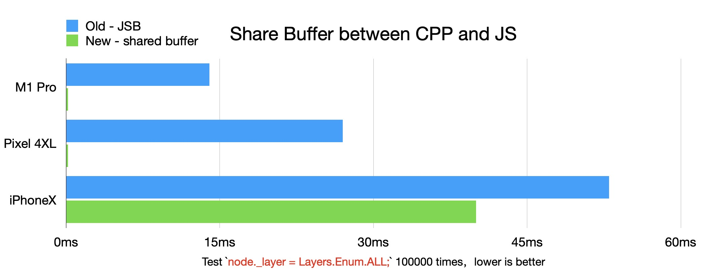
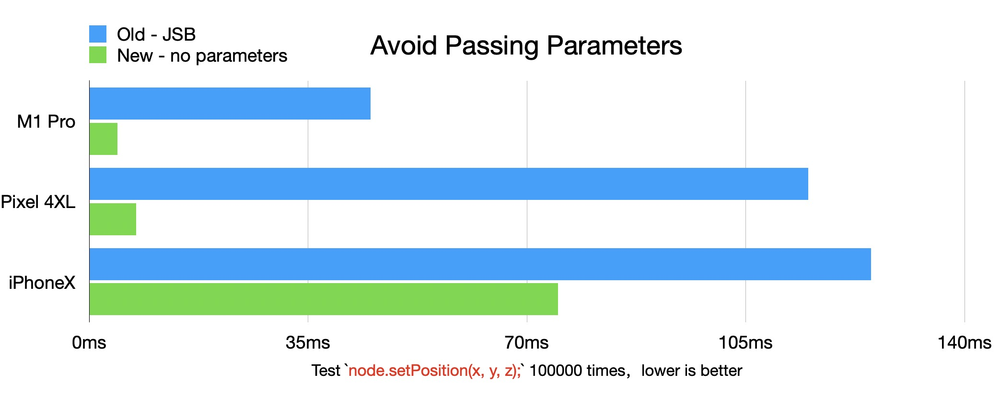
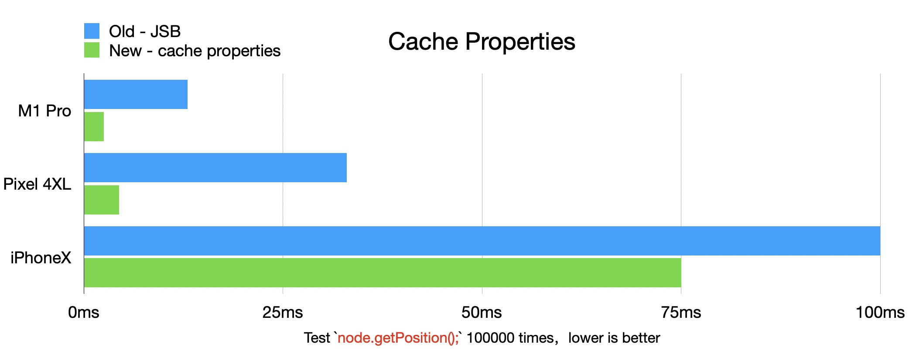
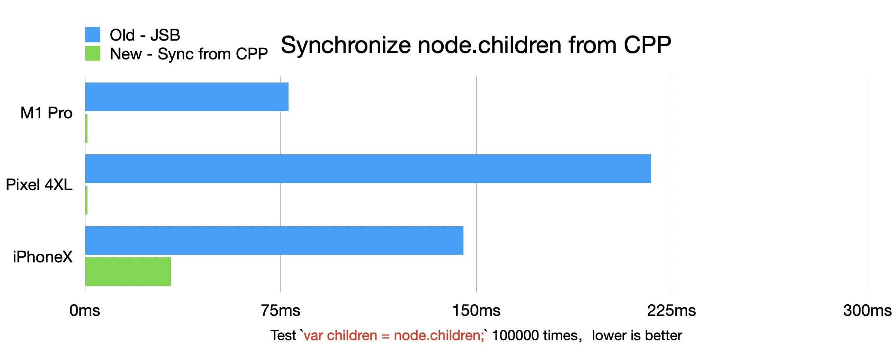
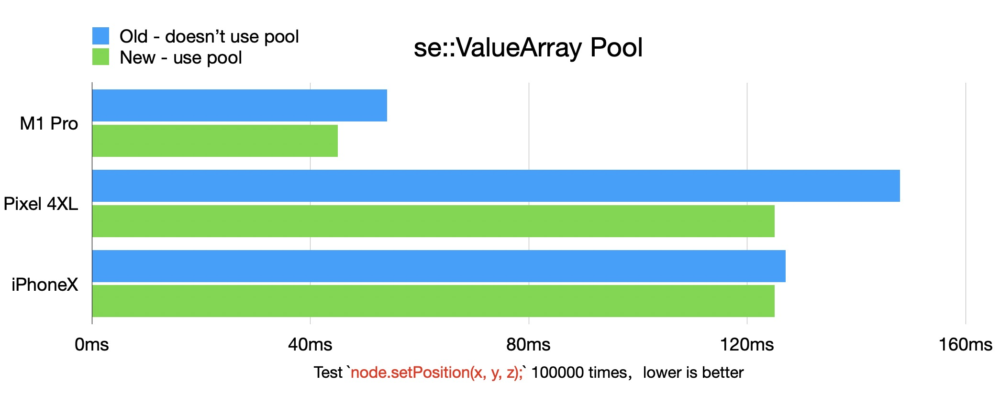

# Optimization of Cross-Language Invocation

## Introduction

In the native implementation of Cocos Creator version 3.6.0, we have made improvements in the native (CPP) code. This mainly involves the implementation of the node tree (Scene, Node), assets (Asset and its subclasses), material system (Material, Pass, ProgramLib), 3D renderer (including Model, SubModel), and 2D renderer (Batch2D, RenderEntity) in CPP. And these functionalities are exposed to the JS through binding techniques.

As known to all, in Cocos Creator 3.x, developers can only use TypeScript (TS) scripts to develop game logic. Although we have implemented more engine code in CPP, developers cannot directly use CPP for game logic development. Therefore, we use the Script Engine Wrapper API (referred to as SE API) to bind and expose the types implemented in the CPP to JS. The interfaces exposed to JS remain consistent with those in the web environment.

The primary benefit of moving core code to the native is that the execution performance of engine code running on native platforms is improved, especially on platforms that do not support JIT compilation (such as iOS). However, before the official release of version 3.6.0, we also faced a series of side effects resulting from the "elevation of the native level". The main issue was that the number of JSB calls (interactions between JS and CPP languages) increased significantly compared to previous versions. This directly offset the benefits brought by the elevation of the native level and even resulted in poorer performance compared to the previous version(v3.5). This article will introduce some optimization methods to reduce JSB calls. If developers encounter similar issues with excessive JSB calls in their own CPP code, we hope this article can provide some optimization insights.

## Shared Memory

For properties in Node that require frequent synchronization, we utilize shared memory between CPP and JS to avoid JSB calls. To facilitate the sharing of CPP memory with JS, we have encapsulated the bindings::NativeMemorySharedToScriptActor helper class.

bindings/utils/BindingUtils.h

```c++
namespace cc::bindings {

class NativeMemorySharedToScriptActor final {
public:
    NativeMemorySharedToScriptActor() = default;
    ~NativeMemorySharedToScriptActor();

    void initialize(void *ptr, uint32_t byteLength);
    void destroy();

    inline se::Object *getSharedArrayBufferObject() const { return _sharedArrayBufferObject; }

private:
    se::Object *_sharedArrayBufferObject{nullptr};

    CC_DISALLOW_COPY_MOVE_ASSIGN(NativeMemorySharedToScriptActor)
};

} // namespace cc::bindings
```

bindings/utils/BindingUtils.h

```c++
#include "bindings/utils/BindingUtils.h"
#include "bindings/jswrapper/SeApi.h"

namespace cc::bindings {

NativeMemorySharedToScriptActor::~NativeMemorySharedToScriptActor() {
    destroy();
}

void NativeMemorySharedToScriptActor::initialize(void* ptr, uint32_t byteLength) {
    CC_ASSERT_NULL(_sharedArrayBufferObject);
    // The callback of freeing buffer is empty since the memory is managed in native,
    //The external array buffer just holds a reference to the memory.
    _sharedArrayBufferObject = se::Object::createExternalArrayBufferObject(ptr, byteLength, [](void* /*contents*/, size_t /*byteLength*/, void* /*userData*/) {});
    // Root this object to prevent it from being garbage collected (GC), we will invoke `unroot` in the destroy function.
    _sharedArrayBufferObject->root();
}

void NativeMemorySharedToScriptActor::destroy() {
    if (_sharedArrayBufferObject != nullptr) {
        _sharedArrayBufferObject->unroot();
        _sharedArrayBufferObject->decRef();
        _sharedArrayBufferObject = nullptr;
    }
}

} // namespace cc::bindings
```

bindings/jswrapper/v8/Object.h

```c++
using BufferContentsFreeFunc = void (*)(void *contents, size_t byteLength, void *userData);
static Object *createExternalArrayBufferObject(void *contents, size_t byteLength, BufferContentsFreeFunc freeFunc, void *freeUserData = nullptr);
```

bindings/jswrapper/v8/Object.cpp

```c++
/* static */
Object *Object::createExternalArrayBufferObject(void *contents, size_t byteLength, BufferContentsFreeFunc freeFunc, void *freeUserData /* = nullptr*/) {
    Object *obj = nullptr;
    std::shared_ptr<v8::BackingStore> backingStore = v8::ArrayBuffer::NewBackingStore(contents, byteLength, freeFunc, freeUserData);
    v8::Local<v8::ArrayBuffer> jsobj = v8::ArrayBuffer::New(__isolate, backingStore);

    if (!jsobj.IsEmpty()) {
        obj = Object::_createJSObject(nullptr, jsobj);
    }
    return obj;
}
```

Analysis of the code above reveals that NativeMemorySharedToScriptActor calls the v8::ArrayBuffer::NewBackingStore and v8::ArrayBuffer::New functions to create an External type of ArrayBuffer. It is named "External" because its memory is not allocated and managed internally by V8. Instead, its memory is entirely managed by the code out of V8. When the ArrayBuffer object is garbage collected, the freeFunc callback function is triggered. In Node, the memory that needs to be shared consists of several contiguous properties in the Node. The creation and release of this memory are entirely handled by CPP Node itself, and the destruction of CPP Node instances is controlled by the GC. Therefore, when NativeMemorySharedToScriptActor::initialize internally calls se::Object::createExternalArrayBufferObject, it passes an empty implementation of the callback function.

Node.h

```c++
class Node : public CCObject {
    ......
    inline se::Object *_getSharedArrayBufferObject() const { return _sharedMemoryActor.getSharedArrayBufferObject(); } // NOLINT
    ......
    bindings::NativeMemorySharedToScriptActor _sharedMemoryActor;
    ......
		// Shared memory with JS
    // NOTE: TypeArray created in node.jsb.ts _ctor should have the same memory layout
    uint32_t _eventMask{0};                                             // Uint32: 0
    uint32_t _layer{static_cast<uint32_t>(Layers::LayerList::DEFAULT)}; // Uint32: 1
    uint32_t _transformFlags{0};                                        // Uint32: 2
    index_t _siblingIndex{0};                                           // Int32: 0
    uint8_t _activeInHierarchy{0};                                      // Uint8: 0
    uint8_t _active{1};                                                 // Uint8: 1
    uint8_t _isStatic{0};                                               // Uint8: 2
    uint8_t _padding{0};                                                // Uint8: 3
    ......
};
```

Node.cpp

```c++
Node::Node(const ccstd::string &name) {
#define NODE_SHARED_MEMORY_BYTE_LENGTH (20)
    static_assert(offsetof(Node, _padding) + sizeof(_padding) - offsetof(Node, _eventMask) == NODE_SHARED_MEMORY_BYTE_LENGTH, "Wrong shared memory size");
    _sharedMemoryActor.initialize(&_eventMask, NODE_SHARED_MEMORY_BYTE_LENGTH);
#undef NODE_SHARED_MEMORY_BYTE_LENGTH

    _id = idGenerator.getNewId();
    if (name.empty()) {
        _name.append("New Node");
    } else {
        _name = name;
    }
}
```

In the Node constructor, `_sharedMemoryActor.initialize(&_eventMask, NODE_SHARED_MEMORY_BYTE_LENGTH);` is called to set the first 20 bytes starting from the `_eventMask` property as shared memory.

node.jsb.ts

> **Note**: All files ending with `.jsb.ts` will be replaced with their corresponding versions without the `.jsb` extension during the packaging process. For example, `node.jsb.ts` will replace `node.ts`. You can refer to the `cc.config.json` file in the root directory of the engine for more details. It contains the corresponding `overrides` field, such as `"cocos/scene-graph/node.ts": "cocos/scene-graph/node.jsb.ts"`.

```ts
// The _ctor callback function in JS is triggered during the final stage of the `var node = new Node();` process in JS, i.e., after the CPP Node object is created. Therefore, the ArrayBuffer returned by the _getSharedArrayBufferObject binding function must exist.
nodeProto._ctor = function (name?: string) {
    ......
    // Get the CPP shared ArrayBuffer object through the _getSharedArrayBufferObject binding method
    const sharedArrayBuffer = this._getSharedArrayBufferObject();
    // Uint32Array with 3 elements, offset from the start: eventMask, layer, dirtyFlags
    this._sharedUint32Arr = new Uint32Array(sharedArrayBuffer, 0, 3);
    // Int32Array with 1 element, offset from the 12th byte: siblingIndex
    this._sharedInt32Arr = new Int32Array(sharedArrayBuffer, 12, 1);
    // Uint8Array with 3 elements, offset from the 16th byte: activeInHierarchy, active, static
    this._sharedUint8Arr = new Uint8Array(sharedArrayBuffer, 16, 3);
    //
  
    this._sharedUint32Arr[1] = Layers.Enum.DEFAULT; // this._sharedUint32Arr[1] represents the layer
    ......
};
```

By using shared memory, it also means that we cannot pass the values to be set from JS to CPP through JSB binding functions. Therefore, we need to define corresponding getter/setter functions in the `.jsb.ts` file. These functions will internally modify the shared memory by directly manipulating the TypedArray.

```ts
Object.defineProperty(nodeProto, 'activeInHierarchy', {
    configurable: true,
    enumerable: true,
    get (): Readonly<Boolean> {
        return this._sharedUint8Arr[0] != 0; // Uint8, 0: activeInHierarchy
    },
    set (v) {
        this._sharedUint8Arr[0] = (v ? 1 : 0); // Uint8, 0: activeInHierarchy
    },
});

Object.defineProperty(nodeProto, '_activeInHierarchy', {
    configurable: true,
    enumerable: true,
    get (): Readonly<Boolean> {
        return this._sharedUint8Arr[0] != 0; // Uint8, 0: activeInHierarchy
    },
    set (v) {
        this._sharedUint8Arr[0] = (v ? 1 : 0); // Uint8, 0: activeInHierarchy
    },
});

Object.defineProperty(nodeProto, 'layer', {
    configurable: true,
    enumerable: true,
    get () {
        return this._sharedUint32Arr[1]; // Uint32, 1: layer
    },
    set (v) {
        this._sharedUint32Arr[1] = v; // Uint32, 1: layer
        if (this._uiProps && this._uiProps.uiComp) {
            this._uiProps.uiComp.setNodeDirty();
            this._uiProps.uiComp.markForUpdateRenderData();
        }
        this.emit(NodeEventType.LAYER_CHANGED, v);
    },
});

Object.defineProperty(nodeProto, '_layer', {
    configurable: true,
    enumerable: true,
    get () {
        return this._sharedUint32Arr[1]; // Uint32, 1: layer
    },
    set (v) {
        this._sharedUint32Arr[1] = v; // Uint32, 1: layer
    },
});

Object.defineProperty(nodeProto, '_eventMask', {
    configurable: true,
    enumerable: true,
    get () {
        return this._sharedUint32Arr[0]; // Uint32, 0: eventMask
    },
    set (v) {
        this._sharedUint32Arr[0] = v; // Uint32, 0: eventMask
    },
});

Object.defineProperty(nodeProto, '_siblingIndex', {
    configurable: true,
    enumerable: true,
    get () {
        return this._sharedInt32Arr[0]; // Int32, 0: siblingIndex
    },
    set (v) {
        this._sharedInt32Arr[0] = v; // Int32, 0: siblingIndex
    },
});

nodeProto.getSiblingIndex = function getSiblingIndex() {
    return this._sharedInt32Arr[0]; // Int32, 0: siblingIndex
};

Object.defineProperty(nodeProto, '_transformFlags', {
    configurable: true,
    enumerable: true,
    get () {
        return this._sharedUint32Arr[2]; // Uint32, 2: _transformFlags
    },
    set (v) {
        this._sharedUint32Arr[2] = v; // Uint32, 2: _transformFlags
    },
});

Object.defineProperty(nodeProto, '_active', {
    configurable: true,
    enumerable: true,
    get (): Readonly<Boolean> {
        return this._sharedUint8Arr[1] != 0; // Uint8, 1: active
    },
    set (v) {
        this._sharedUint8Arr[1] = (v ? 1 : 0); // Uint8, 1: active
    },
});

Object.defineProperty(nodeProto, 'active', {
    configurable: true,
    enumerable: true,
    get (): Readonly<Boolean> {
        return this._sharedUint8Arr[1] != 0; // Uint8, 1: active
    },
    set (v) {
        this.setActive(!!v);
    },
});

Object.defineProperty(nodeProto, '_static', {
    configurable: true,
    enumerable: true,
    get (): Readonly<Boolean> {
        return this._sharedUint8Arr[2] != 0;
    },
    set (v) {
        this._sharedUint8Arr[2] = (v ? 1 : 0);
    },
});
```

### Performance Comparison Results



## Avoiding Parameters Passing

If JSB function calls involve parameters, V8 internally needs to validate the reasonableness of the parameters. These validation tasks can also impact the performance of the calls. For JSB functions that may be frequently called in Node, we avoid passing floating-point parameters by reusing a global Float32Array.

scene-graph/utils.jsb.ts

```ts
import { IMat4Like, Mat4 } from '../core/math';

declare const jsb: any;

// For optimizing getPosition, getRotation, getScale
export const _tempFloatArray = new Float32Array(jsb.createExternalArrayBuffer(20 * 4));

export const fillMat4WithTempFloatArray = function fillMat4WithTempFloatArray (out: IMat4Like) {
    Mat4.set(out,
        _tempFloatArray[0], _tempFloatArray[1], _tempFloatArray[2], _tempFloatArray[3],
        _tempFloatArray[4], _tempFloatArray[5], _tempFloatArray[6], _tempFloatArray[7],
        _tempFloatArray[8], _tempFloatArray[9], _tempFloatArray[10], _tempFloatArray[11],
        _tempFloatArray[12], _tempFloatArray[13], _tempFloatArray[14], _tempFloatArray[15]
    );
};
//
```

The above code defines a global `_tempFloatArray` that is used to store number or composite types (such as Vec3, Vec4, Mat4, etc.) parameters.

node.jsb.ts

```ts
// ......
// Set the FloatArray to the CPP code
Node._setTempFloatArray(_tempFloatArray.buffer); 
// ......
// Reimplement the setPosition function in JS with parameters
nodeProto.setPosition = function setPosition(val: Readonly<Vec3> | number, y?: number, z?: number) {
    if (y === undefined && z === undefined) {
        // When both y and z are undefined, it means the first parameter is of type Vec3
        _tempFloatArray[0] = 3;
        const pos = val as Vec3;
        // Assign the new pos to the FloatArray and this._lpos cache
        this._lpos.x = _tempFloatArray[1] = pos.x;
        this._lpos.y = _tempFloatArray[2] = pos.y;
        this._lpos.z = _tempFloatArray[3] = pos.z;
    } else if (z === undefined) {
        // If z is undefined, there are only 2 parameters x and y
        _tempFloatArray[0] = 2;
        this._lpos.x = _tempFloatArray[1] = val as number;
        this._lpos.y = _tempFloatArray[2] = y as number;
    } else {
        _tempFloatArray[0] = 3;
        this._lpos.x = _tempFloatArray[1] = val as number;
        this._lpos.y = _tempFloatArray[2] = y as number;
        this._lpos.z = _tempFloatArray[3] = z as number;
    }
    this._setPosition(); // This is a native binding function without parameters
};
```

jsb_scene_manual.cpp

```ts
namespace {

/**
 * Helper class for operating on the shared global FloatArray
 */
class TempFloatArray final {
public:
    TempFloatArray() = default;
    ~TempFloatArray() = default;

    inline void setData(float* data) { _data = data; }

    ......

    inline const float& operator[](size_t index) const { return _data[index]; }
    inline float& operator[](size_t index) { return _data[index]; }

private:
    float* _data{ nullptr };

    CC_DISALLOW_ASSIGN(TempFloatArray)
};

TempFloatArray tempFloatArray;

} // namespace
```

```c++
static bool js_scene_Node_setTempFloatArray(se::State& s) // NOLINT(readability-identifier-naming)
{
    const auto& args = s.args();
    size_t argc = args.size();
    CC_UNUSED bool ok = true;
    if (argc == 1) {
        uint8_t* buffer = nullptr;
        args[0].toObject()->getArrayBufferData(&buffer, nullptr);
        // Initialize the associated data of TempFloatArray
        tempFloatArray.setData(reinterpret_cast<float*>(buffer));
        return true;
    }
    SE_REPORT_ERROR("wrong number of arguments: %d, was expecting %d", (int)argc, 1);
    return false;
}
SE_BIND_FUNC(js_scene_Node_setTempFloatArray)
```

```c++
bool register_all_scene_manual(se::Object* obj) // NOLINT(readability-identifier-naming)
{
    ......
    __jsb_cc_Node_proto->defineFunction("_setPosition", _SE(js_scene_Node_setPosition));
    __jsb_cc_Node_proto->defineFunction("_setScale", _SE(js_scene_Node_setScale));
    __jsb_cc_Node_proto->defineFunction("_setRotation", _SE(js_scene_Node_setRotation));
    __jsb_cc_Node_proto->defineFunction("_setRotationFromEuler", _SE(js_scene_Node_setRotationFromEuler));
    __jsb_cc_Node_proto->defineFunction("_rotateForJS", _SE(js_scene_Node_rotateForJS));
    ......
}
```

```c++
// Binding for node._setPosition() without parameters
static bool js_scene_Node_setPosition(void* s) // NOLINT(readability-identifier-naming)
{
    auto* cobj = reinterpret_cast<cc::Node*>(s);
    auto argc = static_cast<size_t>(tempFloatArray[0]);
    if (argc == 2) {
        // Get the parameters from tempFloatArray
        cobj->setPositionInternal(tempFloatArray[1], tempFloatArray[2], true);
    } else {
        cobj->setPositionInternal(tempFloatArray[1], tempFloatArray[2], tempFloatArray[3], true);
    }
    return true;
}
SE_BIND_FUNC_FAST(js_scene_Node_setPosition) // Note that the new SE_BIND_FUNC_FAST macro is used here
```

Node.h

```c++
    inline void setPositionInternal(float x, float y, bool calledFromJS) { setPositionInternal(x, y, _localPosition.z, calledFromJS); }
    void setPositionInternal(float x, float y, float z, bool calledFromJS);
```

bindings/jswrapper/v8/HelperMacros.h

```c++
#define SE_BIND_FUNC(funcName)                                                    \
    void funcName##Registry(const v8::FunctionCallbackInfo<v8::Value> &_v8args) { \
        JsbInvokeScope(#funcName);                                                \
        jsbFunctionWrapper(_v8args, funcName, #funcName);                         \
    }

#define SE_BIND_FUNC_FAST(funcName) \
    void funcName##Registry(const v8::FunctionCallbackInfo<v8::Value> &_v8args) { \
        auto *thisObject = static_cast<se::Object *>(_v8args.This()->GetAlignedPointerFromInternalField(0)); \
        auto *nativeObject = thisObject != nullptr ? thisObject->getPrivateData() : nullptr; \
        funcName(nativeObject); \
    }
```

bindings/jswrapper/v8/HelperMacros.cpp

```c++
// The SE_BIND_FUNC macro calls the jsbFunctionWrapper function, which performs additional tasks internally.
SE_HOT void jsbFunctionWrapper(const v8::FunctionCallbackInfo<v8::Value> &v8args, se_function_ptr func, const char *funcName) {
    bool ret = false;
    v8::Isolate *isolate = v8args.GetIsolate();
    v8::HandleScope scope(isolate);
    bool needDeleteValueArray{false};
    se::ValueArray &args = se::gValueArrayPool.get(v8args.Length(), needDeleteValueArray);
    se::CallbackDepthGuard depthGuard{args, se::gValueArrayPool._depth, needDeleteValueArray};
    se::internal::jsToSeArgs(v8args, args);
    se::Object *thisObject = se::internal::getPrivate(isolate, v8args.This());
    se::State state(thisObject, args);
    ret = func(state);
    if (!ret) {
        SE_LOGE("[ERROR] Failed to invoke %s\n", funcName);
    }
    se::internal::setReturnValue(state.rval(), v8args);
}
```

The internal implementation of the `SE_BIND_FUNC_FAST` macro is extremely fast because it is very simple. It immediately triggers the callback function once it obtains the private data, without any se-related API calls. This avoids the conversion between `se::Value` and `jsvalue` and also bypasses parameter validation by V8. You can compare it with the standard implementation of the `SE_BIND_FUNC` macro.

Furthermore, you may wonder why we don't share the position, rotation, and scale information directly through the approach described in the 'Shared Memory' section, but using `_setPosition()`, `_setRotation()`, and `_setScale()` JSB methods without parameters. The reason is that this JSB calls cannot be removed. Let's take a look at the implementation of `Node::setPosition()`:

```c++
class Node : public CCObject {
    ......
    inline void setPosition(const Vec3 &pos) { setPosition(pos.x, pos.y, pos.z); }
    inline void setPosition(float x, float y) { setPosition(x, y, _localPosition.z); }
    inline void setPosition(float x, float y, float z) { setPositionInternal(x, y, z, false); }
    inline void setPositionInternal(float x, float y, bool calledFromJS) { setPositionInternal(x, y, _localPosition.z, calledFromJS); }
    void setPositionInternal(float x, float y, float z, bool calledFromJS);
  
    ......
    inline uint32_t getChangedFlags() const {
        return _hasChangedFlagsVersion == globalFlagChangeVersion ? _hasChangedFlags : 0;
    }
    inline void setChangedFlags(uint32_t value) {
        _hasChangedFlagsVersion = globalFlagChangeVersion;
        _hasChangedFlags = value;
    }
    ......
};
```

```c++
void Node::setPositionInternal(float x, float y, float z, bool calledFromJS) {
    _localPosition.set(x, y, z);
    invalidateChildren(TransformBit::POSITION);

    if (_eventMask & TRANSFORM_ON) {
        emit<TransformChanged>(TransformBit::POSITION);
    }

    if (!calledFromJS) {
        notifyLocalPositionUpdated();
    }
}
```

`setPosition` not only assigns a value to `_localPosition`, but it also needs to trigger the invocation of the `invalidateChildren` function. `invalidateChildren` is a recursive function that internally traverses all child nodes and modifies other properties such as `_transformFlags`, `_hasChangedFlagsVersion`, and `_hasChangedFlags`. Therefore, we cannot remove `setPosition` through the "shared memory" approach mentioned in the first section.

### Performance Comparison Results



## Caching Properties

Caching properties in the JS can help avoid accessing the C++ interface through getters and reduce JSB(JavaScript Bindings) calls.

node.jsb.ts

```ts
Object.defineProperty(nodeProto, 'position', {
    configurable: true,
    enumerable: true,
    get (): Readonly<Vec3> {
        return this._lpos;
    },
    set (v: Readonly<Vec3>) {
        this.setPosition(v as Vec3);
    },
});

nodeProto.getPosition = function getPosition (out?: Vec3): Vec3 {
    if (out) {
        return Vec3.set(out, this._lpos.x, this._lpos.y, this._lpos.z);
    }
    return Vec3.copy(new Vec3(), this._lpos);
};

nodeProto._ctor = function (name?: string) {
    ......
    this._lpos = new Vec3();
    this._lrot = new Quat();
    this._lscale = new Vec3(1, 1, 1);
    this._euler = new Vec3();
    .......
};
```

### Performance Comparison Results



## Node Synchronization

In the user's logic code, it is common to use the following pattern:

```ts
const children = node.children;
for (let i = 0; i < children.length; ++i) {
  const child = children[i];
  // do something with child
}
```

The `.children` getter may be called frequently, which can result in excessive JSB (JavaScript Bindings) calls. The getter for `children` is bound uniquely because it represents a JS array, while in CPP it corresponds to the type `ccstd::vector<Node*> _children;`. As a result, there is no straightforward way to synchronize data between JS Array and CPP's std::vector. If the `.children` getter is called using JSB each time, it will generate a temporary JS Array using `se::Object::createArrayObject`, and then convert each CPP child to JS child using `nativevalue_to_se` and assign it to the JS Array. This incurs a heavy conversion overhead and generates temporary arrays that need to be garbage collected, adding additional pressure to the GC.

To address this issue, we cache the `_children` property in the JS. When `_children` is modified in the CPP, we use the event system to notify the JS code's `_children` to update its content. This is achieved by listening to `ChildAdded` and `ChildRemoved` events.

Let's illustrate this with the example of `node.addChild(child);`:

```c++
class Node : public CCObject {
    ......
    inline void addChild(Node *node) { node->setParent(this); }

    inline void removeChild(Node *node) const {
        auto idx = getIdxOfChild(_children, node);
        if (idx != -1) {
            node->setParent(nullptr);
        }
    }
    inline void removeFromParent() {
        if (_parent) {
            _parent->removeChild(this);
        }
    }
    void removeAllChildren();
    ......
};
```

```c++
void Node::setParent(Node* parent, bool isKeepWorld /* = false */) {
    ......
    onSetParent(oldParent, isKeepWorld);
    emit<ParentChanged>(oldParent);
    if (oldParent) {
        if (!(oldParent->_objFlags & Flags::DESTROYING)) {
            index_t removeAt = getIdxOfChild(oldParent->_children, this);
            if (removeAt < 0) {
                return;
            }
            // Remove the child from the old parent node
            oldParent->_children.erase(oldParent->_children.begin() + removeAt);
            oldParent->updateSiblingIndex();
            oldParent->emit<ChildRemoved>(this);
        }
    }
    if (newParent) {
        ......
        // Add the child to the new parent node
        newParent->_children.emplace_back(this);
        _siblingIndex = static_cast<index_t>(newParent->_children.size() - 1);
        newParent->emit<ChildAdded>(this);
    }
    onHierarchyChanged(oldParent);
}
```

After calling `addChild`,  the `Node::_children` in the CPP is modified, it triggers the `emit<ChildAdded>` event. This event is listened to during Node initialization, as seen in the code snippet in `jsb_scene_manual.cpp`.

```c++
// jsb_scene_manual.cpp
static void registerOnChildAdded(cc::Node *node, se::Object *jsObject) {
    node->on<cc::Node::ChildAdded>(
        [jsObject](cc::Node * /*emitter*/, cc::Node *child) {
            se::AutoHandleScope hs;
            se::Value arg0;
            nativevalue_to_se(child, arg0);
            // Call the private JS function _onChildAdded
            se::ScriptEngine::getInstance()->callFunction(jsObject, "_onChildAdded", 1, &arg0);
        });
}

static bool js_scene_Node_registerOnChildAdded(se::State &s) // NOLINT(readability-identifier-naming)
{
    auto *cobj = SE_THIS_OBJECT<cc::Node>(s);
    SE_PRECONDITION2(cobj, false, "Invalid Native Object");

    auto *jsObject = s.thisObject();

    registerOnChildAdded(cobj, jsObject);
    return true;
}
SE_BIND_FUNC(js_scene_Node_registerOnChildAdded) // NOLINT(readability-identifier-naming)
  
bool register_all_scene_manual(se::Object *obj) // NOLINT(readability-identifier-naming)
{
    ......
    __jsb_cc_Node_proto->defineFunction("_registerOnChildAdded", _SE(js_scene_Node_registerOnChildAdded));
    ......
}
```

node.jsb.ts

```ts
Object.defineProperty(nodeProto, 'children', {
    configurable: true,
    enumerable: true,
    get () {
        return this._children;
    },
    set (v) {
        this._children = v;
    },
});

nodeProto._onChildRemoved = function (child) {
    this.emit(NodeEventType.CHILD_REMOVED, child);
};

// This function is called by the CPP's registerOnChildAdded function
nodeProto._onChildAdded = function (child) {
    this.emit(NodeEventType.CHILD_ADDED, child);
};

nodeProto.on = function (type, callback, target, useCapture: any = false) {
    switch (type) {
        ......
        case NodeEventType.CHILD_ADDED:
            if (!(this._registeredNodeEventTypeMask & REGISTERED_EVENT_MASK_CHILD_ADDED_CHANGED)) {
                this._registerOnChildAdded(); // Call the JSB method to register the listener
                this._registeredNodeEventTypeMask |= REGISTERED_EVENT_MASK_CHILD_ADDED_CHANGED;
            }
            break;
        ......
        default:
            break;
    }
    this._eventProcessor.on(type, callback, target, useCapture);
};

nodeProto._ctor = function (name?: string) {
    ......
    this._children = [];

  	// Use the on interface to listen for CHILD_ADDED and CHILD_REMOVED events
    this.on(NodeEventType.CHILD_ADDED, (child) => {
        // Synchronize the this._children array in the JS
        this._children.push(child);
    });

    this.on(NodeEventType.CHILD_REMOVED, (child) => {
        const removeAt = this._children.indexOf(child);
        if (removeAt < 0) {
            errorID(1633);
            return;
        }
        this._children.splice(removeAt, 1);
    });

    ......
};
```

### Performance Comparison Results



## Parameter Array Object Pool

Up to version 3.6.0, Cocos Creator engine does not have an efficient memory pool implementation. When using the se (Script Engine Wrapper) for JS -> CPP interactions, temporary `se::ValueArray args(argCount)` objects need to be created. `se::ValueArray` is a `ccstd::vector<se::Value>` typedef, which leads to a significant amount of temporary memory allocations and deallocations, greatly impacting performance. This issue was not exposed in previous versions because the native code was relatively low-level and had fewer JSB calls. However, in version 3.6.0, with the increased native level hierarchy and JSB calls, this problem became more severe.

To address this issue, we came up with a solution: using an object pool to reuse `se::ValueArray` objects. The implementation of the object pool, `se::ValueArrayPool`, is relatively simple and is outlined below:

bindings/jswrapper/ValueArrayPool.h

```c++
// CallbackDepthGuard class for resetting se::Value objects in a se::ValueArray after use
// If the se::ValueArray is allocated with `new`, it will handle the `delete` process
class CallbackDepthGuard final {
public:
    CallbackDepthGuard(ValueArray &arr, uint32_t &depth, bool needDelete)
    : _arr(arr), _depth(depth), _needDelete(needDelete) {
        ++_depth;
    }

    ~CallbackDepthGuard() {
        --_depth;
        for (auto &e : _arr) {
            e.setUndefined();
        }
        if (_needDelete) {
            delete &_arr;
        }
    }

private:
    ValueArray &_arr;
    uint32_t &_depth;
    const bool _needDelete{false};
};

class ValueArrayPool final {
public:
    // The maximum number of arguments for a bound function is 20
    // If there are more than 20 arguments, consider refactoring the function parameters
    static const uint32_t MAX_ARGS = 20;

    ValueArrayPool();

    ValueArray &get(uint32_t argc, bool &outNeedDelete);

    uint32_t _depth{0};

private:
    void initPool(uint32_t index);
    ccstd::vector<ccstd::array<ValueArray, MAX_ARGS + 1>> _pools;
};

extern ValueArrayPool gValueArrayPool;
```

bindings/jswrapper/ValueArrayPool.cpp

```c++
ValueArrayPool gValueArrayPool;

// Define the maximum depth as 5. If the depth exceeds this value, the object pool will not be used.
#define SE_DEFAULT_MAX_DEPTH (5)

ValueArrayPool::ValueArrayPool() {
    _pools.resize(SE_DEFAULT_MAX_DEPTH);
    for (uint32_t i = 0; i < SE_DEFAULT_MAX_DEPTH; ++i) {
        initPool(i);
    }
}

ValueArray &ValueArrayPool::get(uint32_t argc, bool &outNeedDelete) {
    // If the depth is greater than the size of the object pool, directly create a new ValueArray object.
    if (SE_UNLIKELY(_depth >= _pools.size())) {
        outNeedDelete = true;
        auto *ret = ccnew ValueArray();
        ret->resize(argc);
        return *ret;
    }

    outNeedDelete = false;
    CC_ASSERT_LE(argc, MAX_ARGS);
    // Retrieve a ValueArray object from the object pool.
    auto &ret = _pools[_depth][argc];
    CC_ASSERT(ret.size() == argc);
    return ret;
}

// Initialize pool
void ValueArrayPool::initPool(uint32_t index) {
    auto &pool = _pools[index];
    uint32_t i = 0;
    for (auto &arr : pool) {
        arr.resize(i);
        ++i;
    }
}
```

Let's look at the implementation of jsbFunctionWrapper function:

```c++
SE_HOT void jsbFunctionWrapper(const v8::FunctionCallbackInfo<v8::Value> &v8args, se_function_ptr func, const char *funcName) {
    bool ret = false;
    v8::Isolate *isolate = v8args.GetIsolate();
    v8::HandleScope scope(isolate);
  
    /* Original code
    se::ValueArray args;
    args.reserve(10);
    */

    // Optimized implementation - Start
    bool needDeleteValueArray{false};
    // Retrieve a se::ValueArray from the global object pool, note that needDeleteValueArray is an output parameter
    se::ValueArray &args = se::gValueArrayPool.get(v8args.Length(), needDeleteValueArray);
    // Define a "callback depth guard" variable depthGuard, which automatically cleans up the object pool when it's destroyed
    se::CallbackDepthGuard depthGuard{args, se::gValueArrayPool._depth, needDeleteValueArray};
    // Optimized implementation - End
  
    se::internal::jsToSeArgs(v8args, args);
    se::Object *thisObject = se::internal::getPrivate(isolate, v8args.This());
    se::State state(thisObject, args);
    ret = func(state);
    if (!ret) {
        SE_LOGE("[ERROR] Failed to invoke %s\n", funcName);
    }
    se::internal::setReturnValue(state.rval(), v8args);
}
```

### Performance Comparison Results



## Conclusion

The main optimization techniques employed in Cocos Creator 3.6.0 native engine are as follows:

1. Implementing the engine's core modules in the native(C++) to leverage the performance of C++ code execution.
2. Minimizing the frequency of cross-language interactions (JS <-> CPP) through the following five methods:
   - Shared memory: Improving performance by reducing memory copies.
   - Avoiding parameter passing: Using member variables instead of frequent parameter passing.
   - Caching properties: Storing frequently accessed properties in cache to avoid redundant retrieval.
   - Node synchronization: Synchronizing node changes through an event listening mechanism during node operations.
   - Parameter array object pool: Reusing parameter array objects using an object pool to reduce memory allocation and deallocation overhead.

By implementing these optimization measures, we have improved the performance of the Cocos Creator engine. These optimization techniques significantly reduce the overhead of cross-language interactions and enhance the overall performance and responsiveness of the engine.
