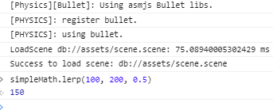
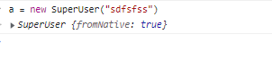

# `sebind` Tutorial

Before `sebind`, both manual and automatic bindings required more steps for developers to complete the binding and required more knowledge of JSB. `sebind` takes advantage of C++ templates to minimize intermediate code.

## A simple example

We will define an object `simpleMath` in the global space, and add a `lerp` function.

```js
let v = simpleMath.lerp(a, b, t);
```
The function is implemented in C++.

### Preparation

We need to create a Cocos Creator project, save a scene, and create a new build task for any native platform. This example uses the Windows platform.

### Step 1: Add the binding code

In the `native/engine/common/Classes` directory, create a new file `HelloSEBind.cpp` and write the following code:

```c++
// HelloSEBind.cpp
#include "bindings/sebind/sebind.h"

namespace {
struct Empty {}; // act as a namespace
float lerp(float a, float b, float t) { return (1 - t) * a + t * b; }
} // namespace

bool jsb_register_simple_math(se::Object *globalThis) {

  sebind::class_<Empty> demoMathClass("simpleMath");
  {
    // invoke through simpleMath.lerp(a, b, t);
    demoMathClass.staticFunction("lerp", &lerp).install(globalThis);
  }
  return true;
}
```

Include the file `HelloSEBind.cpp` to `native/engine/common/CMakeLists.txt`

```cmake

# ... 

list(APPEND CC_COMMON_SOURCES
    ${CMAKE_CURRENT_LIST_DIR}/Classes/Game.h
    ${CMAKE_CURRENT_LIST_DIR}/Classes/Game.cpp
    ${CMAKE_CURRENT_LIST_DIR}/Classes/HelloSEBind.cpp # new file
)
```
### Step 2: Register to `ScriptEngine`

Edit `Game.cpp`, located in the `native/engine/common/Classes` directory

```c++
// ...

// declare registry function
extern bool jsb_register_simple_math(se::Object *);       // #1

Game::Game() = default;


int Game::init() {

// ...
  _xxteaKey = SCRIPT_XXTEAKEY;

  // add callback to script engine
  auto *seengine = se::ScriptEngine::getInstance();        // #2
  seengine->addRegisterCallback(jsb_register_simple_math); // #3
  
  BaseGame::init();
  //....
```

### Step 3: Verification

Start the program in Debug mode, and connect with Chrome devtools:



Done.

Compared to the previous approachs, the use of the `SE` APIs is greatly reduced, and so is the amount of code.

## A more complex binding example

`sebind` does interface binding on a class-by-class basis. Each JS class requires the construction of a corresponding `sebind::class_` instance. All class bindings are done through the methods provided by `sebind::class_`.

In the following, we will familiarize ourselves with the `sebind` binding process by exporting the sample code for the `User` class.

> **Note**: The sample code is only used to illustrate the usage of `sebind`, the internal interface design and implementation is not useful in practice.

```c++
class User {
private:
  static int userCount;

public:
  // static methods
  static int doubleUserCount() { return 2 * userCount; }
  // static attributes
  static int getUserCount() { return userCount; }
  static void setUserCount(int v) { userCount = v; }

  // constructors with different parameters
  User() { userCount++; }
  User(const std::string &name_) : User() { name = name_; }
  User(const std::string &name_, const std::string &token)
      : User() {
    name = name_;
    _token = token;
  }
  User(const std::string &name_, const std::string &token, int credit)
      : User(name, token) {
    _credit = credit;
    name = name_;
    _token = token;
  }

  
  ~User() = default;

  // attributes 
  std::string getToken() const { return _token; }
  void setToken(const std::string &t) { _token = t; }

  // override function
  std::string toString() const { return name + ":" + _token; }
  std::string toString(const std::string &tag) const {
    return "[" + tag + "]:" + name + ":" + _token;
  }

  // function args with bound type
  std::string mergeName1(User &other) { return name + "|" + other.name; }
  std::string mergeName2(User *other) { return name + "|" + other->name; }
  std::string mergeName3(const std::shared_ptr<User> &other) {
    return name + "|" + other->name;
  }
  // public fields
  std::string name{"unset"};

private:
  std::string _token{"unset"};
  int _credit{-1};
};

int User::userCount = 0;

} // namespace

```
#### Instantiate `sebind::class_`

Relates a C++ class to a specified JS class name

```c++
sebind::class_<User> userClass("User"); 
```

#### Bind constructors

```c++
    userClass.constructor<>() // JS: new User
        .constructor<const std::string &>() // JS: new User("Jone")
        .constructor<const std::string &, const std::string &>() // JS: new User("Jone", "343453")
        .constructor<const std::string &, const std::string &, int>() //JS:  new User("Jone", "343453", 5678)
```

There are 4 constructor patterns declared here, with 0,1,2,3 parameters. Each template parameter corresponds to the constructor's parameter type. 
When calling `new User(...)` will trigger the corresponding C++ constructor depending on the number of arguments

> **Note**: If you don't declare any `constructor`, `sebind:class_` will use the default parameterless constructor. 

We can also define common functions as constructors, for example:

```c++
User *createUser(int credit) {
  return = new User("Lambda", "ctor", credit);
}

// ...
.constructor(&createUser) // JS: new User(234)
```

The return value needs to be a `User*` type. This is equivalent to declaring the constructor `constructor(credit:number)` in JS.

#### Exporting member properties

Export a C++ public field as a JS property

```c++
.property("name", &User::name)  // JS: user.name
```

You can also define `getter`/`setter` functions as properties. Here the `getter` function needs to have a return value, and no parameters. The `setter` function takes one argument.

```c++
.property("token", &User::getToken, &User::setToken) // JS: user.token
```

> **Note**: `getter`/`setter` can not be both `nullptr`.

Common functions, with `User*` as the first argument, can be used as member functions. For example:

```c++
std::string tokenLong_get(User *u) {
  return "token[" + u->getToken() + "]";
}
void tokenLong_set(User *u, const std::string &s) {
  u->setToken("token[" + u->getToken() + "]");
}
//...
.property("tokenPrefix", &tokenLong_get, &tokenLong_set) // JS: user.tokenPrefix
```

#### Export Member Functions

Exporting C++ member functions to JS.

```c++
.function("mergeName1", &User::mergeName1) // JS: user1.mergeName1(user2)
.function("mergeName2", &User::mergeName2) // JS: user2.mergeName1(user2)
.function("mergeName3", &User::mergeName3) // JS: user3.mergeName1(user2)
```

Instances of bound types in JS can be passed as arguments to C++ bound functions. C++ functions can take instances of bound objects by *reference*, *pointer* or *smart pointer*. Here, if `User` inherits `cc::RefCounted`, we can use `cc::IntrusivePtr<User>` to hold it. If we don't inherit `cc::RefCounted`, as is the case now, we can also hold it with `std::shared_ptr<User>`. After holding with `shared_ptr/IntrusivePtr`, the associated JS object is GC'd, and the object held at the C++ level will not be destroyed. 

> **Note**: The binding type needs to be registered with the macro `JSB_REGISTER_OBJECT_TYPE(User);` before calling the sebind APIs. Only then will the subsequent `jsb_conversions` method handle the type conversion correctly.

If a function is overloaded, we need to specify the specific type of the function pointer with `static_cast`.

```c++
.function("toString", static_cast<std::string(User::*)() const>(&User::toString))   ///JS: (new User).toString()
.function("toString", static_cast<std::string(User::*)(const std::string&) const>(&User::toString))  //JS: (new User).toString("1111")
```

Similar to constructors, overloaded functions are matched based on the number of arguments, and the same number of arguments should be avoided. If you need to determine the type of parameters at runtime, you can refer to bind [`SE` functions](#manual-type-conversion).

#### Exporting static methods of a class

Exporting static functions of a C++ class

```c++
.staticFunction("doubleUserCount", &User::doubleUserCount) // JS: User.doubleUserCount()
```
It is also possible to export common functions as class static functions

```c++
int  static_add(int a, int b) { return a + b; }
///...
.staticFunction("add", &static_add) //JS: User.add(1,2)
```

#### Export Class Static Properties

Export a C++ class static function as a static property of a JS class.

```c++
.staticProperty("userCount", &User::getUserCount, &User::setUserCount)  //JS: User.userCount
```
or common functions
```c++
int gettime() { return time(nullptr); }
/// ...
.staticProperty("time", &gettime, nullptr) //JS: User.time
```

#### Registering A Destruct Callback

Register a callback for when the bound object is GC'd.

```c++
.finalizer([](User *usr) {
  std::cout << "release " << usr->name << std::endl;
})
```

#### Export the class to JS global namespace

Mounts the `User` class to the `globalThis` object, completing the export. `User` class can be accessed globally in the JS script.

```c++
.install(globalThis);
```

#### Class Inheritance

Specify the parent class's prototype in the second parameter of the `sebind::class_` constructor. Here the `SuperUser` class inherits from the `User` class. 

```c++
sebind::class_<User> superUser("SuperUser", userClass.prototype());
{
  superUser.constructor<const std::string &>()
      .function(
          "superName", +[](User *user) { return user->name + ".super";
          }) // JS:  (new SuperUser("Mok")).superName()
      .install(globalThis);
}
```

> **Note**: that the static methods of the parent class are not inherited by the child class. 

## Other Uses

### Manual Type Conversion

`sebind` supports binding traditional `SE` functions to perform the conversion manually. For example:

```c++
bool jsb_sum(se::State &state) {
  double result = 0;
  auto &args = state.args();
  for (int i = 0; i < args.size(); i++) {
    result += (args[i].isNumber() ? args[i].toDouble() : 0);
  }
  state.rval().setDouble(result);
  return true;
}
/// 
.staticFunction("sum", &jsb_sum) // JS: User.sum(1,2,3,4,5)
```

This allows for variable-length parameters and flexible parameter conversions. It's more flexible than automatic conversions and requires developers to be more familiar with the `SE API`.

### Requirng JS `this` Object within constructor

Requring the corresponding JS `this` object in a C++ constructor is a common requirement, and simplifies access from C++ to JS.

All we need to do is specify the placeholder `sebind::ThisObject` in the argument type of the `constructor` and declare the argument type of the corresponding constructor as `se::Object *`.

```c++
// constructor
User(se::Object *self, const std::string &name_) {
  self->setProperty("fromNative", se::Value(true));
  name = name_;
}
/// ...
superUser.constructor<sebind::ThisObject, const std::string &>() // JS: new SuperUser("Jone")
``` 

> **Note**: Common functions are not supported here for now.

When calling the corresponding constructor in JS, all `sebind::ThisObject` parameters should be ignored.  



<details>
<summary>
Full content of *HelloSEBind.cpp*
</summary>

```c++

#include "bindings/sebind/sebind.h"
#include <iostream>

namespace {


struct Empty {}; // act as a namespace
float lerp(float a, float b, float t) { return (1 - t) * a + t * b; }

class User {
  static int userCount;

public:
  static int doubleUserCount() { return 2 * userCount; }
  static int getUserCount() { return userCount; }
  static void setUserCount(int v) { userCount = v; }

  User() { userCount++; }
  // User(const std::string &name_) : User() { name = name_; }
  User(const std::string &name_, const std::string &token) : User() {
    name = name_;
    _token = token;
  }
  User(const std::string &name_, const std::string &token, int credit)
      : User(name, token) {
    _credit = credit;
    name = name_;
    _token = token;
  }

  User(se::Object *self, const std::string &name_) {
    self->setProperty("fromNative", se::Value(true));
    name = name_;
  }

  ~User() { userCount--; }

  std::string getToken() const { return _token; }
  void setToken(const std::string &t) { _token = t; }
  std::string toString() const { return name + ":" + _token; }
  std::string toString(const std::string &tag) const {
    return "[" + tag + "]:" + name + ":" + _token;
  }

  std::string mergeName1(User &other) { return name + "|" + other.name; }
  std::string mergeName2(const std::shared_ptr<User> &other) {
    return name + "|" + other->name;
  }
  std::string mergeName3(User *other) { return name + "|" + other->name; }

  std::string name{"unset"};

private:
  std::string _token{"unset"};
  int _credit{-1};
};

int User::userCount = 0;

class UserExt : public User {
public:
    using User::User;
};

/////////////////////////////////////////////////////

User *createUser(int credit) { return new User("Lambda", "ctor", credit); }

std::string tokenLong_get(User *u) { return "token[" + u->getToken() + "]"; }
void tokenLong_set(User *u, const std::string &s) {
  u->setToken("token[" + u->getToken() + "]");
}

int static_add(int a, int b) { return a + b; }

bool jsb_sum(se::State &state) {
  double result = 0;
  auto &args = state.args();
  for (int i = 0; i < args.size(); i++) {
    result += (args[i].isNumber() ? args[i].toDouble() : 0);
  }
  state.rval().setDouble(result);
  return true;
}

int gettime() { return time(nullptr); }


} // namespace

JSB_REGISTER_OBJECT_TYPE(User);

bool jsb_register_simple_math(se::Object *globalThis) {

  sebind::class_<Empty> demoMathClass("simpleMath");
  {
    // invoke through simpleMath.lerp(a, b, t);
    demoMathClass.staticFunction("lerp", &lerp).install(globalThis);
  }

  sebind::class_<User> userClass("User");
  {

    userClass
        .constructor<>()
        .constructor<const std::string &>()
        .constructor<const std::string &, const std::string &>()
        .constructor<const std::string &, const std::string &, int>()
        // .constructor(&createUser)
        .property("name", &User::name)
        .property("token", &User::getToken, &User::setToken)
        .property("tokenPrefix", &tokenLong_get, nullptr)
        .function("mergeName1", &User::mergeName1)
        // .function("mergeName2", &User::mergeName2)
        .function("mergeName3", &User::mergeName3)
        .function("toString",
                  static_cast<std::string (User::*)() const>(&User::toString))
        .function("toString",
                  static_cast<std::string (User::*)(const std::string &) const>(
                      &User::toString))
        .staticFunction("doubleUserCount", &User::doubleUserCount)
        .staticProperty("userCount", &User::getUserCount, &User::setUserCount)
        .staticProperty("time", &gettime, nullptr)
        .staticFunction("sum", &jsb_sum)
        .finalizer([](User *usr) {
          std::cout << "release " << usr->name << std::endl;
        })
        .install(globalThis);
  }

  sebind::class_<UserExt> superUser("SuperUser", userClass.prototype());
  {
    superUser.constructor<sebind::ThisObject, const std::string &>()
        .function(
            "superName", +[](UserExt *user) { return user->name + ".super"; })
        .install(globalThis);
  }

  return true;
}
```

</details>


