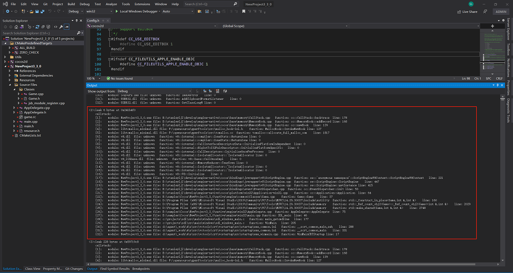
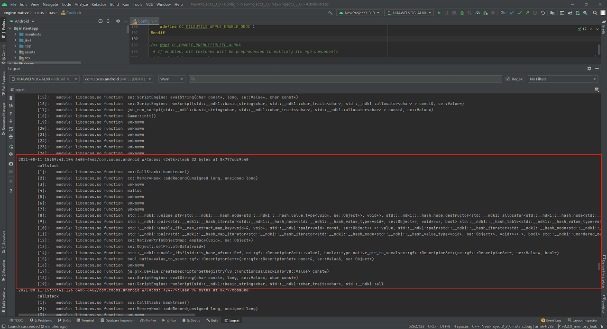

# Native engine memory leak detection system

The native engine is developed using the C++ language, and memory leaks are inevitable. In order to facilitate game & engine developers to quickly find memory leaks, Cocos Creator 3.5.0 provides a **memory leak detection system**.

Compared with other memory leak detection tools, the built-in memory leak detection tool in Cocos Creator has the following advantages:

- **Cross-platform**: support Windows/Android/Mac/iOS platforms.
- **Ease of use**: no need to download additional tools and perform complex configurations. Support output of stack information at memory leaks, which is convenient for quickly locating leaks.
- **Consistency**: the usage process of each platform is almost the same: start the game from the IDE -> run for a period of time -> close the game -> view the IDE output log.
- **Real-time**: although the frame rate of the game in the profiling mode has dropped, it still maintains the real-time running frame rate.
- **Accuracy**: theoretically zero false positives.

## Usage steps

1. The memory leak detection system is disabled by default. To enable it, you need to modify the value of the macro `USE_MEMORY_LEAK_DETECTOR` in the `cocos-engine/native/cocos/base/Config.h` file of the engine directory to **1**.

    ```c++
    #ifndef USE_MEMORY_LEAK_DETECTOR
        #define USE_MEMORY_LEAK_DETECTOR 1
    #endif
    ```

2. The Android platform requires one additional step as a result of the different implementation mechanisms amongst platforms:

    Add a line of code `set(CMAKE_CXX_FLAGS "${CMAKE_CXX_FLAGS} -finstrument-functions")` to the `native/engine/android/CMakeLists.txt` file in the project directory, as follows:

    ```
    set(PROJ_SOURCES
        ${CMAKE_CURRENT_LIST_DIR}/../common/Classes/Game.h
        ${CMAKE_CURRENT_LIST_DIR}/../common/Classes/Game.cpp
        ${CMAKE_CURRENT_LIST_DIR}/jni/main.cpp
    )
    set(CMAKE_CXX_FLAGS "${CMAKE_CXX_FLAGS} -finstrument-functions")
    ```

3. Start the game from the IDE corresponding to the native platform (such as Visual Studio, Android Studio, Xcode), and close the game after running for a period of time. If there is any memory leak, the detailed information of the memory leak will be output in the output window of the IDE at this time.

    - **Windows platform**

      

      In the Release version, if more friendly stack information is needed, right-click the executable project-properties, open the project properties page, and make the following settings:

        - Linker -> Debugging -> Generate Debug Info: Generate Debug Information(/DEBUG)

        - C/C++ -> Optimization -> Optimization: Disabled(/Od)\

        - C/C++ -> Optimization -> Inline Function Expansion：Disabled(/Ob0)

    - **Android platform**

      

    - **Mac/iOS platform**

      

4. Fix the leak according to the information output by the Native platform IDE, and repeat until there is no leak.
