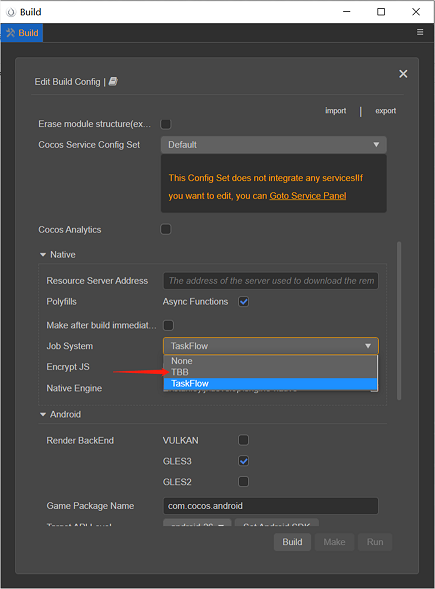

# Native engine memory leak detection system

The native engine is developed using the C++ language, and memory leaks are inevitable. In order to facilitate game & engine developers to quickly find memory leaks, this version provides a **memory leak detection system**

## 1, Compared with other memory leak detection tools, what are the advantages of the built-in memory leak detection tool in Cocos Creator:
- **Cross-platform**: support Windows/Android/Mac/iOS platforms.
- **Ease of use**: No need to download additional tools and perform complex configurations; support output of stack information at memory leaks, which is convenient for quickly locating leaks.
- **Consistency**: The usage process of each platform is almost the same: start the game from the ide -> run for a period of time -> close the game -> view the ide output log.
- **Real-time**: Although the frame rate of the game in the profiling mode has dropped, it still maintains the real-time running frame rate.
- **Accuracy**: theoretically zero false positives.

## 2，Steps for usage
- Modify the macro `USE_MEMORY_LEAK_DETECTOR` in `cocos/base/Config.h` to `1`, the default value of `0` means that the memory leak detection system is turned off, and there will be zero loss of engine performance after it is turned off:
    ```c++
    #ifndef USE_MEMORY_LEAK_DETECTOR
        #define USE_MEMORY_LEAK_DETECTOR 1
    #endif
    ```
- Two additional things need to be done on the android platform:
    - Add a line as follows in the `project directory/native/engine/android/CMakeLists.txt`:
    set(CMAKE_CXX_FLAGS "${CMAKE_CXX_FLAGS} -finstrument-functions")
        ```
        set(PROJ_SOURCES
            ${CMAKE_CURRENT_LIST_DIR}/../common/Classes/Game.h
            ${CMAKE_CURRENT_LIST_DIR}/../common/Classes/Game.cpp
            ${CMAKE_CURRENT_LIST_DIR}/jni/main.cpp
        )
        set(CMAKE_CXX_FLAGS "${CMAKE_CXX_FLAGS} -finstrument-functions")
        ```
    - If the Job System is TBB when building the android project, please change to None or TaskFlow (default), because TBB will conflict with the current memory capture implementation mechanism on the android platform:

        

- Start the game from Visual Studio/Android Studio/XCode, run it for a period of time, and then close the game. At this time, the memory leak details will be output in the output window of the ide (if any):
    - Windows platform:

    

    In the Release version, if more friendly stack information is needed, right-click the executable project-properties, open the project properties page, and make the following settings:

        - Linker-Debugging-Generate Debug Info: Generate Debug Information(/DEBUG)
        - C/C++-Optimization-Optimization: Disabled(/Od)
        - C/C++-Optimization-Inline Function Expansion：Disabled(/Ob0)
        
    - Android platform:

    

    - Mac/iOS platform:
    
    

- Fix the leak according to the information output by the ide, and repeat until there is no leak.

