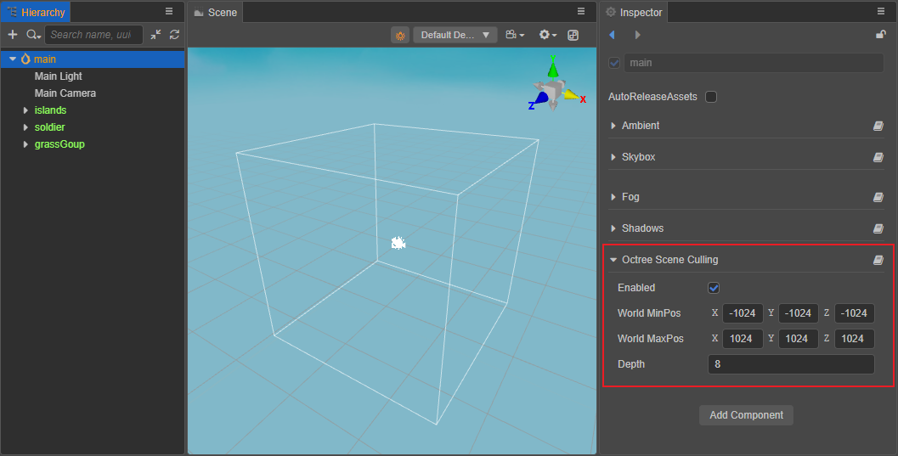

# Native Scene Culling

Creator supports native scene culling starting from v3.4.0, including **Octree Viewing Frustum Culling** and **Occlusion Query Culling** for native platforms only.

## Octree Viewing Frustum Culling

Generally, the engine culls models that are not in the viewing frustum (the visible range of the camera) by checking whether the bounding boxes of the models are in the viewing frustum one by one, which is slower. If octree culling is enabled, the models that are not in the viewing frustum can be quickly culled by the octree.

This feature is disabled by default, to enable it, select the scene root node **Scene** in the **Hierarchy** panel, then you can see the **Octree Scene Culling** option in the **Inspector** panel, and check **Enabled**.



When octree culling is enabled, the whole world's bounding box (e.g. the white bordered cube in the scene above) will be displayed in the **Scene** panel.

The properties of **Octree Scene Culling** are described as follows:

| Property | Description |
| :-- | :-- |
| Enabled      | Check this option to enable Octree Scene Culling, only for native platforms. |
| World MinPos | The minimum vertex coordinates of the world bounding box (objects beyond the bounding box are not rendered). |
| World MaxPos | The maximum vertex coordinates of the world bounding box (objects beyond the bounding box are not rendered). |
| Depth        | Depth of the octree, the default value is 8. If the scene is small, it is recommended not to set this value too large, otherwise it may consume memory. |

## Occlusion Query Culling

**Occlusion Query Culling** is off by default, if it is on, the GFX backend will perform an occlusion query through the graphics API and if the object is occluded, only the simplified bounding box and material will be used to render the object to improve performance.

This feature can be turned on with code that says

```ts
director.root.pipeline.setOcclusionQueryEnabled(true);
```

> **Note**: GLES 2.0 does not support occlusion query culling, and some GLES 3.0 devices do not support it without the `GL_EXT_occlusion_query_boolean` extension.

## Performance optimization suggestions

- If most of the objects in the scene are visible, it is recommended not to enable **Octree Viewing Frustum Culling** and **Occlusion Query Culling**.
- Performance may vary slightly from device to device, so decide whether to turn on the corresponding culling function after comparing performance tests.
