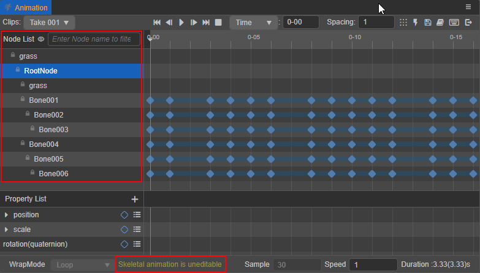

# Animation Clip

An Animation Clip is an asset containing animation data, which is one of the core elements of the animation system. By attaching an Animation Clip on the [Animation Component](animation-component.md), this animation data can be applied to the node where the Animation Component is located.

Currently, Creator supports importing Skeletal Animation assets produced by external art tools or by creating a new Animation Clip asset directly inside Creator.

## Animations created inside Creator

New Animation Clips can be created, edited, and previewed directly through the **Animation** panel, please refer to the [Animation Editor](animation.md) documentation for details.

This can also be done by scripting, please refer to the [Using Animation Curves](use-animation-curve.md) documentation for details.

## Externally imported skeleton animations

Externally imported animations include the following:

1. Skeletal Animations produced by third-party art tools.

2. Skeletal Animations that come with the model after it is imported.

When a model that contains animations is imported, the animation contained in the model will be imported at the same time. This animation is used in the same way as the internal new assets, and the crop of skeletal animation can be referred to [Introduction to the animation module of model assets](../asset/mesh.md) documentation.

For additional details about Skeletal Animation settings, please refer to the [Skeletal Animation](skeletal-animation.md) documentation.

> **Note**: Skeletal Animations imported externally cannot be edited in the **Animation** panel. The nodes are locked, and can only be edited in external art tools.
>
> 
