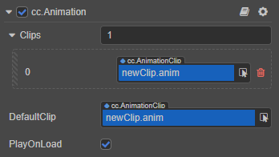

# Animation Component Reference

The Animation component can drive node and component properties on their nodes and children in an animated manner, including properties in user-defined scripts.

There are several ways to add Animation components:

1. Add an Animation component in the **Animation** panel, review the [Creating Animation Components and Animation Clips](animation-create.md) documentation for details.
2. Select the node to be animated in the **Hierarchy** panel, and then select **Add Component -> Animation -> Animation** in the **Inspector** panel to add an Animation component to the node.
3. Added via script, review the [Controlling Animation with Scripts](animation-component.md) documentation for details.

## Animation Component Properties

| Property | Description |
| :-- | :------ |
| Clips | The added animation clip asset, default is empty, support adding multiple. The AnimationClip added here can be edited directly in the **Animation** panel. |
| DefaultClip | The default animation clip. If this option is attached with the **PlayOnLoad** property checked, then the animation will automatically play the content of the Default Clip when it is loaded.
| PlayOnLoad | Boolean type. If this option is checked, the content of the Default Clip will be played automatically after the animation is loaded.

## Detailed Description

If an animation needs to contain multiple nodes, usually one creates a new node as the **root node** of the animation, and then the Animation component will be attached to the root node. All the other children nodes under this root node will be automatically entered into this animation clip and displayed in the **Node List** area of the **Animation** panel. For details, please refer to the [Get Familiar with the Animation Panel - Node list](animation-editor.md#2-node-list) documentation.

The Animation component also provides some common animation control functions. To control animations using scripts, please refer to the [Controlling Animation with Scripts](animation-component.md) documentation.
