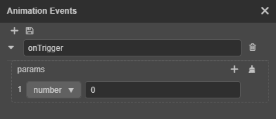

# Controlling Animation with Scripts

## Animation Component

The Animation Component manages a set of animation states that control the play, pause, resume, stop, switch, etc. of each animation. The Animation Component creates a corresponding [Animation State](animation-state.md) object for each Animation Clip. The Animation State is used to control the Animation Clips that need to be used on the object.

In the Animation Component, Animation States are identified by name, and the default name of each animation state is the name of its Animation Clip.

Adding an Animation Component to a node in a script is done in the following way:

```ts
import { Animation, Node } from 'cc';

function (node: Node) {
    const animationComponent = node.addComponent(Animation);
}
```

### Playing and switching animations

#### Playing animations

The Animation Component controls the playback of the specified animation via the [play()](__APIDOC__/en/#/docs/3.4/en/animation/Class/Animation?id=play) API, e.g:

```ts
// Play the animation state 'idle'
animationComponent.play('idle');

// Specify that the 'idle' animation will be played from 1s onwards
animationComponent.play('idle', 1);
```

If no specific animation is specified and `defaultClip` is set when using `play` to play an animation, the `defaultClip` animation will be played. If the `playOnLoad` of the Animation Component is also set to `true`, the Animation Component will automatically play the contents of `defaultClip` on the first run.

```ts
// The defaultClip animation will be played if the defaultClip is set without specifying the animation to be played
animationComponent.play();
```

#### Switching animation

When using the `play` interface to play an animation, if there are other animations playing at the same time, the other animations will be stopped immediately. This switch is very abrupt, and in some cases we want the switch to be a "fade in and fade out" effect, use [crossFade()](__APIDOC__/en/#/docs/3.4/en/animation/Class/Animation?id=crossfade) to smoothly complete the switch within the specified period. For example:

```ts
// Play the animation state 'walk'
animationComponent.play('walk');

/* ... */

// Smoothly switch from walk to run animation in 0.3 seconds
animationComponent.crossFade('run', 0.3);
```

This fade-in and fade-out mechanism of `crossFade()` makes it possible for more than one Animation State to be playing at the same moment. Therefore, the Animation Component has no concept of the **current animation**.

Even so, the Animation Component provides `pause()`, `resume()`, and `stop()` methods that pause, resume, and stop all the animation states being played while also pausing, resuming, and stopping the animation switching.

For more details about the control interface related to the Animation Component, please refer to the [Class Animation](__APIDOC__/en/#/docs/3.4/en/animation/Class/Animation).

## Animation State

The Animation Component only provides some simple control functions, which are mostly sufficient and easy to use, but for more animation information and animation control interfaces, review the [Animation State](animation-state.md) documentation.

## Frame Events

The **Animation** panel supports visual editing of [event frames](animation-event.md), or frame events can be added directly to the script.

The `events` of an `AnimationClip` contain all the frame events of this animation, each with the following properties:

```ts
{
    frame: number;
    func: string;
    params: any[];
}
```

- `frame`: the point in time when the event will be triggered, in seconds. For example, `0.618` means the event will be triggered when the animation reaches the 0.618th second. For the conversion between timeline scale units, please refer to the [Scale Unit Display of the Timeline](animation-editor.md#scale-unit-display-of-the-timeline) documentation.
- `func`: indicates the name of the function that will be called back when the event is triggered. When the event is triggered, the animation system will search **all the components in the animation root node**, if there is a component that implements the function specified in `func` of the animation event, it will call it and pass in the parameters in `params`.

For example, if an event frame is added at 0.5s of the animation timeline:



The code implemented in the script is as follows:

```ts
{
    frame: 0.5;
    func: 'onTrigger';
    params: [ 0 ];
}
```

### Example

The following code indicates that the default Animation Clip of the Animation Component of the node where the `MyScript` script component is located will call the `onTriggered()` method of the `MyScript` component when it reaches the 0.5 second mark and pass the parameter `0`.

```ts
import { Animation, Component } from 'cc';
class MyScript extends Component {
    constructor() {

    }

    public start() {
        const animationComponent = this.node.getComponent(Animation);
        if (animationComponent && animationComponent.defaultClip) {
            const { defaultClip } = animationComponent;
            defaultClip.events.push({
                frame: 0.5, // Triggers the event on the 0.5 second
                func: 'onTriggered', // The name of the function to call when the event is triggered
                params: [ 0 ], // Parameters passed to `func`
            });
            defaultClip.updateEventDatas();
        }
    }

    public onTriggered(arg: number) {
        console.log('I am triggered!');
    }
}
```

## Animation Events

In addition to the callbacks provided by the frame events in the **Animation** panel, the animation system also provides a way to call back animation events. The currently supported callback events include:

- `play`: triggered when playback starts
- `stop`: triggered when playback is stopped
- `pause`: triggered when playback is paused
- `resume`: triggered when playback is resumed
- `lastframe`: if the animation loop is greater than 1, triggered when the animation reaches the last frame.
- `finished`: trigger when the animation is finished.

For more details, please refer to the [Animation.EventType](__APIDOC__/en/#/docs/3.4/en/animation/Class/Animation?id=eventtype) API.
