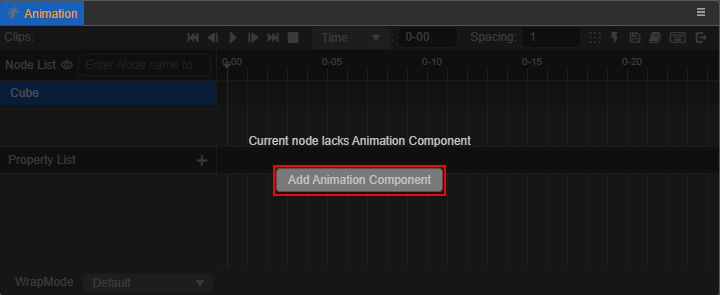
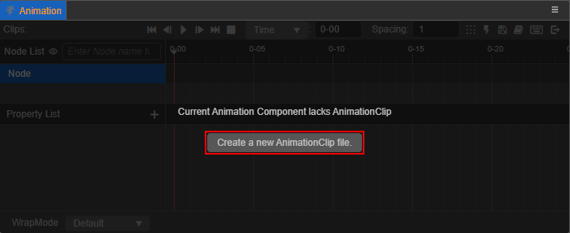
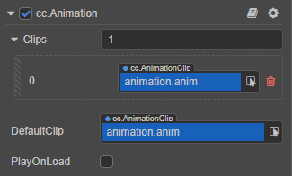
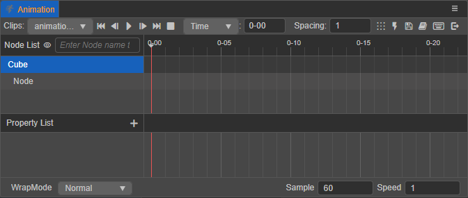
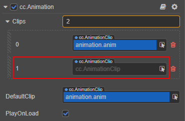
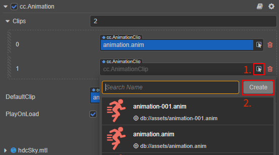

# Creating Animation Components and Animation Clips

Before using the **Animation** panel to create animation, select the node to add animation to in the **Hierarchy** panel or the **Scene** panel, then add the [Animation Component](./animation-comp.md) and mount the **Animation Clip** on the component to edit the animation data, and the edited animation data will be saved in the current Animation Clip. The animation data of the nodes that do not have a Clip mounted cannot be edited.

If the currently selected node does not have an Animation Component, the **Add Animation Component** button will be displayed on the interface of the **Animation** panel, click it to add **Animation Component** on the **Inspector** panel.

Go ahead and click the **Create a new AnimationClip file** button in the **Animation** panel and name it (e.g.: `animation`).

An animation clip (`animation.anim`) is automatically created in the **Assets** panel and mounted to the `DefaultClip` property of the Animation component:

The above briefly describes how to create Animation components and animation clips in the **Animation** panel, for more information about the creation and properties of Animation components, please refer to the [Animation Component Reference](./animation-comp.md). For more information on how to create animation clips, please refer to the end of this article.

Next, go ahead and click **Enter animation editing mode** to start [edit-animation-clip](edit-animation-clip.md). The newly created empty Animation Clip is displayed in the animation editor as follows:

## Attaching new animation clips

An Animation Component can have multiple Animation Clips attached to it. To additionally create and attach a new animation clip on the object of an existing Animation Clip, there are several ways to do so:

1. Click the **+** button at the top left of the **Assets** panel, or right-click on a blank area and select **Animation Clip**, which will generate an animation clip file (default name `animation`) in the **Assets** panel.

    Next, select the corresponding node in the **Hierarchy** panel, find the Animation Component (`cc.Animation`) in the **Inspector** panel, and change the value of the `Clips` property. For example, if only one clip file is attached, and to add another one, change the original **1** to **2**.

    

    Finally, drag the Animation Clip just created in the **Assets** panel to the `cc.AnimationClip` selection box in the above image.

2. Find the Animation component (`cc.Animation`) in the **Inspector** panel and change the value of the `Clips` property.

    Next, click the **Find** button behind the new empty `cc.AnimationClip` selection box, and click the **Create** button at the top right of the pop-up search window to automatically create an Animation Clip in the **Assets** panel and mount it to the `cc.AnimationClip` selection box.

    

3. To create the Animation Clip dynamically by using a script, please refer to the [use-animation-curve](use-animation-curve.md) documentation for details.

The Animation Clips to edit can be switched from the **Clips** drop-down list in the top left corner of **Animation** panel.
