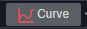
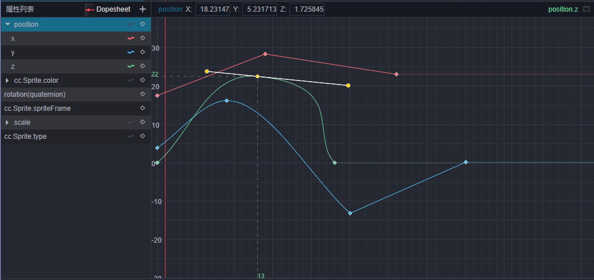
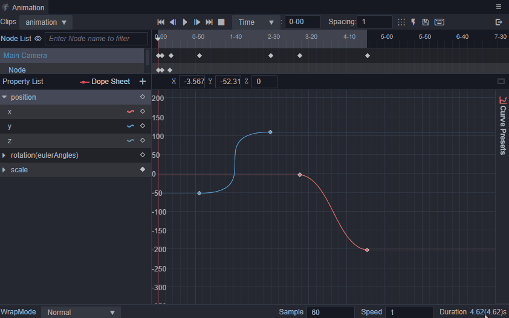

# Curve Editing View

After creating the basic animation clip, one can **control how the keyframes change over time between keyframes by editing the animation curve**. An animation curve is actually a linear track made up of individual keyframes connected on the current property track, with each keyframe being a control point on this curve path. Under the curve editing view, the change of keyframe values is more visually noticed, and keyframe value changes can be adjusted more delicately.

Click the switch view button  on the side of the properties list to switch to the curve editing view.
After switching to the curve editing view, you can see that the line markers will be displayed on the property list, and the line markers will not be displayed on the property tracks that do not support curve editing, and the curves will not be displayed normally when the corresponding property track is selected. When the corresponding curve is displayed in the curve editing area, the line marker will show the corresponding curve color, and the name of the currently selected curve will be displayed in the property menu area.

## Getting to know the curve editor

The **Animation** panel has a built-in curve editor for animation curves, which is actually the same as the particle curve editor. On top of the general curve editor, the **Animation** panel has some customization to better support curve keyframe editing.

For general functions of the curve editor, please refer to the [Curve Editor](./curve-editor.md) documentation for more information.

In addition to general curve editing operations, the curve editor area within the **Animation** panel supports the following functions.

- To show all keyframes, click the button above the curve editor area , or press the <kbd>F</kbd> shortcut to quickly scale the current view area to show all keyframes.
- Shortcuts and handling of all keyframes in the keyframe view of the **Animation** panel, such as double-clicking on the keyframe time line to move to the keyframe position, copy and paste shortcuts, etc.
- Copy and paste in curve editing area is shared with keyframe view mode, so you can paste copied keyframe data with each other in different display views.
- The number of intervals used for the interval alignment keyframe function of the curve editor will be synchronized with the number of intervals in the menu bar of the **Animation** panel.

### Bezier Curve Preset

There are some standard Bezier curve presets built into the animation editor. After entering the curve editing view, click the curve preset panel in the sidebar to show the curve presets. Click the curve to select the curve clip, and then click the preset on the curve preset panel you can applying the curve preset. After apllying preset, the interpMode of the keyframes at both ends of the curve clip will be adjusted to curve mode by default, and the weightMode of the keyframes will be modified to a state where the left and right sides of the curve clip can be stretched freely to achieve the same effect as the curve preset.

