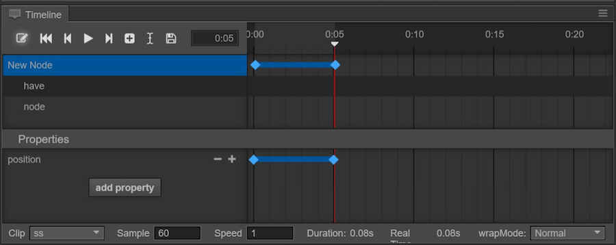
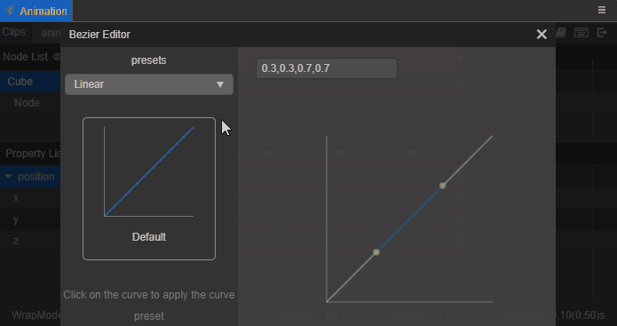
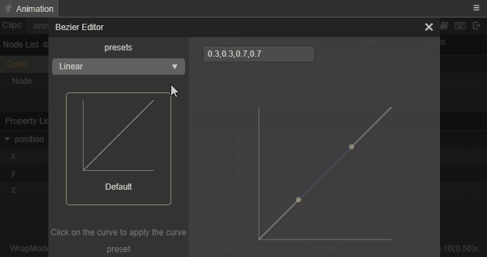
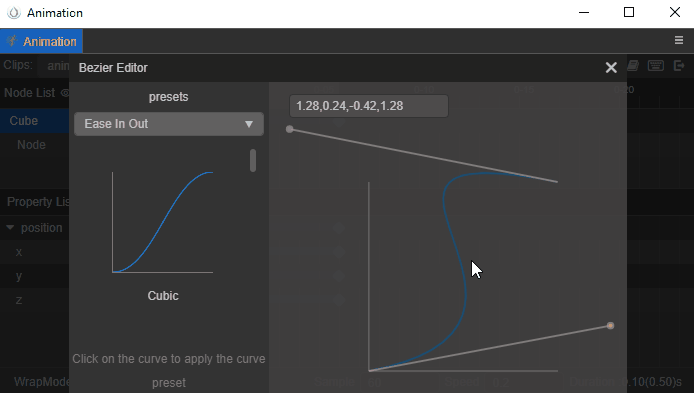

# Editing Animation Easing Curve

After creating a basic Animation Clip, sometimes it is necessary to implement an easing effect like **EaseInOut** between two keyframes. How is this done in the **Animation** panel?

First, add an Animation Property and create two unequal keyframes on the Animation Property track. For example, create two keyframes on the Animation Property `position`, from `(0, 0, 0)` to `(100, 100, 100)`, then a blue connecting line will appear between the two keyframes, double click the connecting line to open the curve editor, the default settings of the panel are as follows:

The animation curves are modified in real time, no need to click save, just click close button in the top right corner.

## Using Preset Easing Curve

In the **Presets** menu, there are several preset curves in **Linear**, **Static**, **Ease In**, **Ease Out**, **Ease In Out**, **User**. Among them, **User** is a custom curve preset category, which is used to store some custom curve effects, please refer to **Custom Easing Curve** section below for details.

Click on the preset curve on the left to apply it directly to the current Animation Curve, and the preset being used on the left will have a golden border check effect.

## Custom Easing Curve

If the preset curves do not meet the animation needs, they can be modified directly in the curve preview area on the right.

There are two gray control points in the curve preview area of the curve editor, drag and drop the control points to change the curve trajectory. If the control points need to be out of view, zoom the preview image by using the mouse wheel.

The curve data during modification is displayed in real time in the input box in the upper left corner of the curve preview area, and **manual input of curve data in the input box** is also supported to generate the curve. The format of the curve data must be **composed of four numbers separated by commas**, otherwise it will not be applied properly.

### Saving Custom Curves

If the custom curve data needs to be saved for reuse, it can be saved in the preset library of **User**.  
After the custom curve is edited, select **User** in the preset menu at the top left, then enter the name of the curve data to save in the input box below, and click the **Add** button to save the custom curve to the preset library of **User**.

> **Note**: **curves with the same name will be overwritten**, saving of custom curves cannot be undone. If they are overwritten they need to be added again.

Custom curves saved in the **User** preset library are the same as preset curves from other libraries, **click to apply them directly**. Also, when the mouse moves to the custom curve, a delete icon button will appear in the lower right corner, click to delete the corresponding easing curve data.
