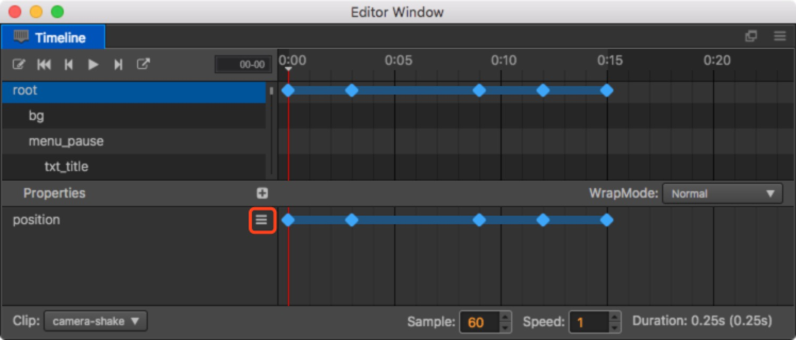

# Editing an Animation curve

Now, that you have mounted Animation clips to the Node, you can create Animation
curves in your Animation clips.

First, you need to understand Animation properties. These include the existing properties of the Node, such as, position rotation, etc. and the user-defined properties of the component.
Properties that are included in a component will add the name of the component to the beginning of their own name, such as: `cc.Sprite.spriteFrame`.

For example, in the image above, the position curve is the property path and the
corresponding blue dots are animation frames.

## Adding a new property path

The normal method for adding a new property path involves first choosing the Node
and then clicking `+` in the property field. In the pop up menu, all
of the addable properties will be listed. Choose the property that you want to add and a corresponding path will be added.

## Delete a property path
Right click the property in the property list and choose the delete option in the pop up menu and the property will be deleted from the animation data.

## Add an animation frame

You can also directly click the 'more' button, sign on the right side of the corresponding property in the property list, then a frame will be added to the currently selected point in time.

Or modify the corresponding properties of the Node in the recording status.
It is important to note that if the changed property track does not exist, the operation will be ignored, so if you want to change the key frame automatically, you will need to create the property track in advance.

## Choose an animation frame
Click the created sequence frame and it will be displayed in the selected state. Now the sequence frame will turn from blue to white. If you need to select multiple sequence frames at once, you can hold down the Ctrl key and select the ones you need or directly drag and highlight them in the property field.

## Move an animation frame
If you move the mouse to any randomly chosen Node, the mouse will display left and right arrows.
You can drag all the chosen Nodes while holding down the left mouse button.

## Modify an animation frame
Click the animation frame that needs to be modified and the selected frame on the
timeline will jump to this frame. After making sure the recording status is opened,
you can directly modify the corresponding properties in the Properties.

## Delete an animation frame
After choosing a sequence frame, click the ??sign in the property field and the currently selected sequence frame will be deleted. Or directly press the Delete key on the keyboard and all the selected nodes will be deleted.

---

Continue on to read about [Sprite Animations](sprite-animation.md).
