# Get Familiar with the Animation Panel

The **Animation** panel is used to edit and preview the animation clip of the currently selected node. When editing animation data or related properties, it will take effect immediately after mouse focus leaves.

The **Animation** panel is already included in the default layout of Cocos Creator, or open the **Animation** panel by clicking **Panel -> Animation -> Animation Editor** in the main menu above the editor.

## Panel Introduction

The **Animation** panel can be divided into the following main sections.

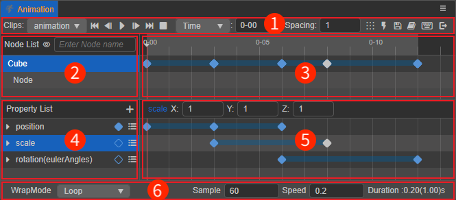

1. **Toolbar**: some common function buttons, such as play/pause/stop animation, add event frame, save animation, quit editing, etc.
2. **Node List**: used to display/set the currently selected node and its child nodes.
3. **Animation timeline and Keyframe Preview**: used to display/set the event frames added to the current node (and its children) and the preview of all keyframes on the added animation property.
4. **Animation Property List**: used to display/set all animation properties included in the currently edited animation clip for the currently selected node.
5. **Animation Property Keyframe Preview**: used to display/set all keyframes on each animation property of the currently selected node.
6. **Related properties of the current animation clip**: used to set the playback mode, playback speed, etc. of the current animation clip.

For specific content, please refer to the following introduction.

### 1. Menu Toolbar

The function buttons in the **Menu toolbar** are, from left to right.

| Icon | Description | Shortcut |
| :---- | :--- | :--- |
| 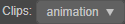 | Toggle animation clips. When multiple animation clips are attached on the Animation component, this button can be used to toggle between clips. | - |
| 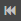 | Moves the red time control line to the beginning of the current animation clip | <kbd>Ctrl</kbd>/<kbd>Cmd</kbd> + <kbd>←</kbd> |
| 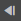 | Move time control line to previous frame | <kbd>←</kbd> |
| 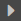 | Play/pause current animation | <kbd>Ctrl</kbd>/<kbd>Cmd</kbd> + <kbd>P</kbd> |
| 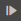 | Move the time control line to the next frame | <kbd>→</kbd> |
| 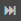 | Move the time control line to the end of the current animation clip | <kbd>Ctrl</kbd>/<kbd>Cmd</kbd> + <kbd>→</kbd> |
| 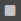 | Click to stop the current animation, the time control line will move to the first frame after stopping | <kbd>Ctrl</kbd>/<kbd>Cmd</kbd> + <kbd>S</kbd> |
| 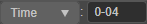 | The scale unit of the timeline are displayed in three ways:  **Time: 0-00** **Frame: 0** **Time (s): 0 s**  See the **Scale Units of the Timeline** section below for details. | - |
| | Used to set the spacing size between keyframes when multiple keyframes are generated at the same time. | - |
|  | Spacing the selected keyframes at the same time. The selected keyframes will be spaced according to the first frame, using the value in the **Spacing** input box as the spacing size.
|  | Add event frame, click this button to add an event frame above the current timeline | - |
| 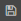 | Save the currently edited animation data. | - |
| 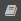 | Click this button to jump to the official manual section on the **Animation** panel | <kbd>Ctrl</kbd>/<kbd>Cmd</kbd> + <kbd>S</kbd> |
| 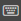 | Open the shortcuts panel, which supports custom shortcuts. See the **Shortcuts** section below for details | - |
| 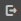| Exit animation editing mode | <kbd>Ctrl</kbd> + <kbd>Q</kbd> |

### 2. Node list

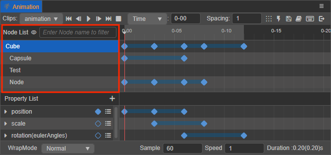

This area shows the currently selected animation nodes and their children, arranged in a way that corresponds to the node tree in the **Hierarchy** panel. Click on the top 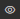 button to hide/show nodes without animation data, or just type the node name in the input box to quickly find the node.

Currently, it is possible to right-click on a node to clear, migrate, copy and paste node data. For details, please refer to the [Common operations on node data](edit-animation-clip.md#common-operations-on-node-data) documentation.

### 3. Animation timeline and keyframe preview

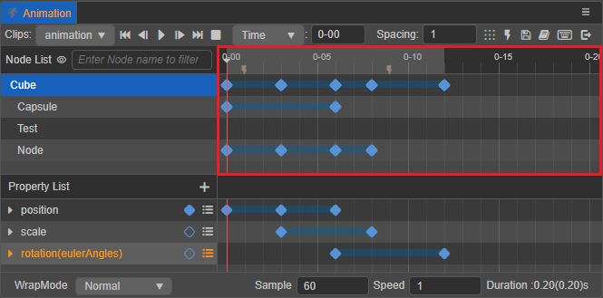

The animation timeline is mainly used to display/set the custom [event frames](animation-event.md) added to the current node, the [keyframes](edit-animation-clip.md) (blue diamond) of all animation properties added to the node (and its children) and to show the preview.

The time control line (red vertical line) indicates the time the current animation is at, and the currently selected time can be changed in several ways:

- Drag and drop the time control line directly
- Double click on the keyframe
- Using the relevant move control buttons in the menu toolbar
- Use shortcut keys, which can be found in the **Shortcuts** section below
- Click anywhere in the upper area of the animation timeline

  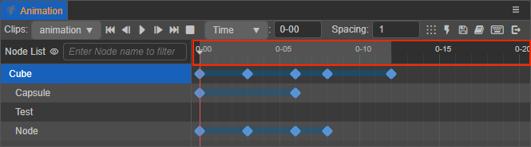

If the time control line is moved, the nodes in the **Scene** panel will also move accordingly to the animation track.

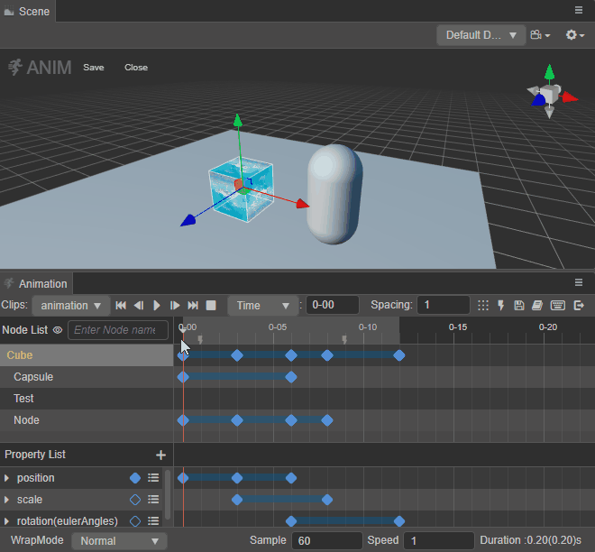

#### Scale unit display of the timeline

The  button in the **Toolbar** can be used to toggle the way the scale unit of the timeline is displayed. The value in the input box will change with the movement of the time control line. Manual input is supported, and the time control line will be automatically positioned to the corresponding position after the input is finished.

The following three display methods are currently supported:

- **Time: 0-00** (default): the animation timeline scale is displayed as a combination of seconds and frames. The value in front of the input box means **seconds**, and the value after it means **frames**, for example `01-05` means 1 second and 5 frames.

  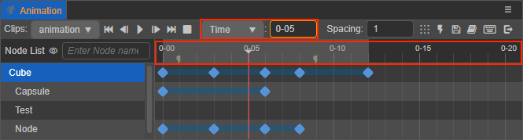

- **Frame: 0**: display the scale of the animation timeline in terms of frames.

  

- **Time(s): 0 s**: display the scale of the animation timeline in seconds.

  

The frame rate (Sample) is generally used to indicate how many frames a second is to be divided into, which can be adjusted in the **Sample** option at the bottom of the **Animation** panel. This is affected to a different extent when the scale unit of the timeline is displayed in different ways.

When the scale unit is set to **Frame**, it is in frames and is not affected by the frame rate.  
When set to **Time** or **Time(s)**, the same scale represents a different point in time as the frame rate changes, and the conversion between the two is calculated as follows:

| Frame Rate (Sample) | Time: 00-00 | Time (s): 0 s |
| :-- | :--------- | :------------ |
| 30 | 01-05 | 1 + 5/30 = 1.17 s |
| 10 | 01-05 | 1 + 5/10 = 1.5 s |

For example, if the frame rate is set to 30 and a keyframe is added to the `01-05` scale, the keyframe will be at frame 35 after the animation starts. Changing the frame rate to 10, the total number of frames where the keyframe is located does not change, it is still at frame 35 after the start of the animation, and the scale reading at the keyframe location becomes `03-05`, which translates to exactly 3 times the previous time (s).

#### Changing the animation timeline scale

If the **Animation** panel display is too small and needs to be enlarged for more keyframes to be displayed within the editor, Just simply scroll the mouse wheel in either **Animation Timeline** and **Animation Property Keyframe Preview** area to scale the timeline up or down.

#### Moving the animation timeline display area

Drag and drop the middle/right mouse button in any area of the **Animation Timeline** or **Animation Property Keyframe preview** to see the hidden keyframes on the left/right side of the animation timeline that are outside the display area.

### 4. List of animation property

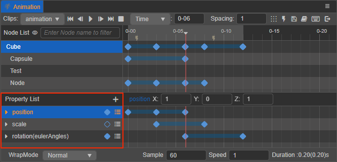

This area is mainly used to display/add/set the animation property of the currently selected node in the current Animation Clip. The animation properties include the node's own properties, component properties (including those in user-defined script components), and the animation properties are added by clicking the **+** button in the upper right corner. Component properties are prefixed with the name of the component, e.g.: `cc.Sprite.spriteFrame`.

Right-click on the animation property or click 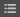 button to the right of the animation property to select **Remove Prop Track**, **Clear Keyframe Data**, or **Copy Prop Track**. For details, please refer to the [Common operations on animation property data](edit-animation-clip.md#Common-operations-on-animation-property-data) documentation.

### 5. Keyframe preview of the animation property

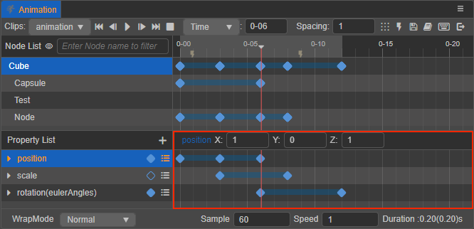

This area is mainly used to display the specific keyframe settings of the currently selected node on each animation property, and is also the main area for keyframe editing. Keyframes can be added by right-clicking on the animation property on the right side. This area also supports the ability to move, copy, and paste keyframes by checking and tapping on them. For details, please refer to the [Common keyframe operations](edit-animation-clip.md#common-keyframe-operations) documentation.

When clicking on a keyframe, it will turn from blue to white and information about it will be displayed above the area, and double-clicking on the keyframe will move the time control line to its location.

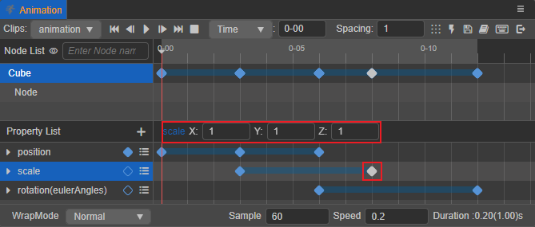

### 6. Related properties of the current animation clip

The properties of the current Animation Clip that can be set directly on the **Animation** panel include: **WrapMode**, **Sample**, **Speed** and **Duration**. For details, please refer to the [Animation Clip Properties Settings](edit-animation-clip.md#animation-clip-properties-settings) documentation.

## Adjusting the Layout of the Animation Panel

The dividers between the node list and the timeline, and between the property list and the timeline are available for dragging and dropping to change the layout. By dragging and dropping you can freely adjust the **Animation** panel to a layout effect suitable for editing.

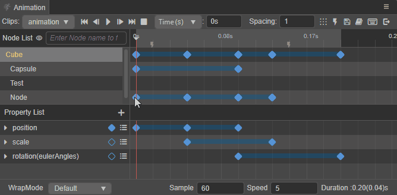

## Shortcut keys

Click on the menu toolbar's  button in the menu toolbar to open the shortcuts panel:

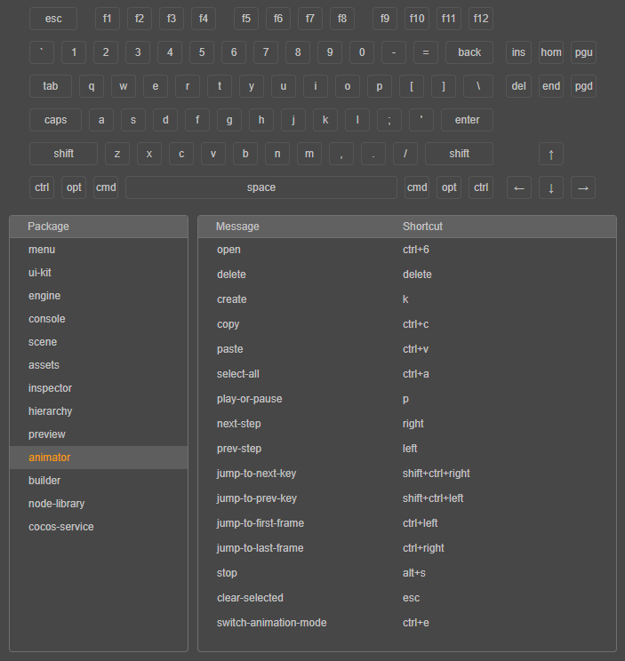

Shortcuts can be customized in the **Animation** panel. Directly click the shortcut key combination of the function to be modified. A prompt will appear as shown below.

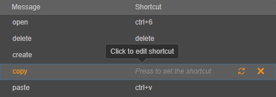

### Default shortcut key summary

Function | Shortcut | Description
:--- | :----- | :---
Enter/exit **Animation** panel | <kbd>Ctrl</kbd>/<kbd>Cmd</kbd> + <kbd>E</kbd> | -
Save animation data | <kbd>Ctrl</kbd>/<kbd>Cmd</kbd> + <kbd>S</kbd> | -
Move forward one frame | <kbd>←</kbd> | Ignore current operation if already at frame 0. Move the time control line when the keyframe is not selected, move the keyframe when the keyframe is selected.
Move back one frame | <kbd>→</kbd> | Move the time control line when the keyframe is not selected, move the keyframe when the keyframe is selected.
Move to the first frame | <kbd>Ctrl</kbd>/<kbd>Cmd</kbd> + <kbd>←</kbd> | Move the red time control line to the beginning of the current animation clip.
Move to the last frame | <kbd>Ctrl</kbd>/<kbd>Cmd</kbd> + <kbd>→</kbd> | Move the time control line to the end of the current animation clip.
Delete the currently selected keyframe | <kbd>Delete</kbd> / <kbd>Cmd</kbd> + <kbd>Backspace</kbd> | -
Play/Pause Animation | <kbd>P</kbd> | -
Stop animation | <kbd>Alt</kbd> + <kbd>S</kbd> | The current time will change to 0 and the time control line will move to the first frame.
Add keyframe | <kbd>K</kbd> | When any animation property is selected, a keyframe will be added at the location of the time control line, ignored if no animation property is selected.
Jump to previous keyframe | <kbd>Ctrl</kbd>/<kbd>Cmd</kbd> + <kbd>Shift</kbd> + <kbd>←</kbd> | Move the time control line to the nearest keyframe on the left (on the selected property track or on the selected node).
Jump to the next keyframe | <kbd>Ctrl</kbd>/<kbd>Cmd</kbd> + <kbd>Shift</kbd> + <kbd>→</kbd> | Move the time control line to the nearest keyframe on the right (on the selected property track or on the selected node).
Multi-select keyframes | <kbd>Ctrl</kbd> | Hold down <kbd>Ctrl</kbd> and click on a keyframe to multi-select a keyframe.
Select all animation property keyframes | <kbd>Ctrl</kbd>/<kbd>Cmd</kbd> + <kbd>A</kbd> | Select all keyframes on the selected animation property.
Copy selected animation data | <kbd>Ctrl</kbd>/<kbd>Cmd</kbd> + <kbd>C</kbd> | Supports copying selected keyframes, property tracks, and node data, while only one type of data can be copied, and the copying priority is determined in this order.
Paste last copied animation data | <kbd>Ctrl</kbd>/<kbd>Cmd</kbd> + <kbd>V</kbd> | Support to paste last copied animation data (e.g.: animation keyframes, animation properties, animation node data, and check the currently available data in that order) across editors (v3.x only).
Unchecked keyframes/event frames/property tracks | <kbd>Esc</kbd> | -

> **Note**: currently, all shortcuts require mouse focus on the Animation Editor panel to take effect, except for the shortcuts **Enter/Exit Animation Editor** and **Save Animation** which are globally available.
