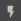
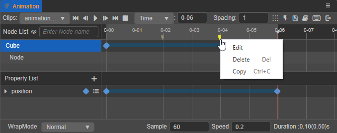
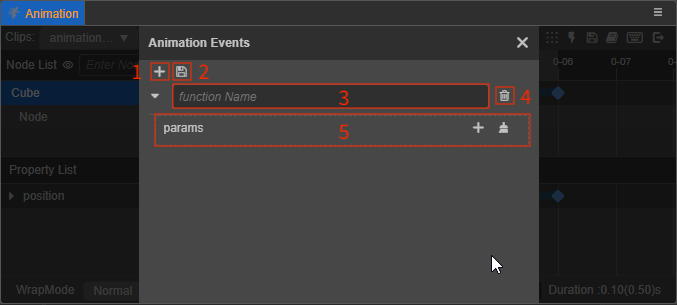
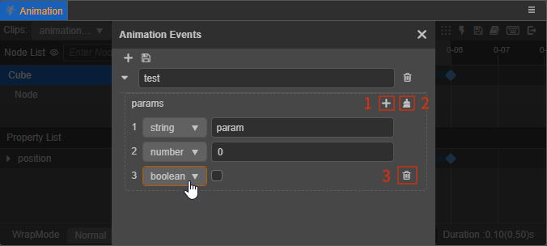

# Adding Animation Events

Animation clips can be better enriched by calling **Animation Event** functions on the specified frame of the animation timeline. After adding **event frames** to a frame of the animation timeline, the animation system will match the corresponding function method in the root node of the animation with the name of the trigger function set in the event frame and execute it when the animation reaches that frame.

To add Animation Events via scripts, please refer to the [Frame Event](animation-component.md#frame-event) documentation for more details.

## Adding event frames

Adding event frames in the **Animation** panel consists of two ways:

1. Drag the time control line to the position where you want to add the event frame, and then click  button in the **Animation Timeline** to add an event frame above the **Animation Timeline**.

2. Right click on the area above the animation timeline and select **New Event Frame**.

After the event frame is added, move the mouse over the event frame and the color will change from white to yellow. Right-click the event frame to perform **Edit**, **Delete**, **Copy-Paste** operations. Event frames can be batched while holding down <kbd>Ctrl</kbd>.

- **Edit**: open the event editor and add event functions
- **Delete**: delete event frames
- **Copy/Paste**: copy and paste event frame data, supports cross-editor (v3.x) use.

### Editing event frames

Right-click on the added event frame and select **Edit** or double-click directly to open the event editor. In the event editor, it is possible to manually enter the name of the event function that needs to be triggered, and the trigger will match the corresponding function method in each component of the animation root node according to this function name, and call it with parameters.

- 1 - add a new trigger function.
- 2 - save the event function.
- 3 - fill in the name of the function to be triggered.
- 4 - delete the current event function.
- 5 - add incoming parameters, currently supports **String**, **Number**, **Boolean** types.

  

- 1 - add incoming parameters, you can choose the parameter type as needed.
- 2 - delete all the added incoming parameters below.
- 3 - When the mouse moves over a parameter, this button will appear, click on it to delete the currently selected parameter.

### Delete event frames

Right-click on an event frame that has been added to the animation timeline (multiple selections are possible) and select **Delete** or use the shortcut <kbd>Delete</kbd> to delete the event frame and all event functions.

### Copy and paste event frames

Copy and paste of event frames and their event functions is supported across editors (v3.x). Copy and paste includes the following two ways of use:

- After selecting an event frame (multiple selection is allowed), use the shortcut keys <kbd>Ctrl</kbd> + <kbd>C</kbd> and <kbd>Ctrl</kbd> + <kbd>V</kbd> to copy and paste. Note that the shortcut paste will start at the position of the current time control line.
- Once selecting an event frame (multiple selection is allowed), right-click on (any) event frame and select **Copy** in the pop-up menu, then right-click on top of the animation timeline and select **Paste Event Frame**.
