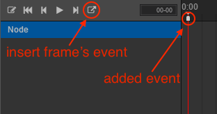

# Animation Events

When using animations in your games, you may want things to during a frame or even
at the end of a frame. We call these animation events.

## Adding an event

First, choose the position where you want an event to happen. Click the __add event__
button at the far left side of the button field. A white rectangle will appear on
the timeline representing the newly added event.

## Deleting an event

There are two ways to delete an event.

* Double click the white rectangle that represents the event.
* Click the __Recycle__ icon behind __Function__ after opening the event editor.

A prompt for deleting this event will appear. Click the __Confirm__ button and the
event will be deleted.

You can also right click __Event__ in the animation editor and choose __Delete__.

## Specifying the  event trigger function and import parameters

Double click the white rectangle of the event you want to modify and the event editor
will open. In the editor, you can manually input the function name that needs to be transmitted. When triggering, the corresponding method will be matched to each component according to this function name.

If you want add imported parameters, you can click `+` or `-` near Params. Only three types of parameters supported: Boolean, String and Number.
