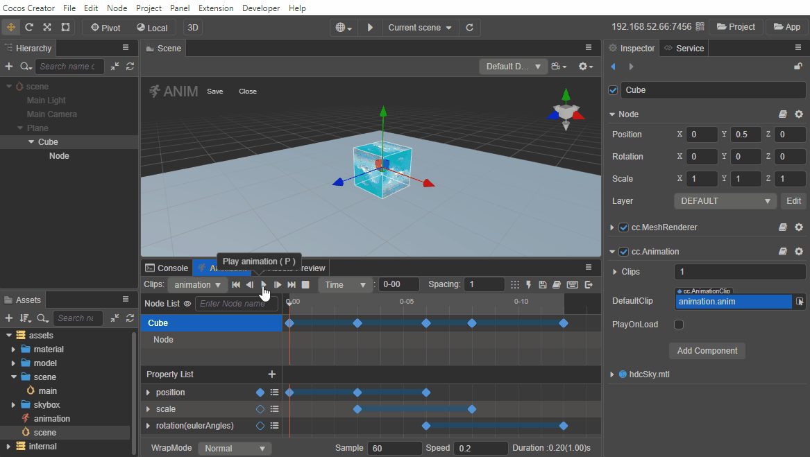
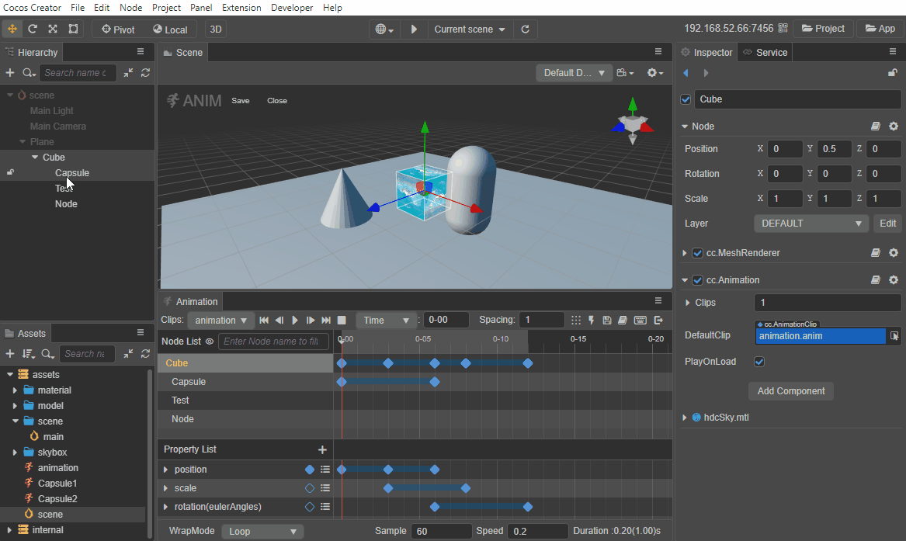
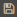
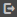

# Animation Panel

Creator supports creating, editing and previewing animation clips directly in the **Animation** panel. In addition to animating the basic properties of nodes, it also supports animating the properties of materials and some components, and it can enrich animation clips by calling the event functions of the [animation event](animation-event.md).

To edit an **Animation Clip** using the **Animation** panel, add an **Animation Component** to a node and attach the clip to the Animation Component. For details, please refer to the [Creating Animation Components and Animation Clips](animation-create.md) documentation.

## Animation editing mode

The animation data in an Animation Clip can only be edited in **Animation Editing Mode**. In Animation Editing Mode, nodes cannot be added/deleted/renamed and property changes that are not recorded within animation keyframes will also be restored after exiting animation editing mode.

When in the Animation Editing Mode, nodes that are not involved in animation data editing are grayed out in the **Hierarchy** panel. When a node is selected in the **Animation** panel, the **Hierarchy** panel will highlight the corresponding node and vice versa.

**Opening the edit mode includes the following two ways**:
 
- Select a node with an Animation component in the **Hierarchy** panel that contains more than one clip file, then click the **Enter Animation Edit Mode** button in **Animation** panel.
- Shortcut <kbd>Ctrl/Cmd + E</kbd>.

**Saving the edited animation data includes the following three ways**.

Click the  (Save) button in the top right corner of the **Animation** panel.
- Click the **Save** button in the top left corner of the **Scene** panel.
- Shortcut <kbd>Ctrl/Cmd + S</kbd>.

**Exit edit mode includes the following three ways**:

- Click the  (Exit) button in the top right corner of the **Animation** panel.
- Click the **Close** button in the top left corner of the **Scene** panel.
- Shortcut <kbd>Ctrl/Cmd + E</kbd>.
