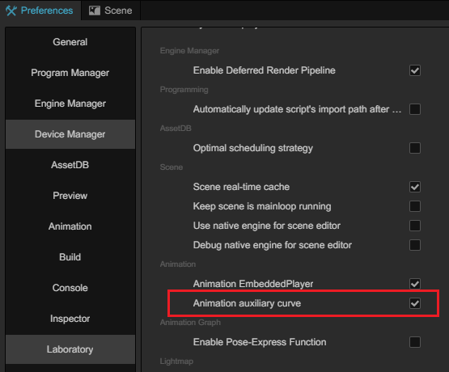

# Auxiliary Curves (Experimental Feature)

You can define and edit auxiliary curves in the animation editor. These are standalone `RealCurve` curve data used in conjunction with animation state machines and other modules.

> In version 3.8, this feature is considered experimental, and developers need to enable it in **Preferences -> Laboratory**.
> Once enabled, you will see the editing area for auxiliary curves in the animation editor.
> 

## Track Operations

> In version 3.8, auxiliary curves are only supported in **skeletal animations**.

By selecting a supported animation type, you can display the defined auxiliary curves. For the same animation, the names of the auxiliary curves serve as unique identifiers and must be **unique**.

Click the **+** button on the right side of the **Curve Name List** to directly add a new auxiliary curve.

Right-click on an existing auxiliary curve to **rename** or **delete** it.

## Keyframes, Curves Editing

The curve editing area is located on the right side of the curve name list. The specific operations in this section can be referenced from the relevant content in animation clip editing:

-   [Keyframe Editing](animation-keyFrames.md)
-   [Curve Editing](animation-curve.md)
-   [Curve Editor](curve-editor.md)
