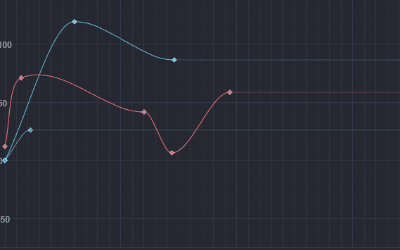
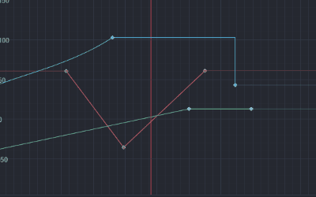
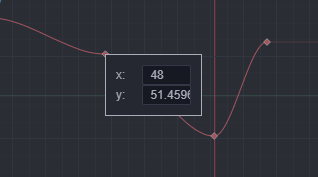
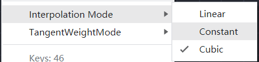
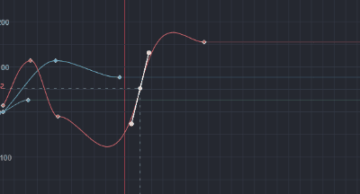
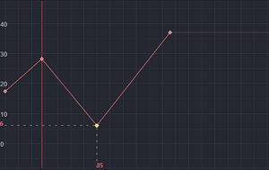
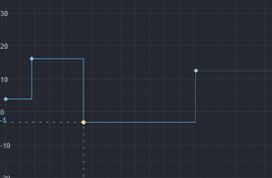
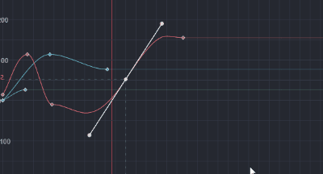
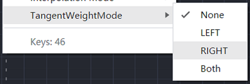

# Curve Editor

The Curve Editor is mainly used to edit the curve trajectory that changes between keyframes. The keyframe curves of animations and particles in the editor are edited using the Curve Editor. For the key point on each curve, **the horizontal coordinate is the keyframe time/frame rate, and the vertical coordinate is the value of the current curve property at the corresponding time**. The Curve Editor supports editing multiple curves at the same time, but only single curve editing is currently available in the particle usage scene.

## Scaling and moving the curve display area

- **Scroll the mouse wheel** directly within the curve display area **to zoom in and out of the horizontal and vertical timeline at the same time**.
- Hold down the right mouse button and drag to pan the current display area.

In addition, shortcut keys can be used to control the pan and zoom of the horizontal and vertical timeline individually.

- Hold down <kbd>Shift</kbd> and roll the mouse wheel to **pan** the curve view area to the left or right;
- Hold <kbd>Ctrl</kbd>/<kbd>Cmd</kbd> + <kbd>Shift</kbd> and roll the mouse wheel to **zoom** the curve view area to the left or right;
- Hold down <kbd>Alt</kbd>/<kbd>Option</kbd> and roll the mouse wheel to **pan** the curve view area up or down;
- Hold down <kbd>Ctrl</kbd>+<kbd>Alt</kbd> / <kbd>Cmd</kbd>+<kbd>Option</kbd> and roll the mouse wheel to **zoom** the curve view area up or down.

## Editing Curve Trajectory

### Adding keyframes

1. Right-click on an existing curve segment where the keyframe is to be added, and then select **Add Keyframe to Curve** in the pop-up menu.
2. When only one curve is displayed, right-click on any blank space and select **New Keyframe** in the pop-up menu.

### Selecting keyframes

A keyframe can be selected by clicking on it directly, or by framing it, and the selected keyframe will be shown in yellow. The selected keyframe will be shown in yellow. When the keyframe is selected individually, the value of the current keyframe will be shown on the left and right axes.

### Moving keyframes

Drag the keyframe directly after it is selected.

### Scaling keyframes

After selecting multiple keyframes, drag the border of the selected area to scale the keyframes as a whole.

### Spacing keyframes

After framing multiple keyframes, click on the selected area and select **Spacing selected keyframes** in the pop-up menu.

### Removing keyframes

After selecting a keyframe, press <kbd>Delete</kbd> (Windows) or <kbd>Cmd</kbd> + <kbd>Backspace</kbd> (macOS) or right-click the selected area and select `Delete` in the pop-up menu.

### Copying and pasting keyframes

- Copying keyframe
After selecting a keyframe, right-click on the selected area and select **Copy**, or press <kbd>Ctrl</kbd>/<kbd>Cmd</kbd> + <kbd>C</kbd>.

- Pasting keyframe
In any blank space, right-click on the selected area and select **Paste**, or just use the shortcut <kbd>Ctrl</kbd>/<kbd>Cmd</kbd> + <kbd>V</kbd>.

### Editing keyframe data

In the Curve Editor, the keyframe values are already displayed visually, dragging the keyframes up, down, left, and right is actually modifying the underlying keyframe data. In some cases where controlling the keyframe value precisely is necessary, right-click on the keyframe and select **Edit Keyframe Data** in the pop-up menu.

### Interpolation Mode

Right-click on the keyframe and select the corresponding value for `Interpolation Mode` in the pop-up menu. The linear interpolation mode will affect the way the value changes between the current keyframe and the next frame, and different option values will have different display effects. See below for more details on the options.

The interpolation mode includes the following option values:

- **Linear**: linear mode, linearly varying the value between the current frame and the next keyframe, with the tangent direction pointing to the next keyframe.

    

- **Constant**: constant mode, where changes between the current keyframe and the next keyframe keep the current keyframe value unchanged.

    

- **Cubic**: free curve mode, where the value between the current frame and the next keyframe changes in a curve. Only in the current mode the left and right tangent levers appear when the keyframe is selected.

    

### Editing keyframe tangents

A keyframe has two tangents on the left and right, the length and direction of the tangents will control the shape of the curve between keyframes. In `Cubic` interpolation mode, just drag the tangent control point to edit it directly. In different tangent weight modes, the tangent lever can be operated in different ranges, please refer to the next paragraph.

#### Tangent Weight Mode

Right-click on the keyframe to see the modification options menu for the interpolation mode, and click on Modify. The tangent weight mode value will only work if the `Interpolation Mode` is `Cubic`.

The tangent option range is actually two main types:

- **No-Weighting Mode**: the variation between keyframes uses the Hermite algorithm, where the direction of the curve depends on the direction of the left and right tangents of the keyframes. In this case, the left and right tangent levers of the keyframe can only change the tangent direction. The tangent control points at this point are only drawn to facilitate the direction change, so the tangent lever length does not change when scaling the curve view area at this point.

- **Weighting Mode**: the change between keyframes uses the Bessel algorithm, and the curve orientation is also influenced by the left and right tangent control points of the keyframes. The left tangent control point can be moved at will to adjust the control bar length, the left tangent control point is the real coordinate point at this time, and the control bar will be scaled simultaneously when scaling the curve view area.

    

The keyframe has left and right tangents, and the tangent weight mode has the following option values:

- `None`: the left and right tangents are in no-weighting mode.
- `Left`: left tangent is in weighting mode, right tangent is in no-weighting mode.
- `Right`: right tangent is in in weighting mode, left tangent is in no-weighting mode.
- `Both`: both left and right tangents are in weighting mode.

#### Broken

By default, the left and right tangent slopes of the keyframe are kept the same. Adjusting the tangent lever on either side will follow the adjustment on the other side, which makes it easier for us to adjust the transition more naturally. In some cases, the curve does not always transition smoothly. At this time, right-click the keyframe and click the Broken option in the right-click menu to disconnect the key left and right joysticks. After disconnecting, the keyframes can be adjusted separately using the left and right joysticks.

### Moving curves up and down

The whole curve can be dragged up and down directly after double tapping the curve.
