# Editing Animation Clips

Once an Animation Clip is attached on to an Animation Component of a node, click **Enter animation editing mode** or use the shortcut <kbd>Ctrl</kbd>/<kbd>Cmd</kbd> + <kbd>E</kbd> to enter Animation Editing Mode and add keyframe data to the Animation Clip to animate the node. Please refer to the [Animation panel](animation-editor.md) documentation before editing animation clips.

An Animation Clip may contain multiple nodes (nodes and their children), and multiple animation properties can be attached to each node. By moving, rotating, or scaling the nodes, keyframes are added to the animation property corresponding to the currently selected node. All the keyframes added to the animation property are displayed in the corresponding animation property as a list pattern of linear trajectories, which are called animation curves.

## Creating an Animation Curve

Before adding keyframes, it is necessary to know about animation properties. The animation properties include the node's own `position`, `rotation`, `scale`, and other properties, and also include the custom properties in the component `Component`. The properties included in the component are preceded by the name of the component, e.g.: `cc.Sprite.spriteFrame`.

Click the **+** button in the upper-right corner of the **Property List** area to add animation properties as needed, depending on the node type. Added animation properties are grayed out and cannot be added repeatedly.

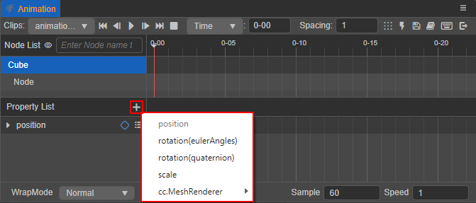

Once the animation properties are added, keyframes can be added to the properties track on the right. When the node and its animation properties are shown in blue in the list, it is determined that the node's properties are the target object for the current keyframe creation. Then, when the corresponding property is modified in the **Animation** / **Inspector** / **Scene** panel, a solid blue diamond will be created on the right side of the animation property where the time control line is located, which is the keyframe (The selected keyframe data can also be modified by this method).

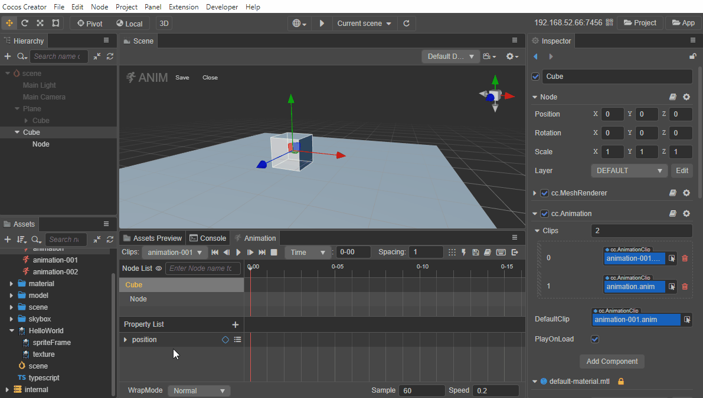

For more information on the design of Animation Curves and how to control them via scripts, please refer to the [Using Animation Curve](use-animation-curve.md) documentation.

### Editing Sprite animations

Next, let's take a look at the process of creating a Sprite animation as an example.

1. Create a Sprite node.

    Create a Sprite node in the **Hierarchy** panel. Or add a Sprite component to the node by selecting the node and clicking the **Add Component** button in the **Inspector** panel and selecting **2D -> Sprite**.

2. Add the Animation Component to the node, attach the Clip file, and enter the Animation Editing Mode. For details, please refer to the [Creating Animation Component and Animation Clip](animation-create.md) documentation.

3. Add the animation property `cc.Sprite.spriteFrame` to the property list.

    Click the **+** button in the upper right corner of the property list, then select **cc.Sprite -> spriteFrame**.

    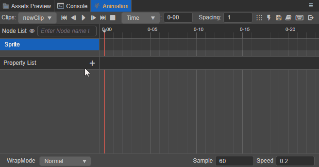

4. Add a keyframe.

    Drag the spriteFrame asset from **Assets** panel to the property track on the right side of the `cc.Sprite.spriteFrame` animation property, and then drag the spriteFrame to be displayed in the next keyframe to the specified position, or select the needed spriteFrame in the property box above the property track. Play to preview the animation that is just created.

    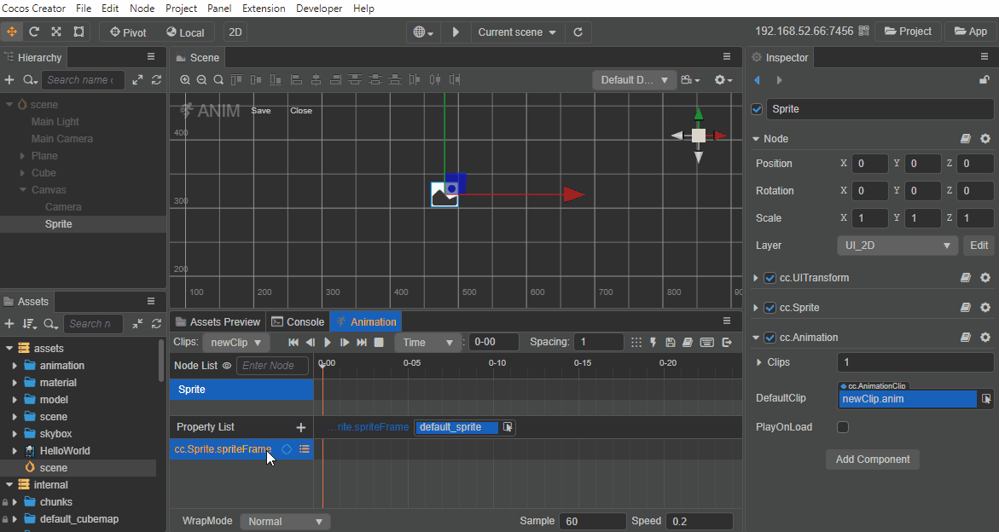

## Common keyframe operations

In the process of editing animation clips, there are often some operations on keyframes, here is a collection of various operations on keyframes in the **Animation** panel, understanding these methods and techniques can be faster and easier to edit animation clips.

### Selected keyframes

The selected keyframe will change from blue to white, including the following:

- Clicking on a keyframe in the animation property track will select it.
- Double-clicking a keyframe will move the time control line to the current keyframe while it is selected.
- Clicking on a node's keyframe in the animation timeline selects all keyframes of the node's animation properties at the same location.

  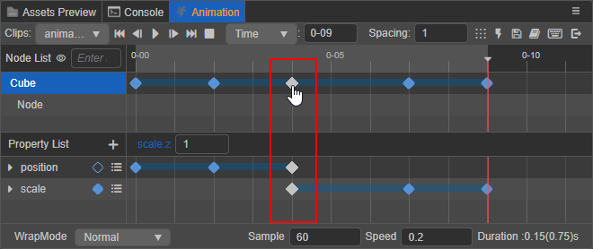

Multiple selection of keyframes is also supported, including the following:

- Holding <kbd>Ctrl</kbd> while clicking multiple keyframes

- Selecting multiple keyframes by box selection will show the number of frames in the animation timeline for the first and last keyframes on the left and right side of the box.

  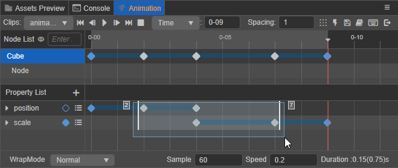

- After **selecting any property track**, press <kbd>Ctrl</kbd>/<kbd>Cmd</kbd> + <kbd>A</kbd> to select all the keyframes on the current animation property track.

### Adding keyframes

In addition to adding keyframes by modifying properties as described in **Creating Animation Curves**, they can also be added in the following ways:

1. Select the animation property and use the shortcut <kbd>K</kbd>, which will add a keyframe at the location of the time control line, or ignore it if the animation property is not checked.

2. Move the time control line to the position where you want to add the keyframe, and click the  button on the right side of the animation property to add a keyframe to the current animation property track.

3. In the animation property track, right-click the position where you want to add the keyframe, and then select **Add keyframe** in the popup menu, the menu will also show the number of frames in the current added keyframe position.

    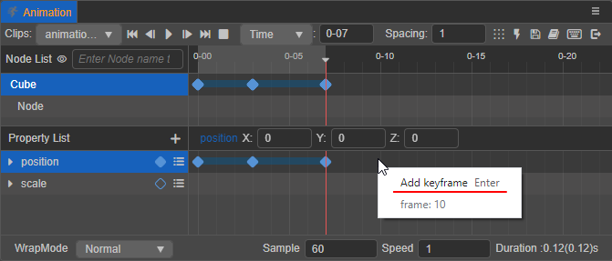

4. When dragging a batch of assets corresponding to an animation property from the **Assets** panel to the property track, keyframes will be added in the order in which the assets are selected, according to the spacing size set in  in the toolbar.

### Removing keyframes

1. Select the keyframe to be deleted (multiple selections are allowed) and press <kbd>Delete</kbd> (Windows) or <kbd>Cmd</kbd> + <kbd>Backspace</kbd> (macOS).

2. Select the keyframe you want to delete (you can select more than one), then right click and select **Remove Keyframe** in the popup menu.

3. Drag the time control line to the position of the keyframe to be removed or **double-click** the keyframe, and then click  button to the right of the corresponding animation property.

### Moving keyframes

Dragging a keyframe while it is selected will move it to the desired position.

- When dragging a single keyframe, a small white box will appear below the keyframe, showing the number of frames and the distance moved during the move.
- When dragging multiple keyframes, the box will show the number of frames in the animation timeline for the first and last keyframes during the move, on the left and right side respectively.

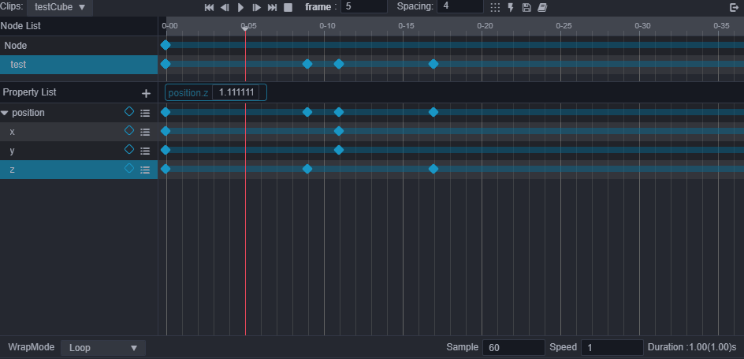

### Scale keyframes

When multiple keyframes are selected, the first and last keyframes will show two control levers, drag any of the levers to move them to scale the selected keyframes as a whole.

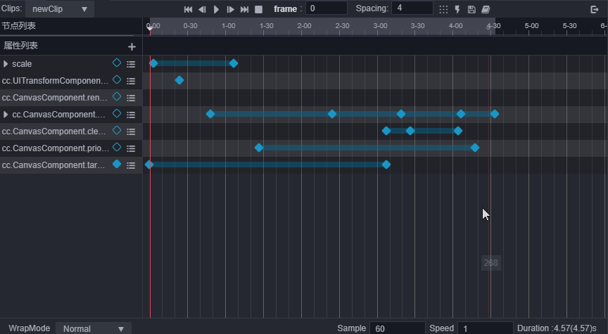

### Spacing keyframes

With multiple keyframes selected, click the 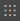 button in the upper menu bar, the selected keyframes will be arranged in order with the first keyframe as the base and the value set in the  input box as the number of spacing frames.

### Copying/pasting keyframes

Copy and paste keyframe data, support cross-node and cross-clip usage. The following two usage methods are included:

- After selecting a keyframe (multiple selection is possible), use the shortcut keys <kbd>Ctrl</kbd> + <kbd>C</kbd> and <kbd>Ctrl</kbd> + <kbd>V</kbd> to copy and paste. Note that the shortcut paste will start at the position of the current time control line.
- After selecting a keyframe (multiple selections are allowed), right-click on (any) keyframe and select **Copy Keyframe** in the popup menu, then right-click on the target animation property track and select **Paste Keyframe** to paste the keyframe on the current animation property track.

The above two pasting methods differ when copying and pasting data from multiple property tracks, the difference mainly lies in:

- When using shortcut keys to paste keyframes, the keyframes will be pasted on the animation property track where they were copied, in the order of the copied keyframes.

  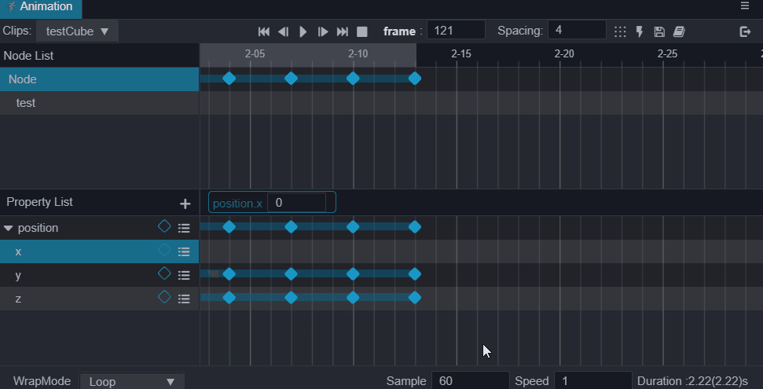

- When right-clicking on the target property track and select Paste, only the copied data will be pasted on the target property track.

  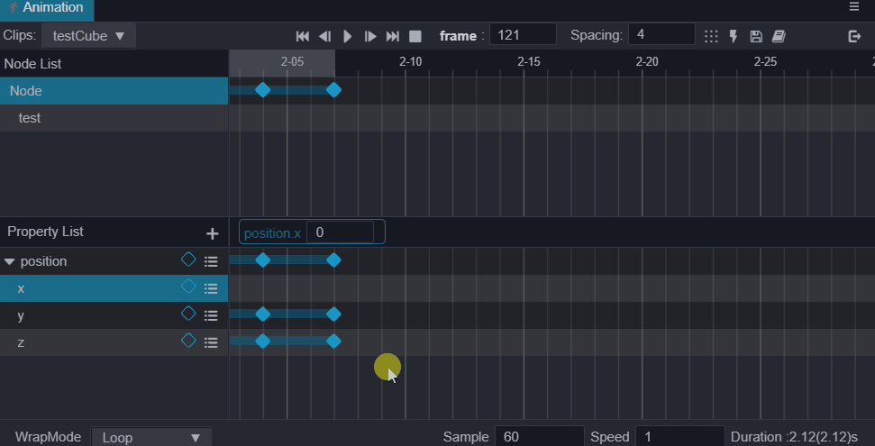

Component property tracks (e.g.: `x`, `y`, `z` properties under the animation property track `position`) as separate property tracks will also follow this rule. If right-clicking on the target component track after copying the keyframe data on the main track (e.g.: animation property track `position`) to paste it, only the target component track will be pasted with the keyframe data. Be sure to copy the data according to the actual position you want to paste, to avoid unintended results.

## Common operations with node data

The animation clip defines the position of the animation data by the name of the node, itself ignoring the root node, and the rest of the child nodes find the corresponding data by the relative path index to the root node.

Right-clicking on a node in the **Node List** area of the **Animation** panel is currently supported to choose between clearing node data, migrating node data, and copying and pasting node data.

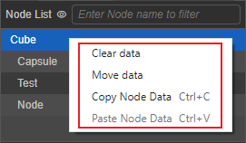

### Clearing node data

Right-click the node that needs to clear all animation data (keyframes), then select **Clear data**, and click **Clear** in the popup window.

### Migrating node data

Right-click the node that needs to migrate all animation data, then select **Migrate Data**, the node will show a dynamic dashed box, when the mouse moves to other nodes, it will show the prompt of "Migrate data to this node", click it and select **Migrate** in the pop-up window. If there is no need to migrate, just select **Cancel**.

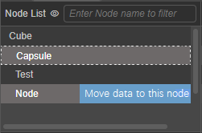

> **Note**: node data migration will overwrite the data on the original node by default.

Because the animation clip will record all the node path information that participated in the animation data editing, so when the node information changes (e.g.: node renaming/deletion/move position), which is not consistent with the original saved in the animation clip, the **Animation** panel will show it in the node list as a yellow uneditable lost state, and the keyframes are also grayed out as uneditable. In this case, the **Migrate Data** function of the node can be used to migrate the animation data of the missing node to another node.

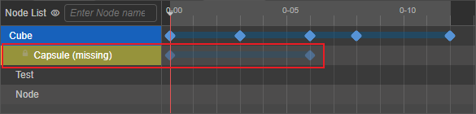

### Copy and paste node data

Copy and paste of node animation data, supports cross-editor (v3.x) usage.

- **Copy**: Select the node you want to copy data from in the node list, right click and select **Copy Data**, or use the shortcut <kbd>Ctrl</kbd>/<kbd>Cmd</kbd> + <kbd>C</kbd> to do so.
- **Paste**: Select the target node in the node list, right click and select **Paste Data**, or use the shortcut <kbd>Ctrl</kbd>/<kbd>Cmd</kbd> + <kbd>V</kbd> to paste the animation data.

> **Note**: the paste function does not support automatic creation of animation properties, so the copied and pasted nodes must have at least one of the same animation property, if not, please create it in advance. When pasting animation data of multiple nodes on the same node, the animation data of the overlapping part will be overwritten by the latter, and the different parts will be fused with each other.

### Edit child node data with the same name

When editing animation data in the animation clip of the parent node, you can also edit the animation data of the child nodes. The animation data will all be saved in the animation clip of the parent node, which is used to achieve effects like moving the hands of the character model with different speeds along with the body, etc. However, if the parent node contains more than one child node with the same name at the same time, only the first child node with the same name will be edited, and the other nodes with the same name will be grayed out to uneditable state.

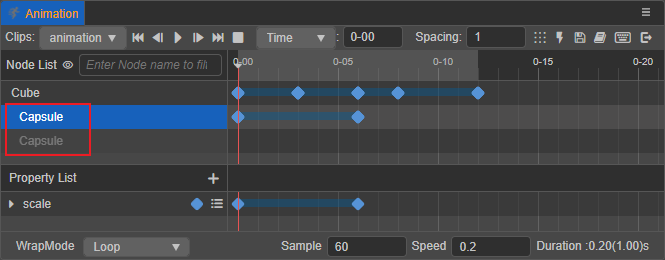

However, it is supported to add animation components and animation clips for the same name child node separately and edit them separately.

## Common operations for animation property data

Right-click on the animation property or click 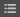 button to the right of the track to select **Remove property track**, **Clear keyframe data**, or **Copy property track**.

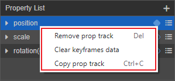

- Remove property track: remove the currently selected animation property, including all keyframes on that property track. Or you can also use the shortcut <kbd>Delete</kbd> key (Windows) or <kbd>Cmd</kbd> + <kbd>Backspace</kbd> (macOS).

- Clear keyframe data: delete all keyframes on the currently selected animation property track.

- Copy animation property track: copy all animation data on the currently selected animation property track and paste it to the target animation property track, supporting the shortcut keys <kbd>Ctrl</kbd>/<kbd>Cmd</kbd> + <kbd>C</kbd> and <kbd>Ctrl</kbd>/<kbd>Cmd</kbd> + < kbd>V</kbd>. When pasting, the overlapping keyframes are overwritten by the latter, and the different parts are blended with each other.

  Copy/paste of animation property data between different editors (v3.x) is currently supported. Copy/paste of animation data is only supported for `ccType` data of the same type.

As with nodes, there is a possibility of missing animation properties. For example, if an property corresponding to an animation property is removed from the **Inspector** panel, it will be displayed in the animation property list as a yellow uneditable missing state, and the keyframe will be grayed out as uneditable. In this case, either exit edit mode and add the relevant property to the corresponding node or simply remove the missing property track.

  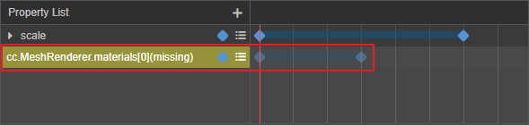

## Animation clip property settings

The properties that can be set directly on the **Animation** panel for the current animation clip are: **WrapMode**, **Sample**, **Speed** and **Duration**.

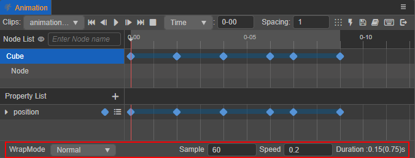

- **WrapMode**: use to set the loop mode of the current animation clip, currently include
    - Default: the effect is the same as Normal
    - Normal: forward single play
    - Loop: loop forward
    - PingPong: loop in forward and then reverse mode
    - Reverse: reverse single play
    - LoopReverse: loop reverse

    For more information about how to set the loop mode by script code, please refer to [Loop Mode](use-animation-curve.md#loop-mode).

- **Sample**: define the frame rate per second of the current animation data, i.e. how many frames a second to divide into, default is 60. please refer to the **Timeline's scale unit display** section above for more details.

- **Speed**: set the speed of current animation, default is 1, the smaller the value the slower the speed.

- **Duration**: the number in front indicates the duration of the animation when the speed is 1, it is determined by the position of the last keyframe. The number in brackets after it indicates the actual running duration, which will change when Speed is adjusted.

Animation clips are reusable and their states are stored in objects called animation states. Through the animation state interface the animation can be controlled by playing, pausing, stopping, shifting, etc. For details, please refer to [Animation State](animation-state.md).
