# Embedded Player (experimental feature)

The role of the embedded player is to allow the production of animation clips that can be bound at the same time particle effects or other animation, etc., used to meet the function of playing animation at the same time play dynamic effects. It can be used to achieve the function of waving a weapon will appear knife light, or feet on the ground will appear smoke and so on.

The entire nesting system can be viewed by expanding the **Player Track List** in the Animation window.

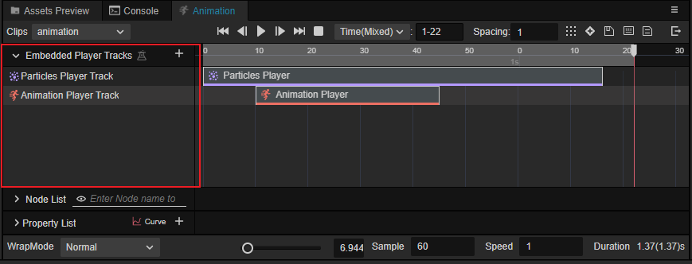

> **Note**: In v3.6, this feature is experimental and developers need to enable it in **Preferences** -> **Laboratory**.  
> Any experience problems or suggestions, please feel free to feedback to us in [forum](https://forum.cocos.org/t/topic/137740).
>
> 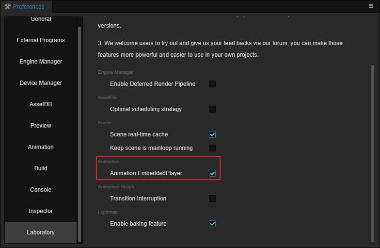

## Track manipulation

The embedded player supports **animation player** as well as **particle player**.

Different tracks can be added by clicking the **+** buttons on the right side of the **animation track list**:

Right click on the added track to **Remove Animation EmbeddedPlayer Track** and **Clear Data**.

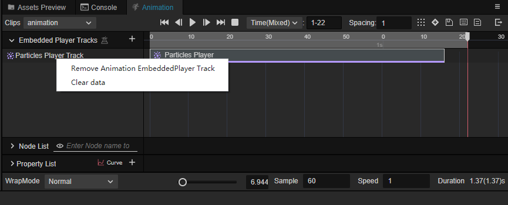

> **Note**: The clear data operation clears the entire track.

You can select **Copy** and **Delete** operations by clicking the right mouse button on the track data.

The delete operation only deletes the currently selected data.

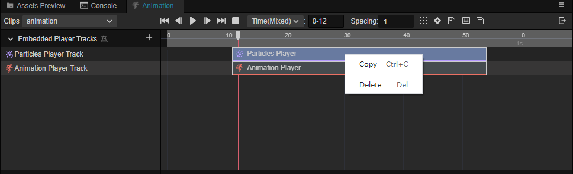

When no data is selected, you can select **Create Animation EmbeddedPlayer**, **Paste** and **Clear Data**.

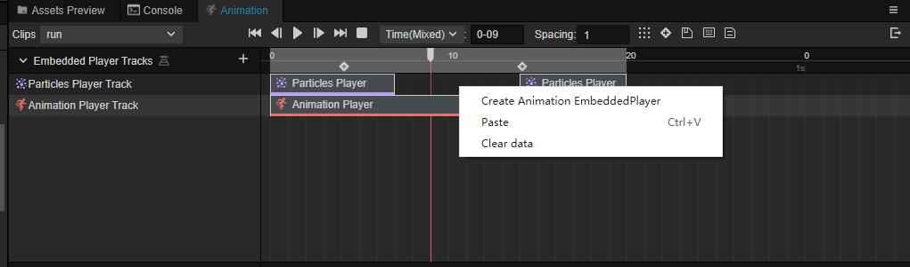

After adding a track, the position of the track data and the duration can be adjusted:

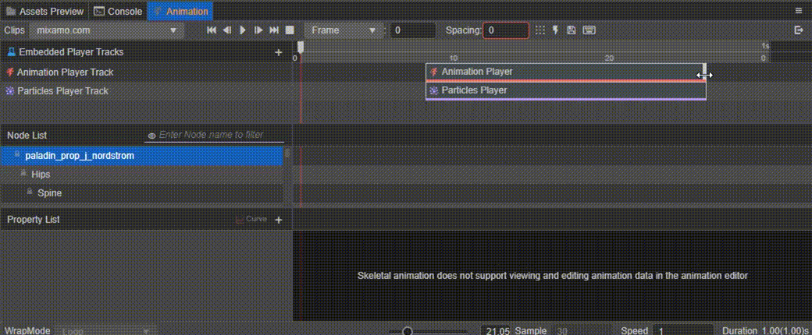

### Particle player track

Select the added Particle Player track on the left in the **Animation Track List**, and adjust the track's properties in the **Inspector** panel.

! [inspector](embedded/particle-inspector.png)

- **Reconciled speed**: keep the embedded particle system playing at the same rate as the current animation clip
- **Child Path**: the drop-down box allows to select the particle system on different sub-nodes.

    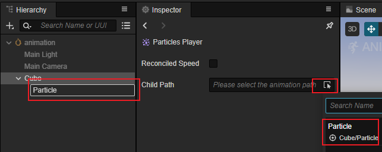

### Animation player tracks

Select the added animation player track on the left in the **Animation Track List**, and adjust the track's properties in the **Inspector** panel.

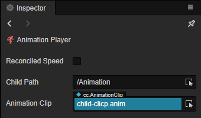

- **Reconciled speed**: keeps the embedded animation at the same playback rate as the current animation clip
- **Child Path**: the drop-down box allows to select the animation components on different sub-nodes.

    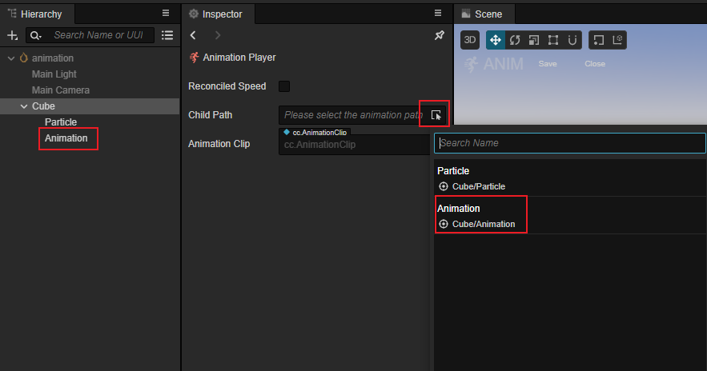

- **Animation clips**: The drop-down menu allows you to select different animation clips:

    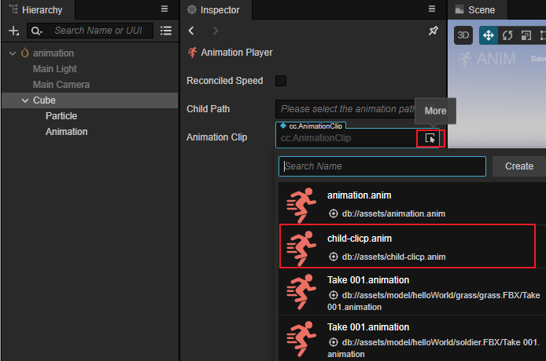

## Preview

The above operation can be used to nest different particle players and animation players when the animation is played, and the effect is displayed as follows.

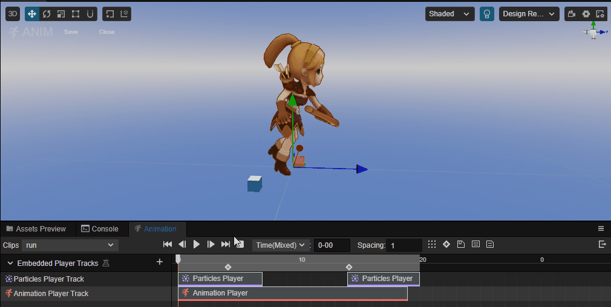

## Adding frame events

You can also add frame events by right-clicking on the nested bar, in the same way as [Adding Animation Events](animation-event.md).

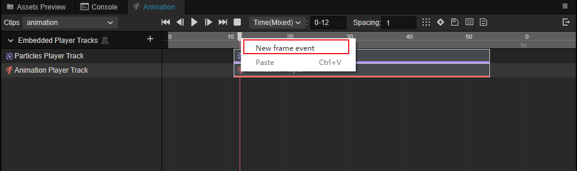
