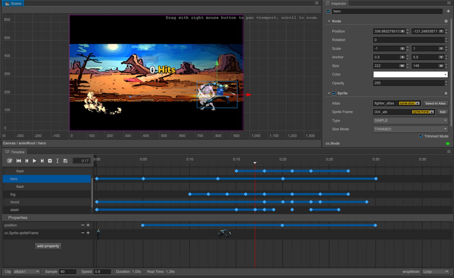

# Animation system
This chapter will introduce the animation system that comes bundled with Cocos Creator.
Animation editors usually have the same standard functionality one would expect: standard movement, rotation, scale and sprite animations. Cocos Creator adds to this by providing support for _over-time_ changes of user defined components and custom properties. Also, with a time curve that can be edited arbitrarily and previewing and editing the movement path directly in the scene view, it can help content creators create various complicated and exquisite dynamic effects without writing a single line of code.

- [About Animations](animation.md)
- [Animation Clips](animation-clip.md)
- [Animation Curve](animation-curve.md)
- [Sprite Animation](sprite-animation.md)
- [Time Curves](time-curve.md)
- [Animation Events](animation-event.md)
- [Scriting Animations](scripting-animation.md)

Start learning from [About Animations](animation.md).
