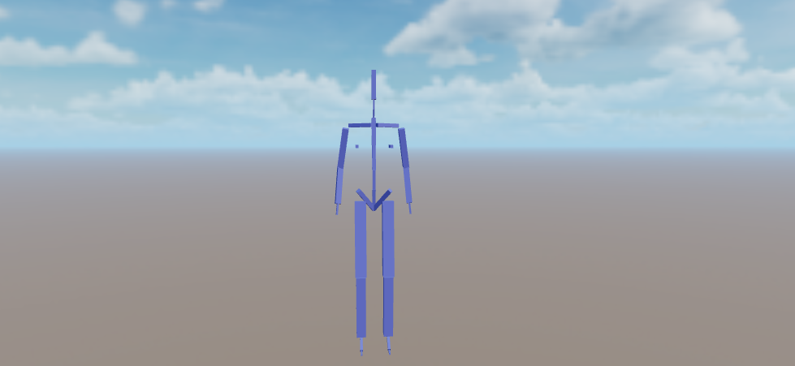
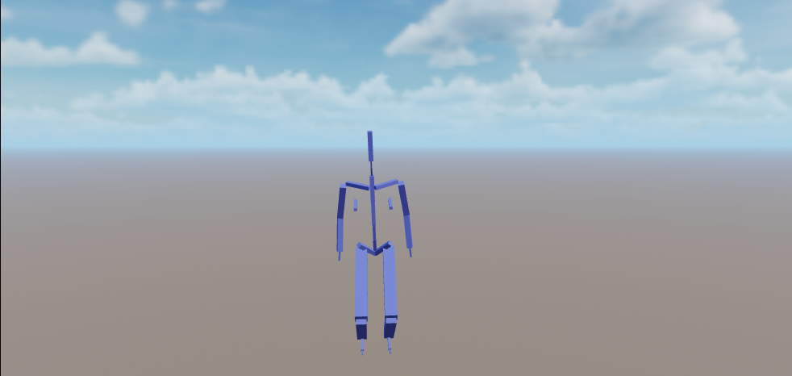
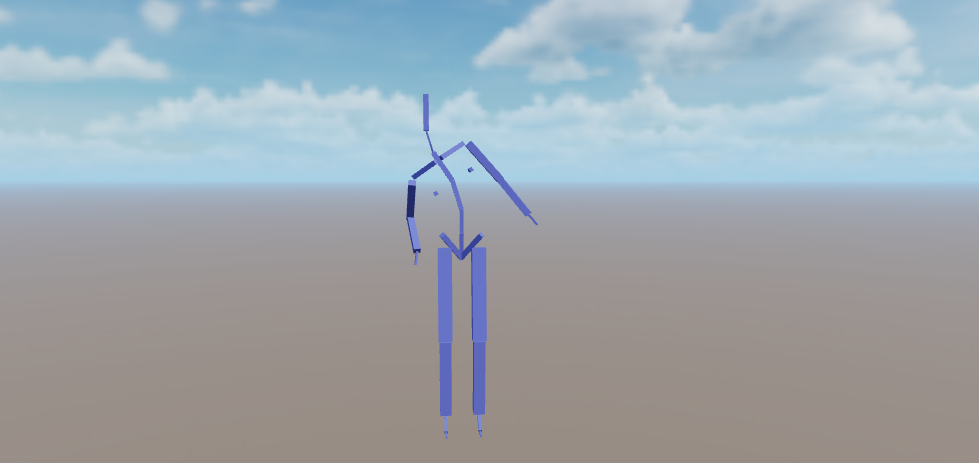
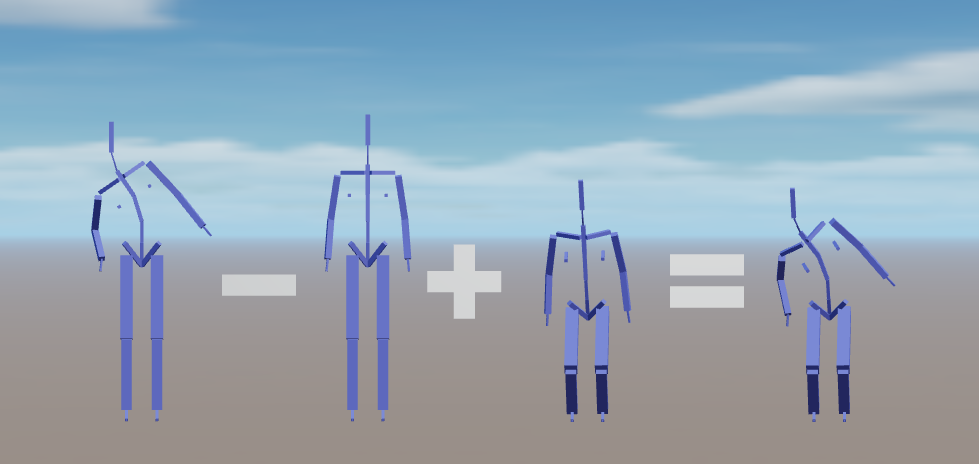
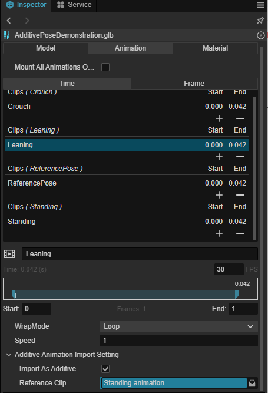
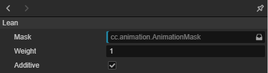

# Additive Animation

Additive animation is a way to reuse animation effects.

Imagine your character has two basic poses: standing and crouching:

In standing, you make a pose for the character where the upper body is tilted at an angle to the right:

If you want the character to have a similar tilted stance in the crouching state, one way to do it would of course be to make another separate stance for the crouching state, but that would inevitably be a repetitive endeavor.

Since the "change" from standing to standing tilt and from crouching to crouching tilt is similar, it is possible to "subtract" the standing stance from the tilted stance to get a difference stance. By superimposing such a differential stance on the crouching stance, one obtains a crouching tilted stance:

The schematic is shown below:

A tilted pose "minus" a standing pose is called an **Additive Pose**, and the animation effect created by applying it to a crouching pose is called an **Additive Animation**.

Formally, an additive animation is the difference of an animation relative to a reference pose that can be superimposed on other animations. The underlying logic for using additive animation is that you can add the same type of changes to different animations, such as leaning forward, backward, left, or right when a character is moving differently. If you use additive animation, you can add the same effect to walking, running, jumping, standing, etc., instead of having to create a set of similar animations for each state, which reduces the amount of animation assets needed for each state.

## Generating Additive Animations

Currently, additive animations can only be generated from animation clips.

By checking the "Import as Additive" box in the Animation Import Configuration panel, the selected animation clip will generate an additive animation when it is used in an animation drawing:

> Note that an animation is either imported as an additive animation or as a non-additive animation.
> If you want an animation to be used as both an additive and non-additive animation, you can copy this animation in the import panel and configure it separately.

## Apply Additive animation

The animation map applies additive animation in two ways, namely:

- Configure the level as an additive level.

- Use [Additive blend node](../procedural-animation/pose-graph/pose-nodes/blend-poses.md#Additive-blending) in the graph map.

> Note that the animation used in the additive hierarchy must produce additive poses.
> For example, if a additive layer ends up outputting non-additive poses, this will result in anomalous animations - often the model will be found to be "bigger".
> Conversely, if a non-additive layer ends up with a additive animation, this will also result in an anomalous animation - the model will often be found to have "disappeared" or become smaller.

## Additive Layers

In the Animation Graph Inspector panel, you can set the selected layer to be **Additive**:

When checked, when the animation effect (graph) generated by this layer will be blended to the preceeding layer as an additive.

## Pose Graph: additive blending nodes

See: [additive blend node](../procedural-animation/pose-graph/pose-nodes/blend-poses.md#additive-blending).
