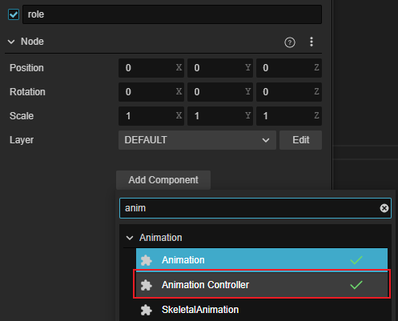

# Animation Controller

The animation controller component is used to apply the [Animation Graph Assets](animation-graph.md) to the object.

Select the node in **Hierarchy** panel where you need to apply the animation graph, and then click **Add Component -> Animation -> Animation Controller** below in **Inspector** panel to add an animation controller component to the node.



> **Note**: Because the Marionette animation system and the old animation system cannot be used together, **animation controller components also cannot be mounted on the same node as animation components or skeletal animation components**.

## Properties


| Properties | Description |
| :---- | :----------- |
| Graph | Added [animation-graph resource](animation-graph.md), default is empty |

## Programmatically Controlling Animation Graphs

The animation controller component provides a number of methods for controlling the [Animation State Machine](animation-graph-basics.md) of the animation graph at runtime.

| Method | Description |
| :----------------------- | :----------------------- |
| `getVariables` | Get all variables and their names/types/values, etc. ||
| `setValue` | Set the value of the variable.             | `getValue
| `getValue` | Get the value of the variable.             | `getValue
| `getCurrentStateStatus` | Get the current state information.       | `getCurrentStateStatus`
| `getCurrentClipStatuses` | Get the current state of the clip.  | `getCurrentClipStatuses`
| `getCurrentTransition` | Get the current state transition.       | `getCurrentClipStatuses`
| `getNextStateStatus` | Get information about the next state.     | `getNextStateStatus
| `getNextClipStatuses` | Get the status of the next animation clip.  | `setLayerWeight
| `setLayerWeight` | Set the weight of a certain [animation-graph layer](animation-graph-layer.md). | |

- **Variable** Control

    For example, we have a variable in the [Animation Graph Panel](./animation-graph-panel.md#Variables) added several variables, the code can get and modify the value of the variables, the code example is as follows.

    ```ts
    // Get the animation controller component    
    let animationController:animation.AnimationController = this.node.getComponent(animation.AnimationController)

    // Get all variables
    let variables= animationController.getVariables();

    // Get the value of the variable named 'vertical'
    let vertical: Number = animationController.getValue("vertical");

    // Change the value of the variable named 'vertical' to 1.0, which will calculate the conditional transition on the next update frame
    animationController.setValue("vertical", 1.0)
    ```

    > **Note**: Variables for the animation state machine can currently only be added and removed in the [Animation Graph Panel](animation-graph-panel.md#Variables).

- Get the current **state**

    Get the normalized progress of the current **state** of the state machine at layer 0, with the following code example.

    ```ts
    let states: animation.MotionStateStatus = animationController.getCurrentStateStatus(0)
    console.log(states.progress);
    ```

- Get the current **transition**

    Gets information about the upcoming **transition** of the state machine at layer 0.

    ```ts
    let transition: animation.TransitionStatus = animationController.getCurrentTransition(0)
    console.log(transition.duration, transition.time)
    ```
