# Animation State Machine

A state refers to an action performed by an animated actor in the form of animations being triggered and played, such as being idle, moving, running, attacking, etc.

An actor may have multiple states and switches between them as different actions are performed. The act of switching from one state to another is called a [transition](state-transition.md). The condition that predetermines the transition is called a **transition condition**.

A state machines manages all the states and transitions of an actor. Typically, the logical connections of states and transitions are depicted as a flow chart, which is editable in the [Animation Graph panel](animation-graph-panel.md). Currently, one animation graph corresponds to one state machine. When the state machine is at a certain state, animation corresponding that state will be played. Depending on the intricacy of the animation graph, the actor can perform a myriad of complex actions by switching between simple skeletal animations.

## State Basics

Besides states that contains animations, users can also create 4 special states in the animation graph including **Entry**, **Exit**, **Any** and **Sub State Machine**. As these states do not contain any animation, they will be referred as **pseudo states** from this point on.

A [sub state machine](#sub-state-machine) serves as a container for a state machine nested within another state machine, primarily used to break down complex state machine designs into controllable chunks. By convention, the state machine with the highest hierarchy is referred as the **Top Level State Machine**. It is comparable to the root node in the scene.

**Entry**, **Exit** and **Any** are mandatory pseudo states that cannot be deleted from the graph. They are accessible in the Animation Graph panel by default. Please take note that the **Exit** state is only available in a **sub state machine**.

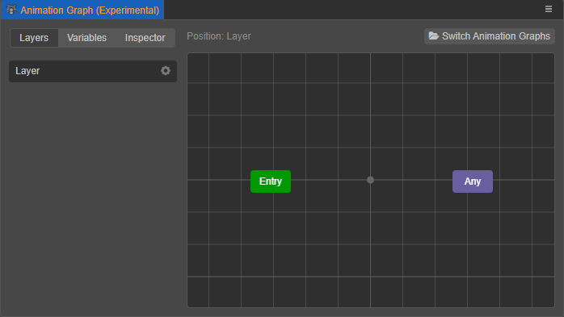

- **Entry**: Represents the entry point of the current state machine. It can only be used as the beginning state of a transition and never the end state.

- **Exit**: Represents the end point of the current state machine. When the state machine reaches the end point, it is considered completed and will shut down. **Exit** can only be used as the end state of a transition and never the beginning state.

   As the current sub state machine is completed, it will be shut down and transitioned to the next nearest state in its parent state machine. The actor will cease all animation if the top level state machine is shut down, which defeats the purpose of having the animation system in the first place. For this reason, **Exit** is only available in sub state machines.

   To manually cease all animation for the actor, users may disable the **Animation Controller** component of the actor.

- **Any**: Represents any state in the graph that is not a pseudo state. It can only be used as the beginning state of a transition and never the end state.

   A transition beginning from **Any** is equivalent to a transition from all available states currently in the graph. In other words, no matter which state it is currently at, it will be transitioned to the end state as long as the transition conditions are met. For instance, a character can switch to the wounding animation from any other animation, be it walking, running, jumping, etc.

    > **Note**: **Any** also includes any state from the sub state machines of the current state machine. Transitions from the sub state machines will be triggered if the transition conditions are met.

## Creating states

A state machine is the collection of all states, pseudo states and the transitions that connect them together under specific conditions.

Right click on the grid in the [Animation Graph panel](animation-graph-panel.md) and select one of the following to add to the graph:
- **Add State – Animation Clip**: Add an animation clip asset as a state, named `Clip Motion` by default.
- **Add State – Blend 1D / 2D**: Add a new animation by blending multiple animations as a new state with a default name of `Blend 1D` / `Blend 2D`. Please see below in section **Animation Blending** for more details.
- **Add Sub State Machine**: Add a new sub state machine named `State Machine` by default, Please see below in section **Sub State Machine** for more details.

All states except sub state machines are represented as blue rectangles in the graph.

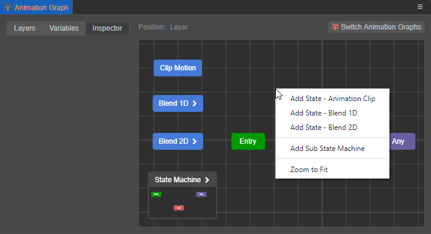

### Setting state properties

Select a state in the graph and the blue rectangle will be highlighted with yellow edges. Properties of the selected state will also be available in the **Inspector** panel to the left of the Animation Graph panel.

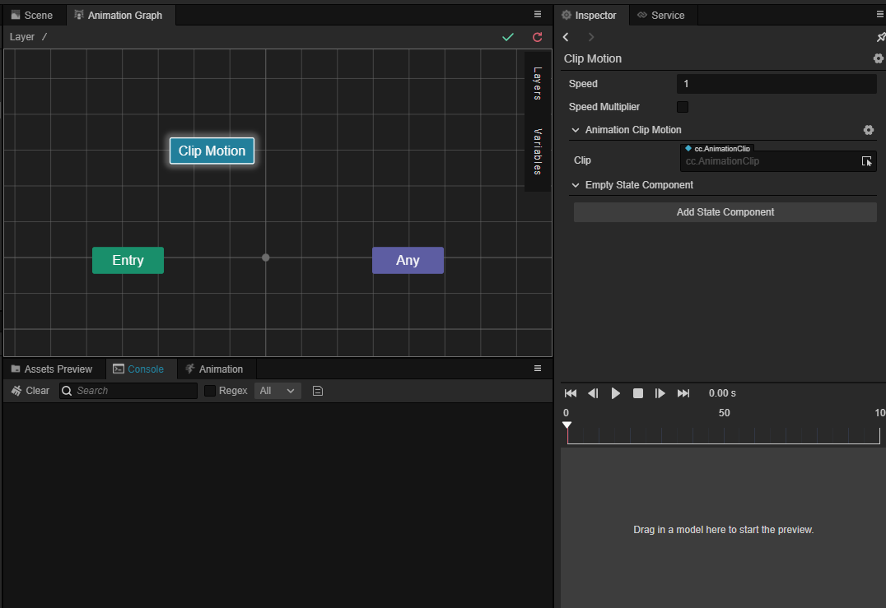

- Name of the selected state is displayed on the top of the **Inspector** panel. Clicking the gear icon will yield options for the selected state to be renamed, deleted, or replaced by a state of a different type.

- **Speed**: Playback speed for the animation attached to the selected state with a default value of 1. Lower value will result in slower animation.

- **Animation Clip Motion**: Specify the animation clip attached to the selected state. Users can drag and drop the animation clip asset from the Assets panel to the **Clip** property or select from its drop-down menu. Once specified, the animation clip will be attached to the selected state, and the selected state will be automatically renamed according to the attached animation clip.

  > **Note**:  If the animation clip is left unspecified, it could cause errors to the state machine.

  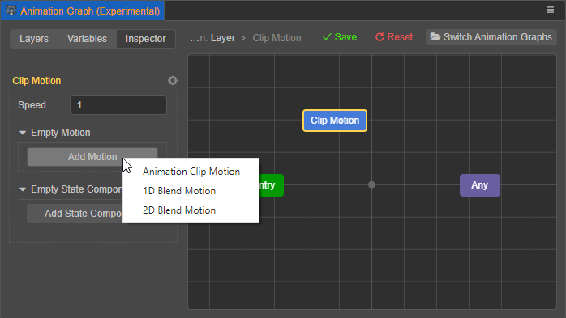

- **State Component**: Attach an animation graph script to the selected state. Users may call from the StateMachineComponent to insert events at certain junctions of the flow chart. For more information, please see below in section **Animation State Component** for more details.

- Clicking the gear icon will yield options for the selected state to be renamed, deleted, or replaced by a state of a different type. Right click on the state note in the graph will also yield the same options.

  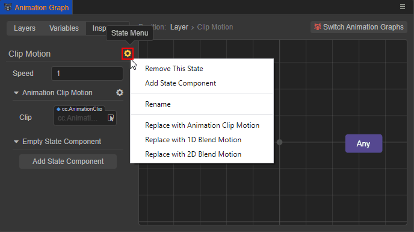

## Animation Blending

Blend Motion creates new animations by blending existing ones with pre-determined parameters, commonly used to create mixed animations such as jumping while running. To achieve optimal results, it is not advisable to blend animations that are excessively different from one another. Based on the parameters used, Blend Motion can be categorized as follows:

- **Blend 1D**: Use **one parameter** to **linearly interpolate** between multiple animations.

- **Blend 2D**: Use **two parameters** to **barycentrically interpolate** between multiple animations.

Blend Motion should be distinguished from [State Transitions](state-transition.md) as:

- Transitions create a brief intersection period for one animation to morph into a second animation.

- Blend Motion combines multiple animations with varying parameters, yielding one combined animation.

### Adding animation blending

Right click on the grid in the Animation Graph panel and select **Add State – Blend 1D** or **Add State – Blend 2D** to create new states. Their respective properties can be accessed in the **Inspector** panel on the left.

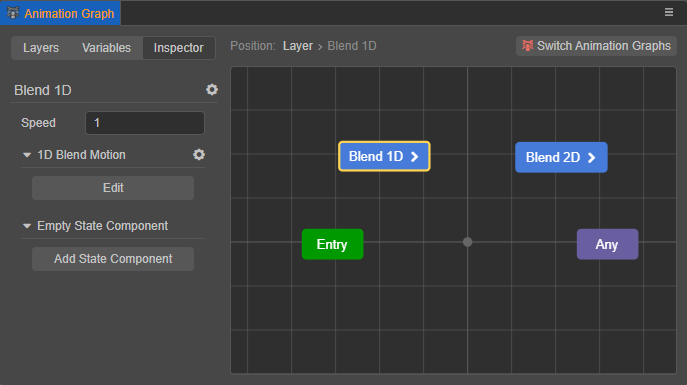

Users can access the parameters for blending in either of the following ways:

- Select the Blend Motion state and click the **Edit** button in the Inspector panel
- Double click on the Blend Motion state node as seen in the animation graph
- Right click on the Blend Motion state node and select **Edit**

To exit the Blend Motion state, users may:

- Right click on the grid and select **Return to Parent**
- Select a higher hierarchy in the **Position** bar on top of the grid window

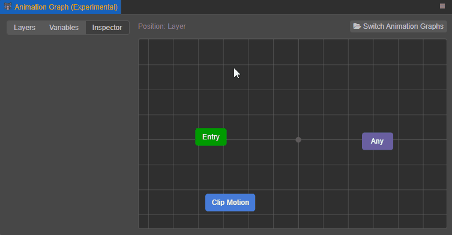

### 1D Animation Blending

Blend 1D **linearly interpolates** multiple animation with **one parameter**, with each target animation assigned with a threshold value.

- When the parameter’s value equates to the threshold value of a target animation, said animation will be the output of the Blend 1D state.
- When the parameter’s value is between the threshold value of 2 target animations, Blend 1D will output the linear interpolation between the two. The formula is `A * (1 - t) + B * t` where A and B are the threshold value of target animations, and t the percentage value of the parameter value in proportion to the range between the two thresholds.

Double click on the Blend Motion state node to enter its sub graph. In it, users may import animation clips by creating a new Clip Motion state, or create additional Blend Motion states.

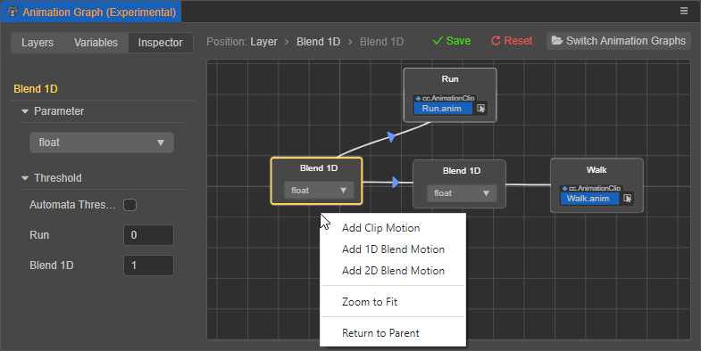

- **Parameter**: Select the parameter to be used to blend between states. A parameter needs to be created under the **Variables** tab first. Blend Motion states require a float type parameter as the input variable. Users may also select from pre-existing variables to be used as the parameter at the Blend Motion state nodes in the graph. For more information, please see [Animation Graph Panel - Variables](animation-graph-panel.md) for details.

- **Threshold**: With every animation clip imported, a new corresponding threshold variable will be added. Users may manually define the value, or enable **Automata Threshold** to allow Cocos Creator to assign threshold values automatically. Threshold variables will be listed in an ascending order.

- Animation clips can be assigned from the drop-down menu from the state nodes in the graph, or from the **Inspector** panel while a Clip Motion state node is selected.

  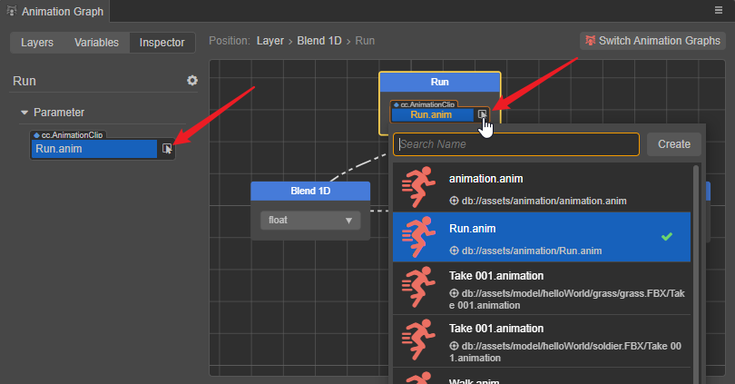

  To remove an animation, select the Clip Motion state, go to the Inspector panel and click the gear icon, then select **Remove this Motion**.

As an example, a state machine that plays different animations when the character is at different movement speeds should look like the screenshot below:

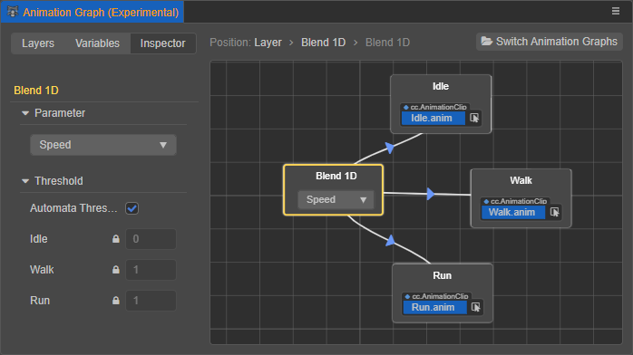

### 2D Animation Blending

Blend 2D **barycentrically interpolates** multiple animation with **two parameters**, with each target animation assigned with a threshold value.

Users may set up a Blend 2D state in the same way as setting up a Blend 1D state, with a few exceptions:

- Blend 2D requires 2 parameters (X, Y) to blend animations.
- Clip Motion states have threshold value in 2 dimensions (`[x, y]`). Threshold variables are listed by the order of their creation. There is no option for **Automata Threshold**.
- Parameter X corresponds to the x dimension of threshold variables while parameter Y the y dimension.

Blend 2D is commonly used to create state machine for character motions, such as:

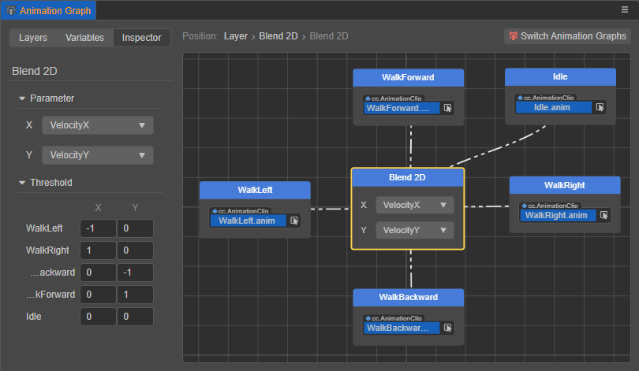

In the example above, the range for parameter X is `[-1, 1]`, and the range for parameter Y is `[-1. 1]`.

## Sub State Machine

Users can create sub state machines to be used recursively anywhere in the animation graph. By convention, the state machine with the highest hierarchy is referred as the **Top Level State Machine**. It is comparable to the root node in the scene.

Right click on the grid and select **Add Sub State Machine** to create a new sub state machine with the default name of `State Machine`.

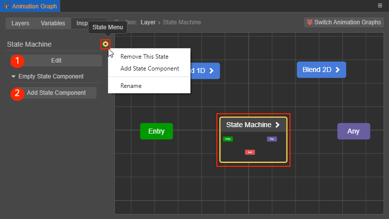

- Button ① is for entering the sub graph of the sub state machine to edit its content. It can also be done by double clicking the sub state machine node in the graph or right click on the node and select **Edit**.

- Button 2 is for adding state components. Please see below in section **Animation State Components** for more details.

- Click the gear icon to rename, remove, or add state components for the selected sub state machine.

### Editing Sub State Machine

The sub graph of a sub state machine is identical to a typical graph except for the **Exit** pseudo state. As the current sub state machine is completed, it will be shut down and transitioned to the next nearest state in its parent state machine.

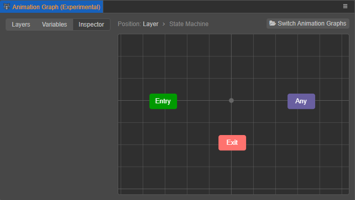

To exit the Blend Motion state, users may right click on the grid and select **Return to Parent** or select a higher hierarchy in the **Position** bar on top of the grid window.

<!-- Sub state machine nodes will display a preview of its content in its parent graph.

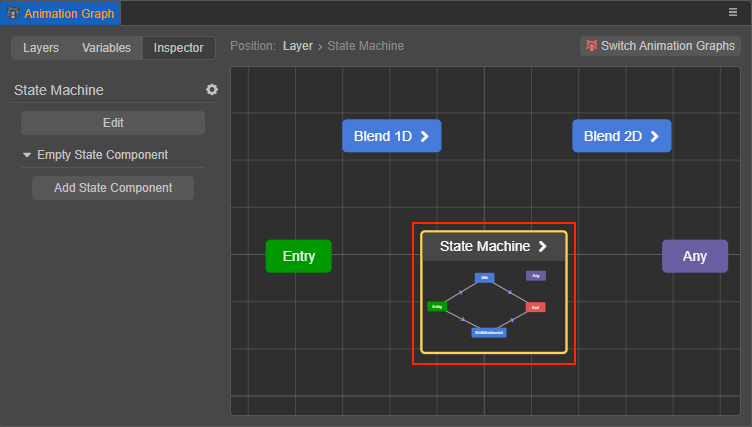 -->

## Animation State Component

States and sub state machines can be attached with state components, which can be created in the **Assets** panel by clicking the + button on the top and select **Animation Graph Script**.


A new Animation Graph Script component will be named `AnimationGraphComponent` by default which is a .ts script.

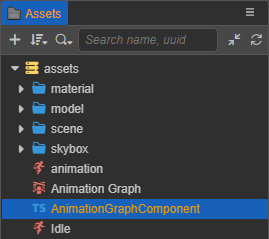

The Animation Graph Script can be attached to a state node in the animation graph by clicking the Add State Component button in the Inspector panel, or click the gear icon on the top and select Add State Component. A state node can be attached with multiple State Components.

Click the gear icon on the right of the added state component and select Remove State Component to remove it.

Animation Graph Script assets can call from the `animation.StateMachineComponent` class which includes methods that registers events of the state machine, which includes:

| Method Name | Description |
| :--- | :--- |
| `onMotionStateEnter` | Triggered when entering a state |
| `onMotionStateExit` | Triggered when exiting a state |
| `onMotionStateUpdate` | Triggered when a state is updated |
| `onStateMachineEnter` | Triggered when entering a sub state machine |
| `onStateMachineExit` | Triggered when exiting a sub state machine |

Methods listed above can also use the following parameters:

- `controller: animation.AnimationController`: The Animation Controller component which the state machine is attached to. This parameter is appliable to all the methods above.

- `motionStateStatus: animation.MotionStateStatus`: Status of the current state. This parameter is only applicable to methods intended for states (`onMotionStateEnter`, `onMotionStateExit`.)

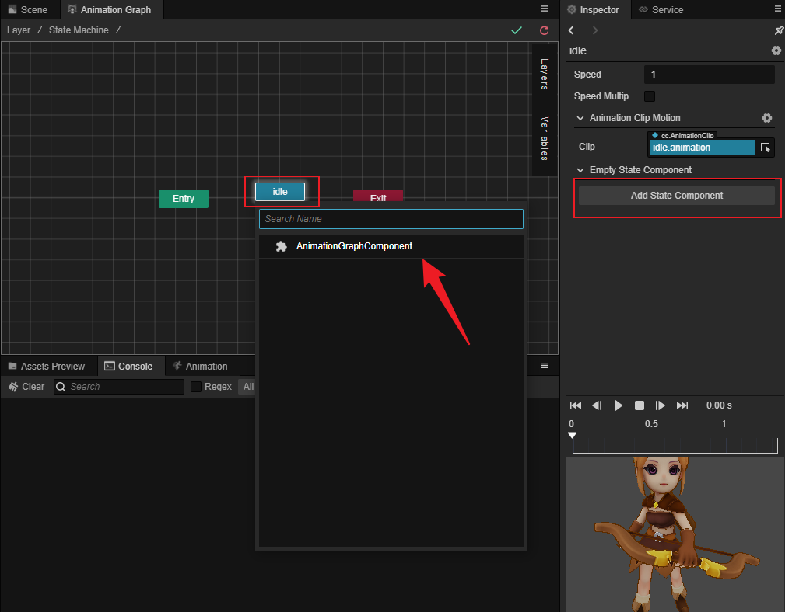

### Example: Enable particles when entering a state

```ts
import { _decorator, animation, PhysicsSystem, ParticleSystem } from "cc";
const { ccclass, property } = _decorator;

@ccclass("AnimationGraphComponent")
export class AnimationGraphComponent extends animation.StateMachineComponent {
    /**
     * Called when a motion state right after it entered.
     * @param controller The animation controller it within.
     * @param stateStatus The status of the motion.
     */
    public onMotionStateEnter (controller: animation.AnimationController, stateStatus: Readonly<animation.MotionStateStatus>): void {
        // Enable all particles attached to the node where the animation controller is also located
        for (const particleSystem of controller.node.getComponents(ParticleSystem)) {
            particleSystem.play();
        }
    }
}
```
