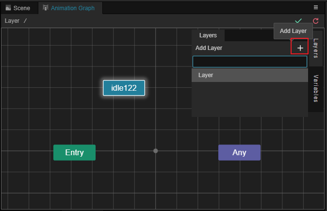
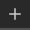
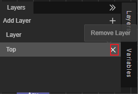
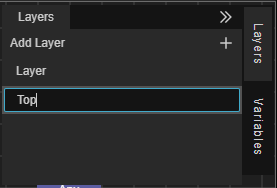
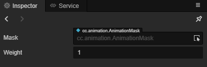
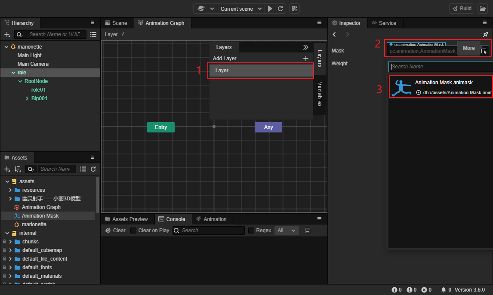
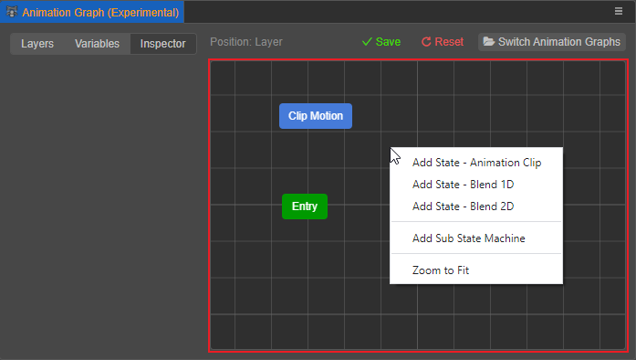
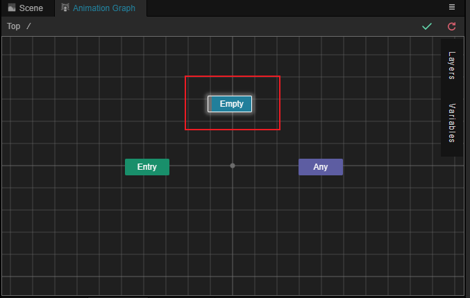
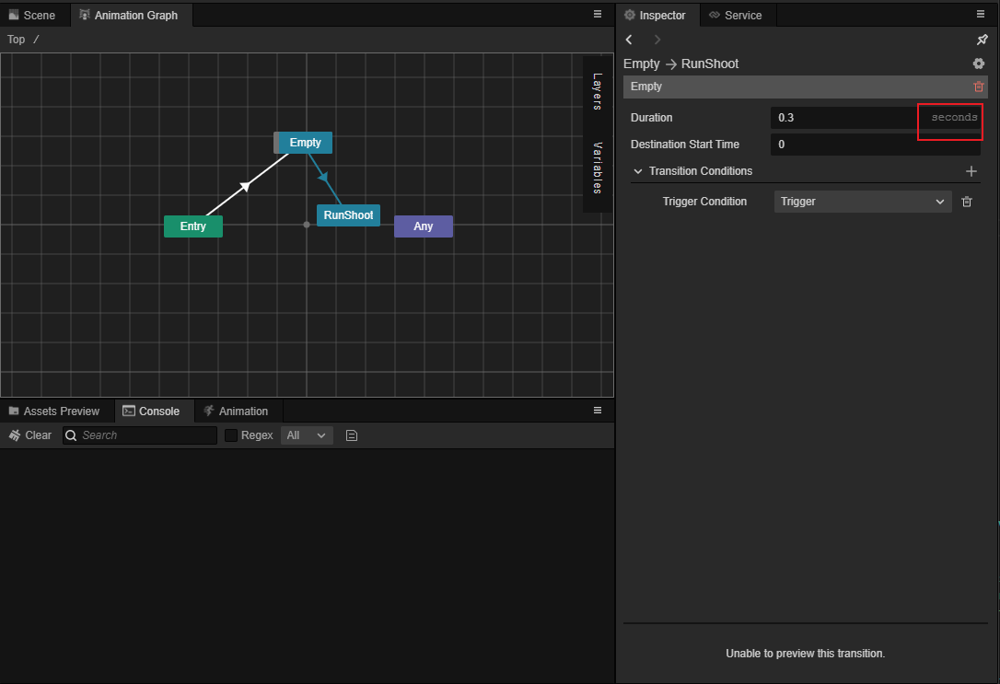
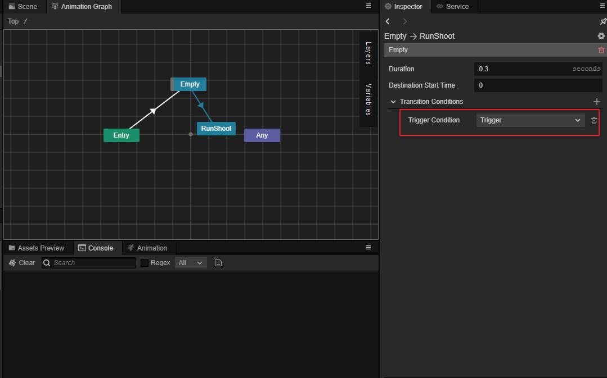

# Animation Graph Layer

The animation graph can have multiple layers, with layers running simultaneously between them, and the animation effects played on them can be mixed according to the configuration of the layers.

## Create layers

Click the **Layers** button in the animation graph, click the  button, and enter the name of the layer in the popup input box to create the layer.

## Delete Layers

After hovering over the layers, you can click **×** on the right side of the layers to delete them, this operation only takes effect when there are multiple layers.

## Rename the layers

Rename a layer by double-clicking the left mouse button at the layer name.

## Layer Properties

After selecting any layer in the animation graph, you can view the layer properties in the **Inspector** panel.

| Properties | Description |
| :-- | :-- |
| **Mask** | The animation mask to specify the corresponding [Animation Mask](animation-mask.md) |
| **Weight** | The weight of the layer to be used when mixing with **previous layers**, in the range [0, 1] |

### Animation Masks

A mask can be assigned to a layer by dragging an animation mask from the **Assets** panel to the **Mask** property of the Animation Graph window or by checking the **Mask** property in the layer.

Refer to the following figure and follow steps 1, 2 and 3.

- Select any layer
- Click on the drop-down menu in the **Inspector** panel.
- Select a pre-created **Mask** resource or drag it from the **Assets** panel.

When specified, all animation effects on that layer are affected by that mask.

For example, you can specify an animation mask to a layer that keeps only the upper body skeleton, with all lower body skeletons disabled, and the animation effect on that layer will only work on the upper body.

### Layer weights

The animation effect of each layer will be blended with the animation effect of the previous layer in a certain proportion, the proportion of the blending is specified by the weight property of the layer.

0 means that the animation of the previous level is used completely, 1 means that the level completely overwrites the animation of the previous layer, when it is at [0,1] then the blending is done properly.

Blending of layers will only blend those bones that are not disabled by the animation mask. For example, if Layer 1 has a skeleton enabled, but a subsequent Layer 2 has disabled it with an animation mask, then
The skeleton will only play the animation of Layer 1 in full, regardless of the weight specified for Layer 2.

You can also dynamically modify the layer weights in code via `AnimationController.prototype.setLayerWeight`.

## Grid layout area manipulation

Right-clicking on a blank space within the grid opens the layer menu.

You can add **states, sub-state machines, blends and empty states** to the menu.

- See [Animation State Machine](animation-graph-basics.md) for how to use **sub-states, sub-state machines** and **blends**.

- **Add Empty State**: This menu creates a default empty state named Empty on the hierarchy, please refer to the **Empty State** section below for more information.

  

- **Return to center view**: This menu returns the view of the layer to the center of the layer.

- Hold down the right or middle mouse button to move the layer grid; use the scroll wheel to zoom in and out of the layer.

## Empty state

In many cases, a requirement is to enable a layer only in certain situations; in all other cases make this layer inactive.

For this requirement, **Empty State** can be used. The **Empty State** can be considered as an animation whose animation effect is the animation effect of the previous level.

The transition from the **Empty State** state is equivalent to the gradual transition from the animation effect of the previous level to the target animation. Transition conditions and transition period can be specified on this transition. However, the transition period can only be specified as an absolute duration (in seconds).

The transition leading to the **Empty** state is equivalent to the source animation's animation decaying until the transition is complete, which is equivalent to the current level being disabled.

As in the example below, when **Empty** transitions to the **RunShoot** state only after the trigger **Trigger** is triggered, and in the **Empty** state, the layer does not affect the animation effects of the preceding layers.

