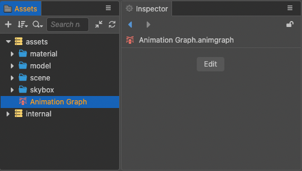
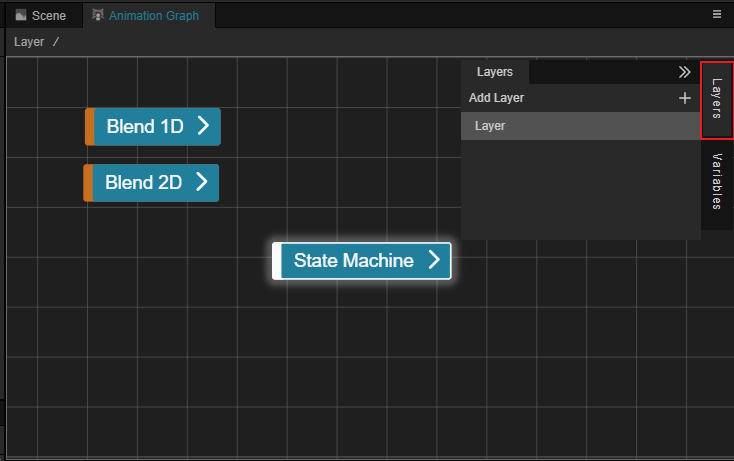
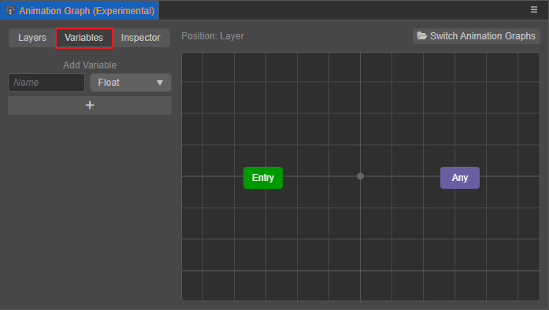
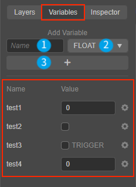
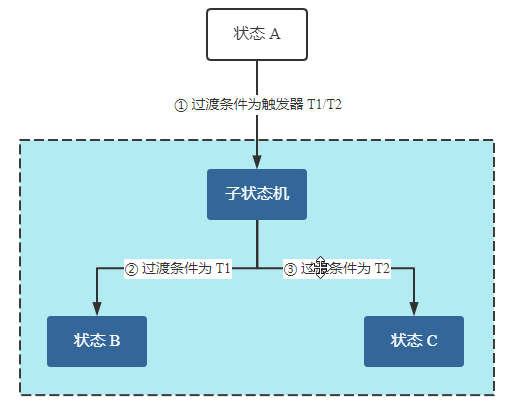
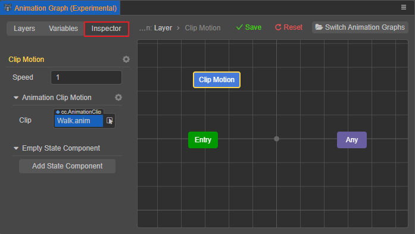

# Animation Graph Panel

The Animation Graph panel is used to view and edit animation graph assets. Once you have prepared the skeletal animations required for an object, you can assemble and combine them into a complete animation flow in the **Animation Graph Panel**.

## Opening the Panel

Select the animation graph asset in the **Assets** panel, then click **Edit in the Animation Graph panel** in the **Inspector** panel:

This opens the Animation Graph panel, which consists of **Layers**, **Variables**, **Inspector** tab on the left, and the grid layout area on the right:

When there are multiple animation graph assets, you can also click the **Switch Animation Graphs** button in the upper right corner of the panel to switch other animation graphs that need to be edited.

## Layers

This tab is mainly used to create, view and edit layers of animation graphs, each layer is controlled by a state machine respectively, but currently only one animation graph layer is supported. The animation layer can be renamed by clicking on the gear icon button to the right of the layer.

## Grid Layout Area

This area mainly shows the state machine corresponding to the layer selected in the **Layers** tab, where the user can visually create, edit and arrange the states in the state machine, as well as set the transition between states. Right-click in the area to create as many states as needed:

When finished editing, you can click **Save** or **Reset** (reset to the last save) in the upper right corner as needed. Please refer to the [Animation State Machine](animation-graph-basics.md) documentation for more operations.

## Variables

This tab is mainly used to create, view and edit the variables of the state machine in the current animation graph layer. The user can manipulate the flow of the animation graph expression in the animation graph by means of custom **variables**, which serve the following purposes:

- as **transition conditions** for transitions between states

- as an **input parameter** for mixing animation states to mix different animation clips

### Creating variables

In the following figure, for example, the steps are:
- Fill in the variable name in the ① input box
- Select the variable type in the ② drop-down box. The supported variable types include **Float**, **Boolean**, **Trigger** and **Integer**, please refer to **Variable Types** section below for details.
- Finally, click the **+** button in ③ to create the variables, and the created variables will be displayed in order at the bottom of the tab.

Each created variable will have a gear icon button on the right side, click it to delete the corresponding variable. Please don't forget to click the **Save** button in the top right corner of the Animation Graph panel to save the settings when you are done.

### Variable Types

The currently supported variable types to create include:

- **Float**: the value of the variable can be any real number

- **Boolean**: the value of the variable can be true/false

- **Integer**: the value of the variable can be any integer

- **Trigger**: the variable is a trigger, if checked, the value is a trigger. Trigger is used for one-time condition judgment, when the trigger condition is satisfied, the state transition occurs. After the transition is completed, all the triggers referenced will be reset to **untriggered state**.

  > **Note**: the trigger will be reset only when it transitions to a certain state. If it transitions to a "pseudo-state", the trigger will not be reset.

  For example, in the following figure, if you set trigger T1 or T2 in ① once, state A will reach state B or C in the sub-state machine without setting the triggers in ② and ③ again:

  

  <!--
  These graphs are edited with ProcessOn and the source files are saved in the en/animation/marionette directory in POS format and can be imported into ProcessOn for editing again.
  -->

## Inspector

This tab is mainly used to set the properties and transition conditions of the various states in the state machine, please refer to the [Animation State Machine](animation-graph-basics.md) documentation for details.

