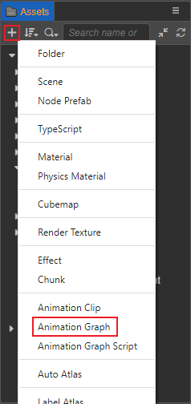
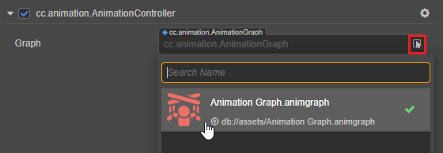
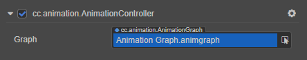

# Animation Graph Assets

The animation graph asset is used to store the entire animation flow data of the object. The flow of the animation is described by a state machine, currently an animation graph only supports one state machine.

## Creating

In the **Assets** panel click the **+** button on the top left, then select **Animation Graph**.

This creates an animation graph asset named `Animation Graph` by default.

## Editing

Once the animation graph is created, it can be edited it in the Animation Graph panel, please refer to the [Animation Graph Panel](animation-graph-panel.md) documentation for details.

## Applying

Animation graph assets need to depend on the Animation Controller component to be applied to the object.

Click **Add Component -> Animation -> Animation Controller** at the bottom of the **Inspector** panel to add the Animation Controller component to the node.

> **Note**: since the Marionette animation system and the old animation system cannot be used together, the animation controller component cannot be attached on the same node as the animation component or the skeletal animation component either.

Then click the arrow icon button behind the **Graph** property box of the animation controller component to select the animation graph asset.

Or just drag and drop the animation graph asset from the **Assets** panel into the **Graph** property box of the Animation Controller component: !

