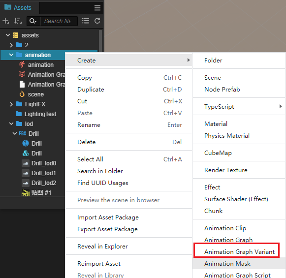
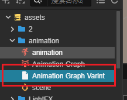
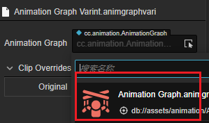
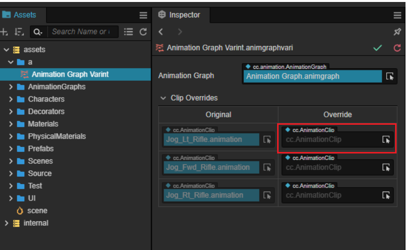
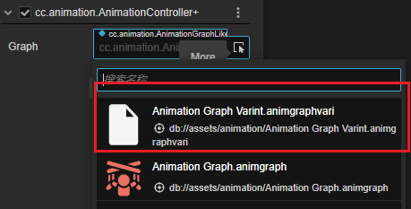

# Animation Graph Variants

If two animation diagrams have the same animation logic but different corresponding animation clips, re-creating an animation graph will create an additional maintenance burden. By using animation variants, this problem can be better solved.

An animated diagram variant is a resource that is created by right-clicking on a new animated diagram variant resource within **Resource Manager**.

The created variant is shown in the following figure.

## Properties

| Properties | Description |
| :-- | :-- |
| **Animation Graph** | Animated diagrams that require variants, selected by drop-down or from within **Assets Manager**   |
| **Clip Overrides** | Animation clips that need to be covered      With the Overrides column on the right, select the animation clips to be replaced from the **Assets Manager** |

## Use of variants

The different variants can be selected by pulling down the **Animation Graph** property of the Animation Controller component.

