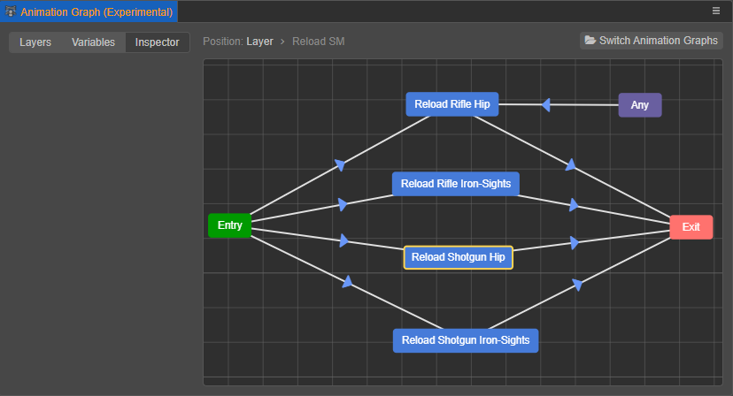

# Marionette System

Cocos Creator introduced the Marionette animation system in v3.4 as the new bespoke state machine system for an automated, modularized skeletal animation workflow.

To distinguish from the animation system from prior to v3.4 which is also accessible in the later versions of Cocos Creator, the new animation system will be referred as the **Marionette** system in this documentation while the animation system from prior to v3.4 will be referred as the **legacy** system. In general, the distinctions between the two include:

- **Legacy**: Powered by the **Animation** component, the legacy system animates objects with animation states containing animation clips (which are keyframe animations created in Cocos Creator) and skeletal animations imported from external sources in the format of `.fbx` and `.gltf`.

- **Marionette**: Powered by the **Animation Controller** component, the Marionette system animate objects with pre-constructed animation graphs, which functions as a controller of multiple animation states that can only contain skeletal animations imported from external sources in the format of `.fbx` and `.gltf`.

## Content

The Marionette system consists of four modules:

- [Animation Graph Assets](animation-graph.md)
- [Animation Graph Panel](animation-graph-panel.md)
- [Animation State Machine](animation-graph-basics.md)
- [State Transition](state-transition.md)

## Terminology

| Function | Description |
| :--- | :--- |
| Animation Graph Assets | Asset that contains the flow chart of animation states, Can be created in the **Assets** panel. For more information, please refer to [Animation Graph Assets](animation-graph.md). |
| Animation Controller Component | References to the Animation Graph Assets and applies it to a node in the scene. |
| Animation Graph Panel |Animation clips can be imported and stored as animation states, which can be assembled into a flow chart to indicate the transition from one clip to another. This is done in the Animation Graph panel once an Animation Graph asset is created. For more information, please see [Animation Graph Panel](animation-graph-panel.md). |
| State | A state is an action that is usually portrayed by an animation clip, such as standby, walk, move, attack, etc. This should be distinguished from an [animation state](../animation-state.md) as used in the legacy system. |
| State Transition | An animated actor is likely to perform multiple actions, each portrayed by an animation clip and registered as an animation state. A [state transition](state-transition.md) contains the logical check for switching between different states. For instance, to create the death animation of a walking character, a state transition is needed to switch the walk state to the death state. |
| Animated State Machine | Collectively, all the animation states and the transitions between them can be constructed in a flow chart, which is known as an [Animation State Machine](animation-graph-basics.md). |

A state machine as displayed in the Animation Graph panel is demonstrated in the screenshot below. In it, each blue rectangle represents a state, while the arrows between them the transitions between different states.

## Example Project

To learn more and experiment with the Marionette system, users may access the example project [*Ms. Amoy*](https://github.com/cocos-creator/MarionetteDemo) with the link provided.
