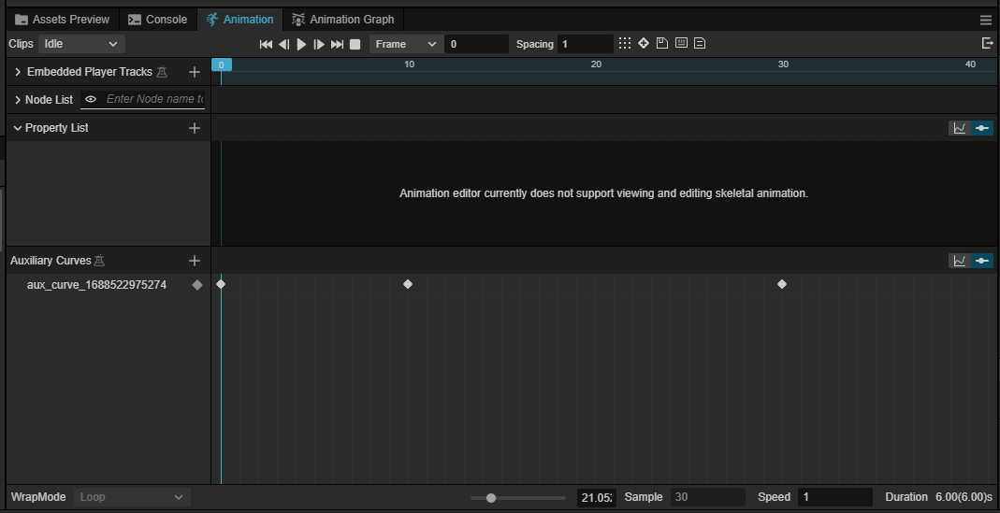

# Auxiliary Curves (experimental)

> **Note**: auxiliary curve is an experimental feature, please use it with caution.Cocos Creator looks forward to your feedback.

## Motivation

Sometimes, when a character performs a certain action, it is accompanied by changes in some other associated attributes in addition to the visual changes in the bones. For example:

- Selective use of IK to correct foot position: when the character is standing in place; not when the character is walking.

- When starting a jump from a run, it may be necessary to decide whether to use a left-footed jump or a right-footed jump, depending on the orientation of the feet at the start of the jump. This is essentially a change in the orientation of the feet that needs to be reflected in the running movement.

- Along with the movement, there are texture changes, particle effect changes, sound changes, and so on.

Some of these changes can be visualized by [Embedded Player](../../../embedded-player.md). But sometimes the embedded player is not up to the task:

- The changes described by the embedded player can't participate in the blending in the same way that bones can.

  For example, when the action fades out, the embedded player stops abruptly; the embedded players for two actions are independent - even though they may be describing color changes in the same material, their effects cannot be blended with the action.

- Changes in the values described by the embedded player cannot be used directly in the animation diagram.
  It is not possible to read the results of the embedded player directly into the animation diagram. Even if it were possible, it would require a tedious setup step.

> This is not to say that we no longer encourage the use of embedded players. When you don't have the blending needs described above, the embedded player is still a quick way to attach other effects to your actions.

Therefore, Cocos Creator introduces a new feature to solve the above problem.

## Concept: Auxiliary Curves

An **Auxiliary Curve** is a named **float** curve whose value is used as an attribute of the pose in addition to the bones:

- When sampling a pose from an animation clip, the auxiliary curve is also sampled;

- When a pose is blended, the value of an auxiliary curve of the same name is also blended.

As their name implies, auxiliary curves play a supporting role in skeletal animation. The source and application of auxiliary curves are defined by the user.

> The main difference between auxiliary curves and skeletal animations is that the values of skeletal animations are written to the scene when applied, driving the bones to produce visual model animations, whereas auxiliary curves do not produce direct visual effects, they are only readable, and it is up to the user to determine their usefulness.

## Editing Auxiliary Curves

In the Animation Clip Editor, you can edit the [Auxiliary Curve](../../../animation-auxiliary-curve.md).

In the pose graph, you can set the auxiliary curve nodes with [Set Auxiliary Curve Node](../pose-graph/pose-nodes/modify-pose.md##Set%20auxiliary%20curve) to set or modify the current value of the auxiliary curve for a pose.

## Using Auxiliary curves

Auxiliary curves can be read and used in animation graphs and animation controllers:

- In [Transition Conditions](../../state-transition.md).

- Some of the properties of the pose nodes in the pose map can be specified by the current value of the auxiliary curve. Example:

- [apply-transition-node](../pose-graph/pose-nodes/modify-pose.md#Apply%20Transformations) The intensity value of [Apply Transformations Node](../pose-graph/pose-nodes/modify-pose.md#Apply%20Transformations) can be specified using an auxiliary curve.

- [Animation Controller](../../animation-controller.md) component provides methods to read the current value of the auxiliary curve.
