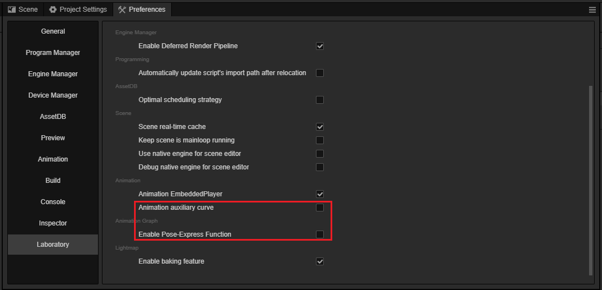
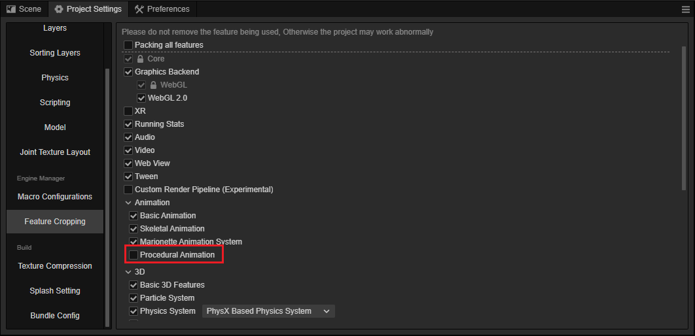

# Enable Procedural  animation

Procedural animation is currently an experimental feature, to enable it, find the **Laboratory** feature in **Preferences** and turn on the following options:

- Animation auxiliary curve
- Enable Pose-Express Function

Open the **Project Settings** panel in the **Project** menu , and navigate to the **Feature Cropping** page, and enable the **Procedural Animation** option.

Then restart the editor or use <kbd>Ctrl + R</kbd> to refresh.