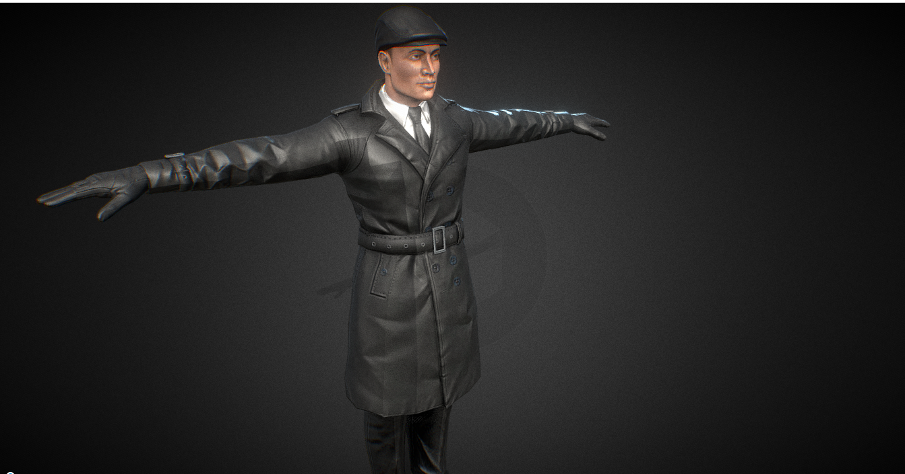
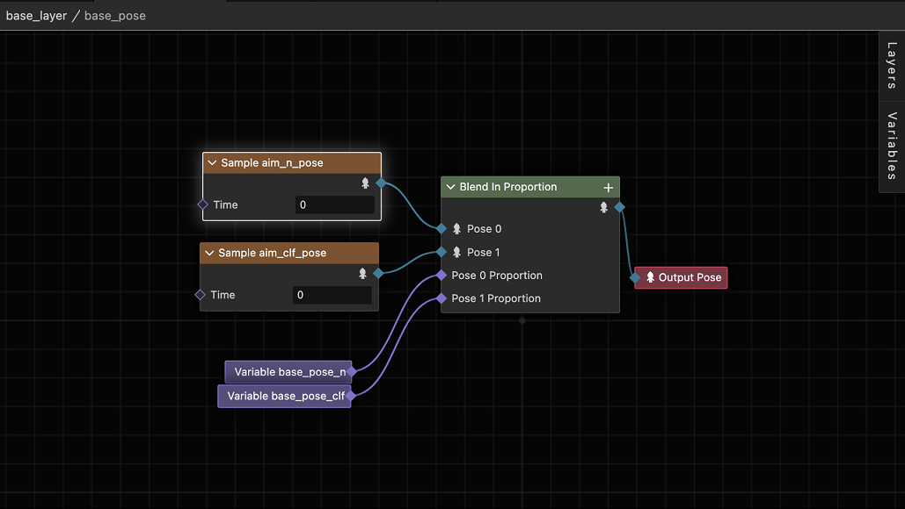

# Introduction to Procedural Animation

Before we can understand procedural animation, we need to understand the "Pose" referred to in animation, and I'm sure you've seen the pose in the image below:

> Image from [https://sketchfab.com](https://sketchfab.com/3d-models/man-in-coat-character-human-riged-model-758a855697be47a1be0d707623e3907e)

This is the *binding pose* in animation. It is also known as a T-Pose because the whole human figure stretches its arms out to make a shape like a T.

> Besides T-Pose, A-Pose is also widely used on human skeleton.

I don't know if you have ever thought about why there is such a "weird" pose as T-Pose.

The original reason may not be known, but nowadays, T-Pose is the most suitable starting animation for animators to animate a character from. So the T-Pose has been preserved as part of the animation workflow.

We can understand T-Pose as a mathematical concept. If the positive X-axis starts at 0, then the starting pose of the animation is T-Pose.

Understanding this allows us to understand the "pose" of the character. We can understand this as the appearance that the character embodies at a given moment in time, and these appearances are determined by the transformations (position, rotation, etc.) provided within its animation information, as well as elements such as skinning. In other words, when we move the "cursor" on the numerical axis to a certain moment, we get the current value on the numerical axis. Similarly, if we move the animation on the timeline, the way the character looks when the timeline stops at a certain moment is called a pose.

In the engine, a character's **pose**, is the information about all the transformations (positions, rotations) of all the character's bones at a given moment. The solved animation map will generate the poses, which are then written to the scene, along with skinned rendering to realize the skeletal animation.

Procedural animation, which is a flowchart-like representation of the pose generation and changes.

A typical procedural animation is shown above.

The difference between procedural animation and normal animation is that normal animation usually means that the developer cannot intervene in the sampling behavior of the animation, whereas procedural animation provides additional capabilities for the developer to extract certain animation, blending, or pose information in the animation sampling to perform weighted blending and other operations on the current animation.

The procedural animation system provides the ability to manipulate animation clips, blends, and poses, which allows the developer to dynamically adjust the animation sampling process according to the needs of the runtime and generate outputs, which can either be used as the final outputs to the screen or as inputs for other animation samples, thus forming a complex animation system.

Let's take a simple example to illustrate procedural animation.

For example, if a character walks on uneven ground, this is usually not taken into account when creating an animation clip because the producer of the art asset does not know what height the character's feet might be at, so an animation of the character walking on flat ground is created, and at runtime, due to the height of the ground, the height at which the feet should be located needs to be dynamically calculated, and the character's feet "Move" the character's feet to the corresponding height, which is usually done using Inverse Kinematic (IK) algorithms.

With procedural animation, we only need to add IK-related nodes to the pose graph, and pass the information needed to calculate IK to the pose graph system at runtime, and then get the correct result through the IK solver.

You can see that procedural animation makes the creation of complex animations easier to follow and understand by providing a visual view.

## When you need procedural animation

Simply put, you should consider using procedural animation capabilities when you need to modify bones dynamically, especially when you need to adjust bones to the environment. For example, when a humanoid character touches a switch, you need to move the hand bones to the switch position and make sure the arm adjusts accordingly.