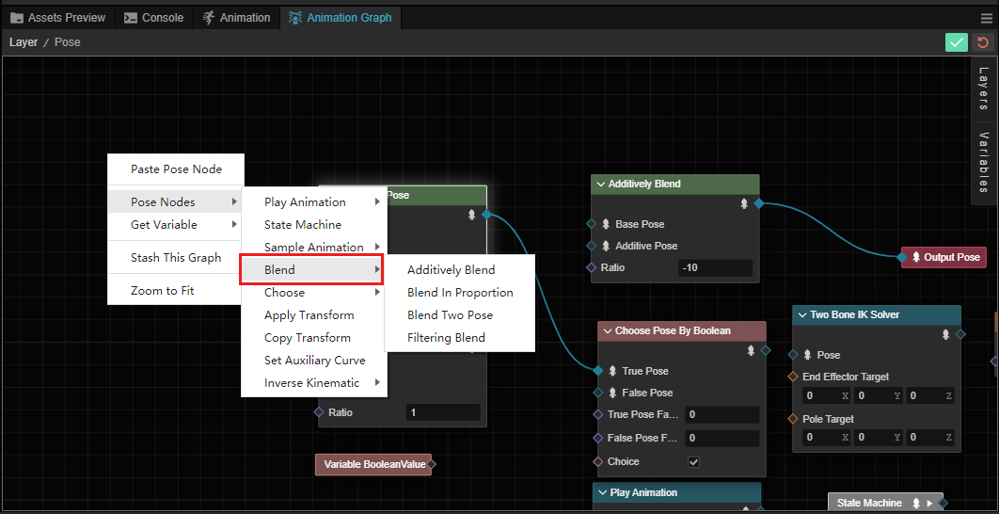
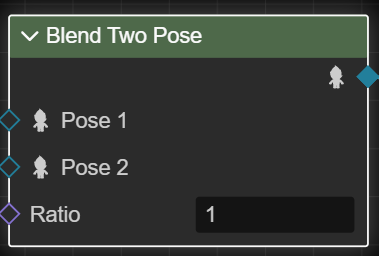
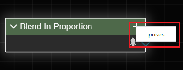
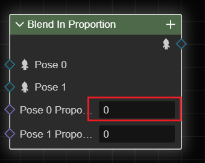
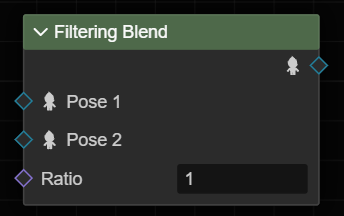
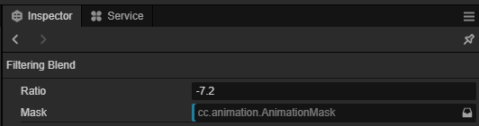
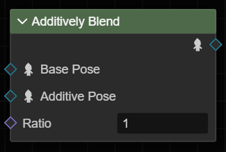

# Blend Pose

There are several type of blend nodes in pose graph.

> All blend nodes are calculated in the local space.

Blend poses can be created in the pose graph by right-clicking on the **Pose Nodes** -> **Blend**.

## Blend Two Pose

The **Blend Two Pose** will blend the two specified poses by ratio.

| Input       | Type   | Description|
| :-- | :-- | :-- |
| **Pose 1** | Pose | First pose in the blend |
| **Pose 2** | Pose   | Second pose in the blend |
| **Ratio**   | Float | Blend ratio. For example, 0.2 means that the final pose will contain 80% of pose 1 and 20% of pose 2. |

## Blend In Proportion

The **Blend In Proportion** node blends the nodes by proportion of each pose.

| Input       | Type   | Description|
| :-- | :-- | :-- |
| **Pose N** | Pose   | Pose in the blend. |
| **Pose N Proportion** | Float | The ratio of the poses to each other. For example, 0.2 means that the final pose will contain 20% of the pose N.|

More poses can be added by clicking the "+" button on the right and selecting the **poses** menu.

After adding a pose, enter the proportion in the input box to set the percentage of the pose in the final pose.

> All proportional weighted results should be 1, otherwise there may be undefined behavior.

## Filtering Blend

The **Filtering Blend** node blends Pose 1 to Pose 2 by the specified ratio and  mask.

| Input       | Type   | Description|
| :-- | :-- | :-- |
| **Pose 1** | Pose    | First pose engaged in the blend |
| **Pose  2** | Pose    | Second pose engaged in the blend|
| **Ratio**   | Float | Blend Ratio. For example. 0.2 means the final pose contains 80% from Pose1 and 20% from Pos2. |

| Inspector | Description |
| :-- | :--  |
| **Mask** | The animation mask to use when blending.Only the parts of pose 2 that are bounded by the mask will be blended into pose 1. |

## Additively Blend

The **Additively Blend** node "adds" the additive blend to the base pose.

| Input       | Type   | Description|
| :-- | :-- | :-- |
| **Base Pose** | Pose   | The base pose. |
| **Additive Pose** | Pose   | The additive pose |
| **Ratio** | Floating Point | Blend Ratio. For example, 0.2 means that only 20% of the stacked poses will be blended into the base pose. |
