# Pose Graph View

## Create Node

Before creating a node, you need to create a pose graph in the animation graph first, and then double-click the mouse to enter the visual editing interface of the pose graph.

Right click on the pose graph and click on Post Nodes in the popup menu to create a node.

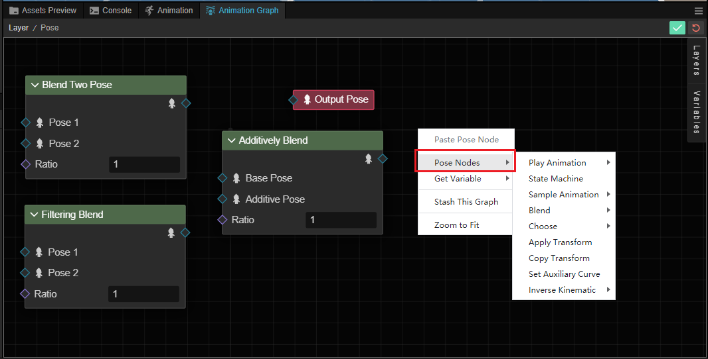

| Menu | Description |
| :-- | :-- |
| **Play Animation** | See [play-or-sample-motion](./play-or-sample-motion.md)
| **State Machine** | See [state machine](./state-machine.md)
| **Sample Animation** | See [play-or-sample-motion](./play-or-sample-motion.md)
| **Blend** | See [blend poses](./blend-poses.md)
| **Select** | Developers can select poses and animations with different types of data, including booleans and indices |
| **Apply Transform** | See [Apply Transformations](./modify-pose.md#%E5%BA%94%E7%94%A8%E5%8F%98%E6%8D%A2)| | **Copy Transform** | **Copy Transformations
| **Copy Transform** | See [Copy Transformations](./modify-pose.md#%E6%8B%B7%E8%B4%9D%E5%8F%98%E6%8D%A2)| | **Copy Transform** | See [Copy Transform](.
| **Set Auxiliary Curve** | See [Auxiliary Curve](../../auxiliary-curve/index.md) |
| **Reverse Dynamics** | Calculate the reverse computation of the skeleton via the reverse dynamics checker, currently supported by [Two-Bone IK](./modify-pose.md#%E5%8F%8C%E9%AA%A8%E9%AA%BC-ik) |

Once created, it will be displayed in the attitude graph as a rectangular box of a different color.

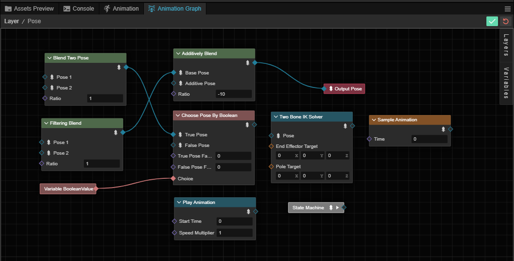

We use **blend** node as an example to illustrate the structure of nodes, other types of nodes can be referred to.

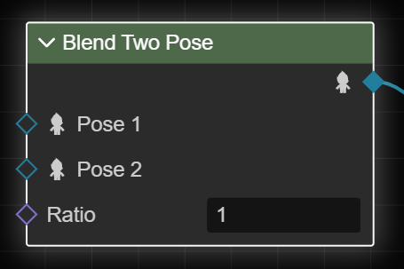

You can see that the node has several components:

- Type: the type of the node displayed at the top.
- Expand/collapse: click on the arrow symbols at the top left of some nodes to expand/collapse them to keep a cleaner view.

    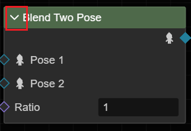

- Inputs: usually on the left side of the node, indicates the inputs to the node, indicated by different colored hollow (unconnected)/solid (connected) diamonds, the outputs of other nodes can be used as inputs, and some of the nodes can also be input directly within the pose graph within the right **Inspector** panel. The inputs are different for different node types, please refer to the documentation for different types of nodes for details.

    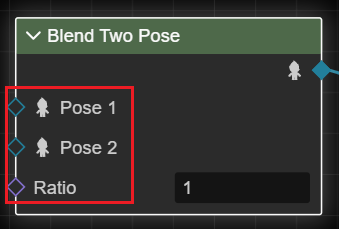

    Some node types, such as variable nodes, have no inputs but only outputs.

- Outputs: The output part is usually on the right side of the node, represented by a hollow (unconnected)/solid (connected) diamond, which can be formed by pressing and dragging the left mouse button to form a connection.

    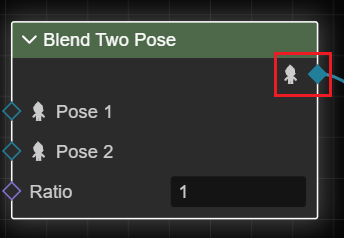

    Generally speaking, a node's output can only be used on another node's input, and only once, which means that if the output has already been used, connecting to the other node through the input again will disconnect the previous connection.

## Node Operations

Clicking the right mouse button on any node brings up the node operations menu.

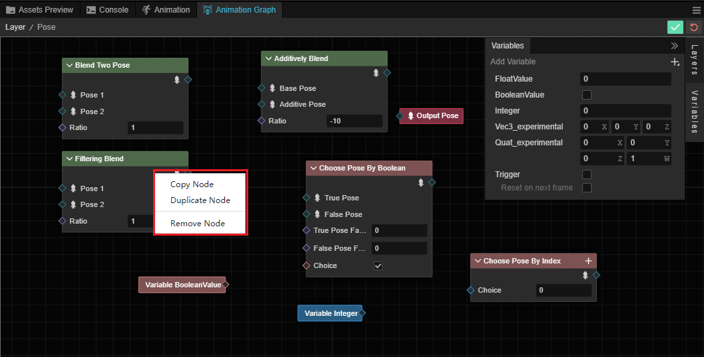

- Copy this node: copy operation will copy the currently selected node for other use.
- Clone this node: clones the selected node in the current pose map.
- Delete this node: removes the selected node from the pose map.

## Menus

Clicking the right mouse button inside the empty space of the pose map will bring up the menu of the pose map.

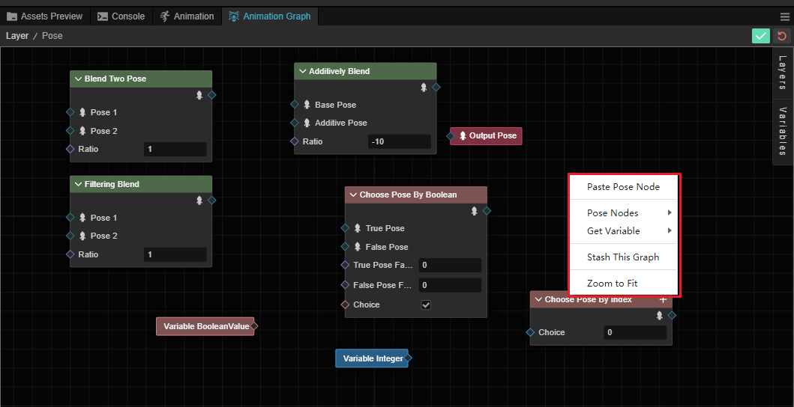

- Delete Pose Node: copy the node that was operated by copying this node above to this node
- Pose node: create a new pose node, please refer to the **Create Node** section above
- Get Variable: this menu can get the variables created in the animation graph, all the non-trigger variables configured in the animation graph can be obtained here.

    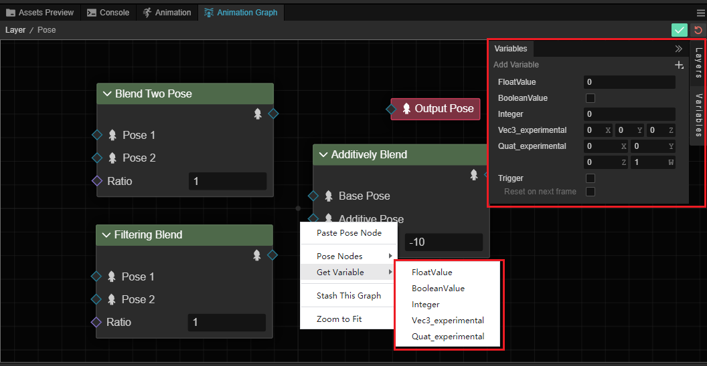

- Stash This Graph: the current pose graph will be dumped as a new pose graph
- Return to center view: The view will automatically return to the center view with the appropriate viewpoint.

## Create Connection

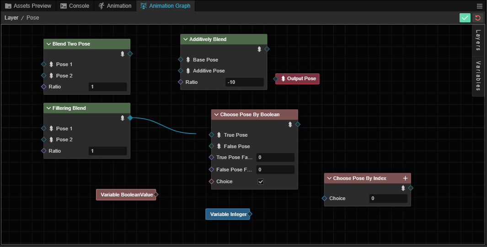

The connection means taking the output of one node and passing it to another node as an input parameter.

For different nodes, it is possible to connect the output of a node to the input of another node by dragging the node's output to the input of the other node, provided of course that the other node accepts the output type.

By dragging and dropping the output of a node to the input of another node.

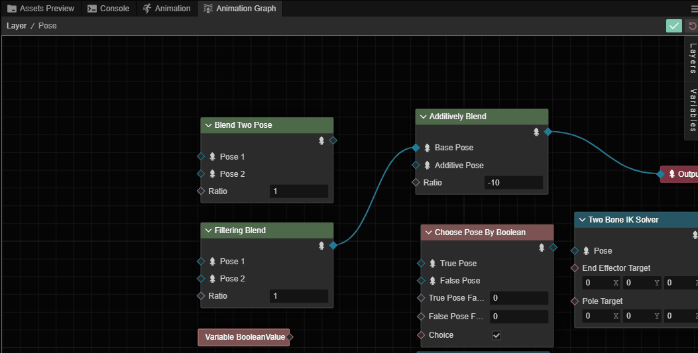

Successful connection is indicated by a solid diamond shape on the node:

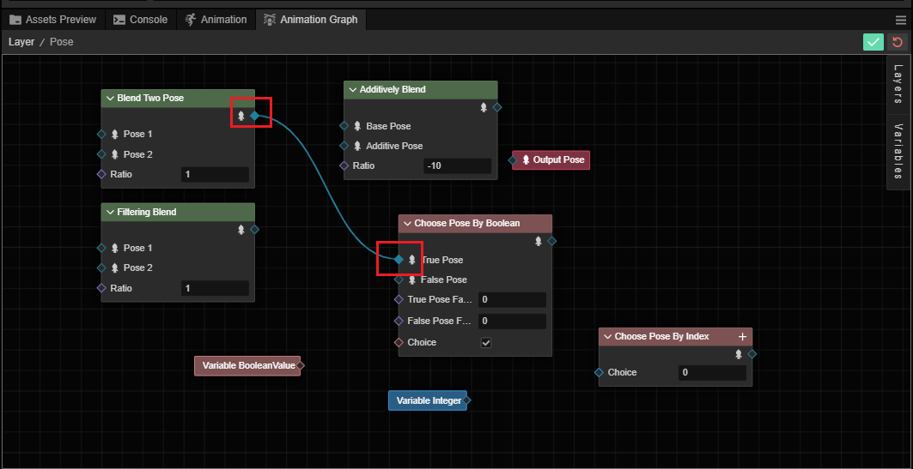

## Delete Connections

A connection can be deleted by clicking the right mouse button on the connected line. A blue highlighting flood light will be displayed around the selected line.

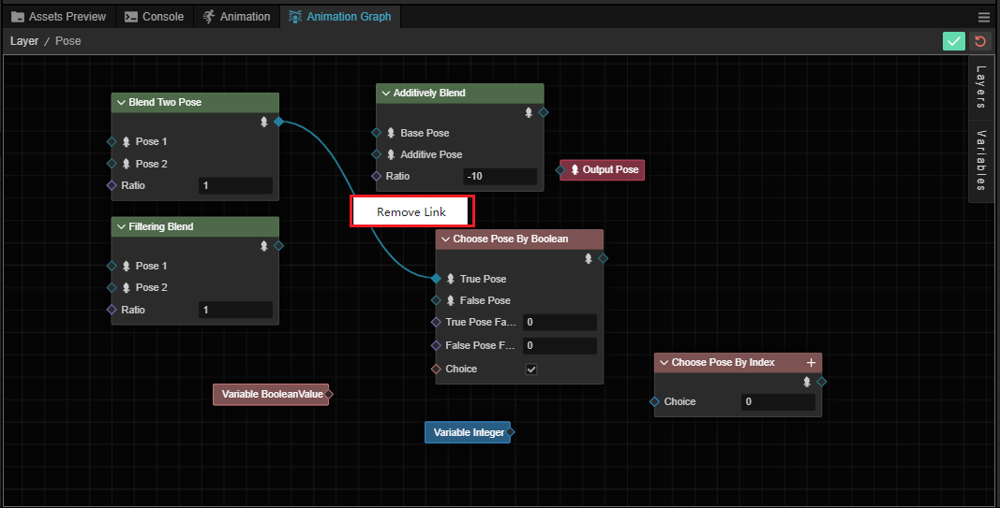
