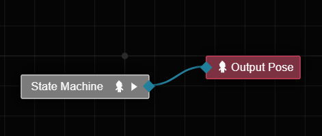

# Procedural Poses (states)

A **Procedural Poses** (state) is a state in a state machine. The state holds a pose graph, and when the state machine runs into this state, the pose it produces is the output gesture of the pose graph.