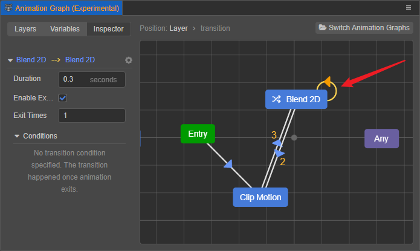

# State Transitions

**Transition** represents a transition between two states, which can be classified depending on the source where the transition occurs.

- **Ordinary Transition**: the source where the transition occurs is a pseudo-state **entry** or **sub-state machine**.

  

- **Animation Transition**: the transition occurs with a source of a **State** or pseudo-state **Any**. Compared to normal transitions, animation transitions can also control the transition period to make the animation switch smoothly.

  

## Creating Transition

Right-click the state that is the source of the transition in the grid layout area, then select **Add Transition**, when the mouse leaves the current state, an arrow will be created, then select the state that is the target of the transition to create a transition between the two:

Multiple same/reverse direction transitions are allowed between two states, and the number of same/reverse direction transitions is marked on the arrow, and the configuration items are displayed in the **Inspector** tab.  
When there are multiple transitions on the state that satisfy both, the transition at the top of the transition list is used first. However, Creator does not recommend relying on this prioritization, and it is best to filter the transitions using the **filter conditions** described below whenever possible.

States also allow transitions to themselves:

## Setting Transitions

With the transition selected in the grid layout area, the **Inspector** tab on the left side allows you to set the trigger conditions associated with the transition, including **Duration**, **Enable Exit Times**, **Exit Times**, **Conditions**.

> **Note**: **Ordinary Transition** can only specify **Conditions**, and the plain transition is more like a selector.

- **Duration**: set the period to complete the current transition, so the animation will switch smoothly. The unit is **seconds** or **times**, default is 0.3 seconds, you can click the unit after the input box to switch.

    

    - When set to **seconds** (default): indicates that the state transition is completed within the set number of seconds

    - When set to **times**: means the period of the state transition is based on the number of times the transition source state is played. For example, if the animation length of the transition source state is 3 s, when **Duration** is set to 0.9 times, it means the transition period is 0.9 ✖️ 3s = 2.7s.

- **Enable Exit Times**: indicates whether the transition source state ends playing as one of the transition conditions. If checked, the transition needs to occur to meet the **Exit Times** condition set below. Play count is used as a special condition, when play count is enabled, the transition will happen only when both the play count condition and the transition condition are satisfied.

- **Exit Times**: sets the total amount of time the animation plays before the transition source state begins (Total = Exit Times ✖️ Animation Length), defaults to 1 time, and takes effect only when **Enable Exit Times** is checked. It is important to note that animations that do not loop will stop when the first play is completed and wait for the remaining number of plays to complete before starting the transition. To loop the animation automatically according to the number of times, please set the wrap mode in the skeleton animation asset beforehand. For example:

    - If the animation of the transition source is an **non-loop animation**, the playing time is 3 s, **Exit Times** is set to 1.4, then the animation of the transition source will continue to stay in the last frame for 1.2s (3s × 0.4) after playing for 3s, before starting the transition.

      

    - If the animation of the transition source is an **loop animation**, playing time is 3 s, **Exit Times** is set to 1.4, then the animation of the transition source will continue to loop the animation to 1.2s (3s × 0.4) after playing 3s, before starting the transition.

      

- **Condition**: there are certain conditions that need to be met when setting up transitions that occur between states, as described below:

Without using other transition conditions, for the animation of the source state to gradually switch to other states when it is almost finished playing once, and the animation of the source state is just finished playing when the switch is done, then we can set **Duration** and **Exit Times** to achieve this, it is recommended to set the unit of **Duration** to **times**, and then make the sum of **Duration** and **Exit Times** sum to **1**.

For example, if the animation length of the transition source state is 3 seconds, set **Duration** to 0.3 times, then **Exit Times** is 0.7. If **Duration** is set to 0.3 seconds, it is more troublesome, **Exit Times** need to convert seconds to times: (3 - 0.3)/ 3 = 0.9 times.

### Transition Conditions

Some transitions between states need to satisfy certain conditions to be triggered, such conditions are called **transition conditions**, or **conditions** for short. If no condition is set for the transition, it will be triggered directly. Conditions can be created in the [Variables](animation-graph-panel.md) tab of the Animation Graph panel.

Once the transition is selected in the grid layout area, the condition can be added by selecting the gear icon button in the **Inspector** tab on the left. The added conditions are displayed below the **Inspector** tab on the left.

The currently supported transition conditions include the following three:

- **Boolean condition**: determines if a variable of Boolean type is true/false. Click the gear icon button on the right to remove the current condition.

  

- **Numeric condition**: determines the logical relationship between a variable of numeric type and another fixed value, including **equal to**, **not equal to**, **greater than**, **less than**, **greater than or equal to**, **less than or equal to**. The condition is satisfied when the equation (inequality) holds. The type of the variable matches the type of the value. If the variable is set to Float type, the type of the value is also Float type.

  

- **Trigger condition**: condition is satisfied when the trigger variable is triggered.

  

**Transition supports specifying multiple transition conditions at the same time, and the transition will occur when and only when all conditions are satisfied.**

### Unconditional Transitions

For **ordinary transitions**, it is allowed to not specify any transition conditions, for example, many times **Entry** needs to transition to other states unconditionally.

However, for **animation transitions**, transitions where neither **conditions** nor **Exit Times** conditions are specified are meaningless and the Creator will simply ignore the transition.

## An edge case

There are cases that cause a state machine to stay on **Entry** or **Exit**, e.g.

- Transitioned to the **Entry** of a sub-state machine, but there is no transition in the sub-state machine that would satisfy the condition.

- Transitioned to the **Exit** of a sub-state machine, but there is no transition in the parent state machine that would satisfy the condition for that sub-state machine.

This situation is called **state machine hover**.

When a state machine hover occurs, it directly interrupts the update until a subsequent transition to the state can be made, at which point it is represented as the animation being paused.

> **Note**: it is not recommended to rely on this behavior, and subsequent adjustments may be made to this behavior.
