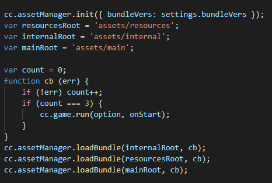

# Asset Bundle Overview

> Author：Santy-Wang

Starting with v2.4, Creator officially supports Asset Bundle functionality. The Asset Bundle is a modular resource tool that allows developers to divide the resources of textures, scripts, scenarios, etc. into different Asset Bundles according to the requirements of the project, loading different Asset Bundles according to the requirements during the game run, minimizing the number of resources to be loaded at startup.Asset Bundle can be placed on demand, e.g. on a remote server, locally, or in a subpack of a mini gaming platform.

## FAQ

Q: What are the advantages that Asset Bundle brings to the table?

A: Asset Bundle is mainly used to modularize the resources in a project according to the developer's wishes, dividing resources with different requirements for different scenarios into multiple bundles, thus reducing the time required for the first download and loading of the game, or it can be reused across projects to load Asset Bundle in subprojects.

Q: What is the difference between Asset Bundle and pre v2.4 resource subpackage?

A.
1. resource subpackage is essentially a basic function of the game platform, such as WeChat mini-games support subpackage function, while Creator carried out a packaging to help users set up, but essentially this function is controlled by the corresponding platform, if the corresponding platform does not support subpackage function, then Creator does not support it either, while Asset Bundle is completely designed and implemented by Creator, is a modular tool to help developers to divide resources, independent of the platform, theoretically can be supported on all platforms.

2. resource subpackage is actually splitting out some textures, meshs into separate packages, but this package is incomplete, unreusable, non-logical, while Asset Bundle is modularizing resources through logical division, Asset Bundle includes resources, scripts, metadata, resource list, so Asset Bundle is completed, logical, reusable, can completely load out the whole scene or any other resources from Asset Bundle, Asset Bundle can greatly reduce the number of json in the first package and the size of settings.js through splitting.

3. The subpackage of resources is platform-related, meaning that it needs to be set up in the way that the platform requires. For example, a WeChat subpackage cannot be placed on a remote server, but only on Tencent's server, whereas Asset Bundle is not subject to these restrictions, and Asset Bundle can be placed locally, on a remote server, or even in a WeChat subpackage.

Q: In what form is the Asset Bundle organized?

A: In a project Asset Bundle is set up by setting up folders, **Resources in the folder and related dependent resources** outside the folder are merged into the same Asset Bundle, and after packing, all Asset Bundles are placed in `${OUTPUT_PATH}/assets/`, `${OUTPUT_PATH}/remote/` and `${OUTPUT_PATH}/subpackages/`, each folder is an Asset Bundle, and you need to upload `remote` to the server.

Q: Can Asset Bundle be used as a mode for lobby plus sub games?

A: Absolutely, subgame scenarios can be placed in Asset Bundle and loaded when needed, and subgames can even be pre-built as Asset Bundle in other projects and then loaded for use in the main project.

Q: Can Asset Bundle reduce the size of settings.js?

A: Absolutely, in fact after v2.4, the packaged project is based entirely on Asset Bundle, setting.js no longer stores any configuration information related to the resource. All configuration relationship tables are stored in each Asset Bundle in the form of config.json. Each config.json stores only the resource information in this Asset Bundle, which reduces the size of the first bundle. This can simply be understood as all config.json combined is equal to the previous settings.js.

Q: Can Asset Bundle be reused across projects?

A: Absolutely, but the following conditions must be met: 1. the engine version is the same, 2. the scripts used in Asset Bundle are included in itself, 3. Asset Bundle has no other external dependencies on the bundle, and if there are other dependencies on the bundle, you must also load the dependencies on the bundle.

Q: Can Asset Bundle do the separation of the first scene?

A: Of course, you can check the First Scene Bundle on the build panel and the first scene will be put into the built-in Asset Bundle `start-scene` to separate the first scene.

Q: Can Asset Bundle be nested? For example, if there is a B folder in the A folder, can both A and B be set to Asset Bundle?

A: Asset Bundle does not support nesting, please avoid using it as such.

## The built-in Asset Bundle

Starting with v2.4, Creator has 4 built-in Asset Bundles, as shown in the figure.


That is, starting with v2.4, all resources will exist in the Asset Bundle. All resources in the resources directory and their dependencies will be in the Asset Bundle of resources, all internal resources and their dependencies will be in the Asset Bundle of internal, all scenarios checked in the build panel and their dependencies will be in the Asset Bundle of main, and if you check the first scene as asset bundle, the first scene will be built into start-scene.

As with other Asset Bundles, you can also set the compression type of the built-in Asset Bundle and even put it on a remote server. You can set this by configuring the remote server address at build time, or you can control the loading of the built-in Asset Bundle by modifying the main.js code through the custom build template feature, similar to the one shown below.

 

## Priority

When the folder is set to Asset Bundle, resources that are dependent on the folder as well as those outside the folder are merged into the Asset Bundle, meaning that there may be a situation where a resource is not itself under the Asset Bundle folder, but is dependent on both Asset Bundles and thus belongs to both Asset Bundles, as shown in the figure.

 

Another scenario is where the resource is under one Asset Bundle folder, but is referenced by another Asset Bundle, as shown in the figure.


In both cases, resource c belongs to both Asset Bundle A and Asset Bundle B. So which bundle does resource c actually exist in? At this point, it is necessary to specify exactly which bundle the resource c is placed in by adjusting the priority of the Asset Bundle.

Bundles can be set with different priorities, Creator has 10 built-in priorities to choose from, the editor will build the bundle in order of priority, when the same resource is referenced by multiple bundles of different priorities, the resource will be prioritized in the high priority bundle, the low priority bundle will store only one record information, at this time the low priority bundle will rely on the high priority bundle, if you want to load this shared resource in the low priority bundle, you must load the high priority bundle before the low priority bundle.
When the same resource is referenced by multiple bundles of the same priority, the resource is copied in each bundle, where different bundles have no dependencies and can be loaded in any order. So try to make shared resources such as `Texture`, `SpriteFrame`, `Audio`, etc in the bundle with higher priority, so that low priority bundles can share their resources and thus minimize the bundle body.

**Note**: The priority of the four built-in Asset Bundles is 11 for INTERNAL, 9 for START-SCENE, 8 for RESOURCES, and 7 for MAIN. When the four built-in bundles contain the same resources, the resources are stored in the bundle with the higher priority. It is recommended that other custom bundle priorities are not higher than the built-in bundle priority, so that resources in the built-in bundle are shared whenever possible.

## Compression type

Bundle also currently provides five compression options for bundle optimization, namely `none`, `default`, `merge all JSONs`, `mini game subpackage`, `Zip`. **All bundles use the `default` type by default, and developers can reset the compression type of all bundles, including the built-in bundle**. The roles of compression types are.
1. There is no compression operation when `none` is selected.
2. When `default` is selected, the bundle attempts to combine JSON files from interdependent resources, thereby reducing the number of runtime load requests.
3. When `merge all JSON` is selected, the bundle will merge the JSON files for all resources into one, which will minimize the number of requests, but may increase the load time for individual resources.
4. Some game platforms, such as WeChat and Baidu, provide subpackage, and when you select `mini game subpackage`, these bundles will be set as subpackage on the corresponding platform. For details of the subpackage, please refer to [subpackage](../publish/subpackage.md)
5. On some platforms, bundle supports compression of resource files into a single zip file, reducing the number of runtime load requests

** In addition, different compression types can be used for different platforms, and the bundle will be built according to the settings of the corresponding platform.**

**Note**: Before version 2.4, if you had a folder in your project with `Subpackage` checked, after upgrading to 2.4, Creator will automatically convert it to Asset Bundle and set its compression type to the `Mini Game Subpackage` option on a supported platform.

## Construction of the Asset Bundle

When building a release, all **code** and **resources** in the Asset Bundle folder are treated as follows.

  - **Codes**: All codes in the Asset Bundle folder are combined into a single entry script file named `index.js` or `game.js`, depending on the publishing platform, and are removed from the main package.
  - **Resources**: All resources in the Asset Bundle folder and externally dependent resources are placed in the `import` or `native` directory.
  - **Resource Configuration**: All resource configuration information including path, type, and version is combined into a file named `config.json`.

The following table of contents was constructed as shown in the figure.

 

## Scripts in Asset Bundle

Because the Asset Bundle supports script subpacks, if you have script files under your Asset Bundle, all scripts are merged into one JS file and removed from the main bundle. When loading the Asset Bundle, an attempt is made to load this script file.

**Note**: Some platforms do not allow the loading of remote script files, such as WeChat, where Creator copies the code of the Asset Bundle to `src/script`, thus ensuring normal loading.

## Load Asset Bundle

AssetManager provides `loadBundle` to load the Asset Bundle and `loadBundle` can be loaded using the name and url of the Asset Bundle, but when you reuse the bundle of other project, only the url will be used to load, so you need to use the following.

```js
cc.assetManager.loadBundle('bundleA', (bundle) => {
  bundle.load('xxx');
});

// When reusing other project bundles
cc.assetManager.loadBundle('https://othergame.com/remote/bundleB', (bundle) => {
  bundle.load('xxx');
});
```

When loading an Asset Bundle through the API, the engine does not load all the resources in the bundle, but only the Asset Bundle's resource list, and all the scripts it contains. After loading, an instance of the `cc.AssetManager.Bundle` class, constructed using the resource list, is returned. You can use this instance to load various resources in the Bundle.

##  Asset Bundle

After the Asset Bundle has been loaded, it will be cached down, at which point you can use the name to get the bundle. for example.

```js
let bundleA = cc.assetManager.getBundle('bundleA');
```

The detailed API for Bundle can be found in [Bundle](... /... /... /api/en/classes/Bundle.html)