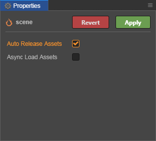

# Release Of Resources

> Author：Santy-Wang

A release module is provided in Asset Manager to manage the release of resources, automatic release and other functions.

## Release resource

When a resource is loaded, it is saved in the cache for the next reuse, and this causes memory and graphics to continue to grow, so what you need to do is release it when you don't need it, thereby moving it out of the cache and freeing up memory and graphics (for textures). creator provides both automatic and manual release.

## Auto release.

Creator v2.4 provides an auto-release mechanism, first, the scenario provides an auto-release option, as shown in the figure.



Once checked, an attempt is made to automatically release all dependent resources for that scene when it is switched.

Unless it's some high frequency use, such as the main scene, we recommend that you try to check the auto-release option all the way to ensure a low memory footprint.

In addition, the engine provides statistical functions for reference count `cc.Asset.addRef` and `cc.Asset.decRef` for increasing and decreasing reference count, respectively. When you call `decRef`, the Creator will also try to auto-release it.

```js
    start () {
        cc.resources.load('images/background', cc.Texture2D, (err, texture) => {
            this.texture = texture;
            // Add references to resources when they need to be held
            texture.addRef();
            // ...
        });
    }

    onDestroy () {
        // When you don't need to hold resources, reduce their references and Creator will try to auto-release them when calling decRef
        this.texture.decRef();
    }
```

The advantage of auto-release is that you don't have to explicitly call the release interface, you just have to maintain the reference count of the resource and Creator will automatically release based on the reference count. This greatly reduces the likelihood of incorrectly releasing resources, and since you don't need to understand the complex referencing relationships between resources, it's recommended that you try to use an automatic form of release for projects with no special needs.

#### Release check.

In order to avoid rendering or other problems caused by incorrectly releasing a resource that is being used, a series of checks are performed when the Creator attempts to auto-release a resource, and only by doing so will the resource be released. The inspection procedure is as follows.

1. if the reference count for that resource is 0, i.e., there are no references to that resource elsewhere, no follow-up checks are required, the resource is destroyed directly, the cache is removed, and all references to its **direct** dependent resource (without descendants) are reduced by 1, and the release check for the dependent resource is triggered.

2. if the resource's citation count is not 0 and there are references to it elsewhere, a circular reference check is required at this point to avoid having its own offspring refer to it. If the reference count is still not 0 after the loop reference check, terminate the release, otherwise destroy the resource directly, remove the cache, and subtract 1 for all references to its **direct** dependent resource (excluding progeny), and trigger the release check for the dependent resource.

After the above check, if the resource can be released, it will destroy the resource, remove the cache, and trigger a release check for its dependent resource.

### Manual release.

In addition to automatic release, Creator also provides a manual release interface that allows the Asset Manager-related interface to be called to manually release resources when the project has a more complex resource release mechanism.

For example, you could use the following.

```js
    cc.assetManager.releaseAsset(texture);
```

Releasing the resource will destroy all internal properties of the resource, such as the data associated with the rendering layer, and move the cache out, freeing up memory and video memory (for textures).

The release interface in v2.4 is similar to the release interface in previous versions, with the following differences.

1. `cc.assetManager.releaseAsset` The interface can only release a single resource, and for the sake of uniformity, the interface can only be released by the resource itself, not by attributes such as resource uuid, resource url, etc.

2. For the convenience of developers, it is no longer necessary to obtain dependent resources through `getDependsRecursively` when developers release resources. You just have to focus on the resource itself, and the engine will go and try to **automatically release** its dependent resource.

**Note**: Resources released through the `releaseAsset` interface do not themselves undergo a release check, only their dependent resources do. Therefore, the `release` and `releaseAsset` interfaces ensure that the resources themselves are released.

## Reference count statistics

The first thing to note is that the reference counting statistics in Asset Manager are different from those implemented in the traditional C++ language. Asset Manager only automatically counts static references between resources, and does not reflect how resources are dynamically held in the game. The reasons are.

1. JavaScript is a language with a garbage collection mechanism that manages its memory, and the upper levels have no way of knowing if a resource is destroyed or referenced.

2. JavaScript is a dynamically typed language that does not provide for assignment operator override, and the statistics of reference counts are highly dependent on assignment operator overlays.

So because of these two issues, prior to v2.4, Creator chose for a long time to give the developer control over the release of all resources, both the resource itself and its dependencies, you had to manually get all the dependencies of the resource and select the dependencies that needed to be released, this way gave the developer the most control and worked well for small projects, but as Creator grew and the project grew in size, the resources referenced by the scene grew and other scene may have reused those resources, this caused the complexity of releasing resources to grow and it was very difficult for the developer to master all the resources. To address this pain point, Asset Manager provides a resource release mechanism based on reference counting, allowing developers to simply and efficiently release resources without worrying about dramatic project size inflation. It should be noted that in this scenario the engine only counts the static references to the resources accurately, but the dynamic references to the resources also need to be controlled by the developer to ensure that the resources can be released correctly.

The first thing that needs to be clarified is what is meant by static and dynamic referencing of resources.

1. when you edit resources in the editor, such as scene, prefab, material, you will set some other resources to their properties, such as set the texture to the material, set the SpriteFrame to the Sprite component in the scene, then these reference relationships will be recorded in the resource serialization data, the engine can analyze the list of dependent resources from this data, then the reference relationships between them are static.

2. The second scenario is that when you edit a resource in the editor without setting any properties, and when the resource is dynamically loaded in code and set to an in-scene component at game runtime, the reference relationship does not exist in the serialized data at this point, so the engine cannot count this part of the reference relationship, which is called the dynamic reference of the resource.

Static references to resources by the engine are statistically as follows.

1. when loading a resource using cc.assetManager or Asset Bundle, record all **direct** dependent resource information for that resource in the underlying load pipeline and add the count of all **direct** dependent resources to 1 and initialize the reference count for that resource to 0.

2. obtain **direct** dependent resource information recorded prior to the release of the resource, subtracting the count of all dependent resources by 1.

Because the reference count for that resource needs to be checked to see if it is 0 during the release check, the above step ensures that the child resource cannot be released before the parent resource because its count is certainly not 0. That is, as long as a resource itself is not released, the resource it depends on will not be released, thus ensuring that the release is not made incorrectly when reusing resources. The following are examples.

1. there is an A prefab that depends on two resources: a material, b material, a material that references the texture α, and b material that references the texture β. After loading the A prefab, the counts of a, b material are both 1, and the counts of texture α and β are also 1.

2. there is now a B prefab that also relies on two resources: b material, c material. After loading, the count of material b is 2 because it is referenced by both preforms, the count of material c is 1, and the count of paste α and β is still 1.

3. At this point, if the prefab A is released, the counts of material a and b are each minus 1. And the count of material a becomes 0, the material a is released, the count of material b becomes 1, and the material b is retained. The count of texture β is still 1 and retained.

The above example shows that when resources are reused, it is possible to ensure that the reused resources are not released by mistake.

If you use dynamically loaded resources for dynamic referencing in your project, for example.

```js
    cc.resources.load('images/background', cc.SpriteFrame, function (err, spriteFrame) {
        self.getComponent(cc.Sprite).spriteFrame = spriteFrame;
    });
```

At this point, although this resource is set to the Sprite component, its reference count will remain at 0 by default and no special processing will be done by the engine. If you dynamically load resources that need to be referenced, held, or reused over time, it is recommended that you manually increase the reference count using the `addRef` interface. For example.

```js
    cc.resources.load('images/background', cc.SpriteFrame, function (err, spriteFrame) {
        self.getComponent(cc.Sprite).spriteFrame = spriteFrame;
        spriteFrame.addRef();
    });
```

Increasing the reference count ensures that the resource will not be released early by mistake. And when you don't need to cite the resource, **be sure to remember** to use `decRef` to remove the citation count and set the resource reference to null, for example.

```js
    this.spriteFrame.decRef();
    this.spriteFrame = null;
```

