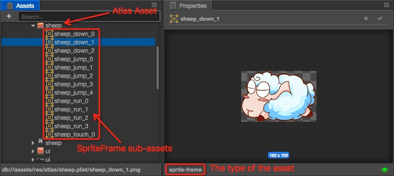

# Atlas

Atlas also named Sprite Sheet, it's a common asset in game developing. Atlas is generated by tools. The tools will combine many images into a large image and create an index file (such as **plist**). Altas asset contains **plist** & **png** is supported by Cocos Creator. Here is a image of an Atlas asset:

## Why using Atlas

Advantages of Atlas:

- In the combine process, blank spaces of images will be removed. And many optimization algorithm will be used. So this will reduce the size & memory of the game.
- When many Sprites using SpriteFrame from one Atlas asset, they can be rendered in one render command. This will reduce CPU consumption.

Here is a video from CodeAndWeb, it will show you [What is a Sprite Sheet](https://www.codeandweb.com/what-is-a-sprite-sheet).

## Create Atlas Asset

You should prepare the original images for generating Atlas:

Then you can generate Atlas by special tools. We suggest:

- [TexturePacker](https://www.codeandweb.com/texturepacker)
- [Zwoptex](https://zwopple.com/zwoptex/)

Please select plist files for cocos2d-x when export atlas by the tool. Then you will get **plist** & **png** with the same name:

> **Notes**:
>
> 1. Zwoptex does not support the latest version of macOS currently.
> 2. If you don't have any special needs, you can generate atlas by using the [Auto Atlas](./auto-atlas.md).

## Import Atlas

Drag **plist** & **png** files into **Assets Panel** at the same time. Then you can use it in Cocos Creator.

### Atlas & SpriteFrame

In the [Texture](sprite.md) document, we introduced the relationship between Texture & SpriteFrame. When Atlas asset imported, here is also a triangle icon beside the `Atlas` asset. Click it to expand Atlas asset. There will be many `SpriteFrame` sub-assets, each one can be used separately.

## Convert separated images to atlas

In the project prototype stage or early production, art content and structure changes will be more frequent, we usually use the separated images to build the scene and make UI. In order to optimize performance and save the package, you need to merge the separated images into a atlas. Creator provides the Auto Atlas Asset to seamlessly merges separated images of a production stage into an atlas when it is released, and automatically updates the resource index. Please see [Auto Atlas Asset](./auto-atlas.md) for detailed usage.
