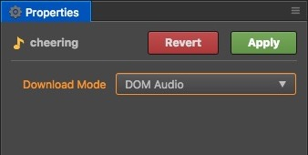

# Audio asset

Audio resources are simple audio files.

Game engine plays different sound resources for game background music and sound effects through basic interface of various platforms.

## About the loading mode of sound

In the **Assets**, select an audio, the **Properties** will have a option of load mode. This option is only valid for the web platform.

### Web Audio


Loading audio resources with Web Audio, the audio resources will be cached in a buffer of the engine.

The advantage of this approach is good compatibility and robust. However the disadvantage is that too much memory will be occupied.

### DOM Audio



By generating a standard element to play the sound resources, the cache is the audio element.

When using standard audio elements to play sound resources, you may encounter some restrictions on some browsers. For example, each play must be played within the user action event (Web Audio only requires the first time), allowing only one sound resource to be played.

For larger Audio such as background music, DOM Audio is recommended.

### Dynamically select load mode

Sometimes we may not use the automatic loading or preload function of the scene, but we want to load it through `cc.assetManager` in our script.

#### default load mode

Audio is loaded and played using the mode you select in the editor by default, but some browser does not support web audio and it will fall back to dom audio.

```js
cc.assetManager.loadRemote('http://example.com/background.mp3', callback);
```

#### Force use DOM mode to load

You can specify `audioLoadMode` as `DOM_AUDIO` to load dom audio forcibly.

```js
cc.assetManager.loadRemote('http://example.com/background.mp3', { audioLoadMode: cc.AudioClip.LoadMode.DOM_AUDIO }, callback);
```
